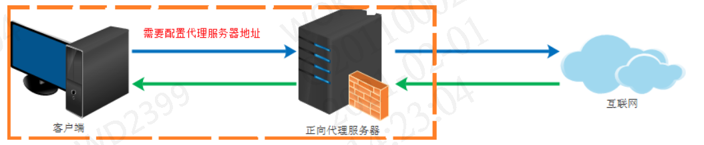
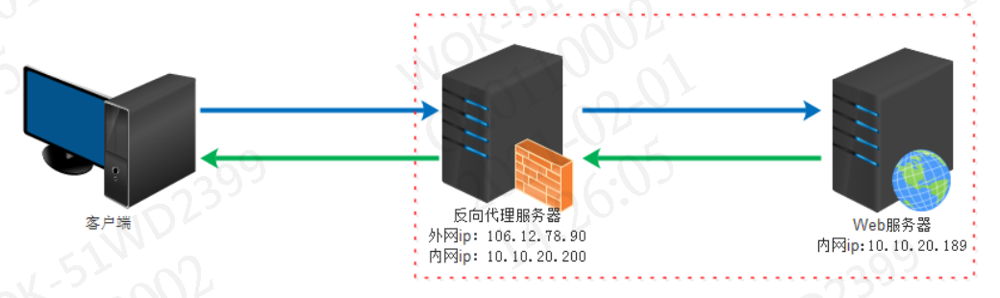
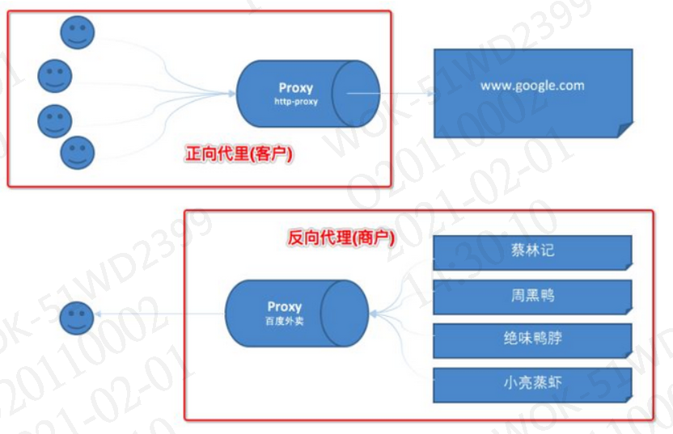

# Nginx


## 什么是Nginx？

​	Nginx是一个**高性能**的**HTTP**和**反向代理**服务器，其特点为**占有内存少**、**并发能力强**。Nginx代码完全由**C语言**编写，官方测试数据表明能够支持高达**50000**个并发连接数的响应。


## Nginx作用

> HTTP代理，反向代理

​	作为WEB服务器最常用的功能之一，尤其是反向代理。

> 负载均衡

​	Nginx提供的负载均衡策略有两种，内置策略和扩展策略。内置策略为轮询，加权轮询，ip hash。扩展策略就只有你想不到的没有他做不到的

**轮询**

​	按照顺序依次调用

**加权轮询**

​	按照权重比例调用

**ip hash**

​	ip hash对客户端的请求ip进行hash操作，然后根据hash结果将同一客户端ip的请求分发给同一台服务器进行处理，可以解决Session不共享的问题。（建议使用Redis）

> 动静分离

​	在软件开发中，有些请求是需要后台处理的，而有些请求时不需要后台处理的（如：css，js，html，jpg等），这些不需要经过后台处理的文件称之为静态文件。

​	将动态网站里的动态网页根据一定规则把不变的资源和经常变的资区分开，动静资源做好了拆分以后，我们就可以根据静态资源的特点将其做缓存操作，以提高资源的响应速度。


### 代理

​	代理其实就是一个中介，A和B本来可以直连，中间插入一个C，C就是中介。
​	刚开始的时候，代理多数是帮助内网client访问外网server用的
​	后来出现了反向代理，"反向"这个词在这儿的意思其实是指方向相反，即代理将来自外网客户端的请求转发到内网服务器，从外到内

#### 正向代理

​	正向代理类似一个跳板机，代理访问外部资源

​	比如我们国内访问谷歌，直接访问访问不到，我们可以通过一个正向代理服务器，请求发到代理服，代理服务器能够访问谷歌，这样由代理去谷歌取到返回数据，再返回给我们，这样我们就能访问谷歌了



​	用途：

- 访问原来无法访问的资源，如google
- 可以做缓存，加速访问资源
- 对客户端访问授权，上网进行认证
- 代理可以记录用户访问记录（上网行为管理），对外隐藏用户信息

#### 反向代理

​	反向代理（Reverse Proxy）实际运行方式是指以代理服务器来接受internet上的连接请求，然后将请求转发给内部网络上的服务器，并将从服务器上得到的结果返回给internet上请求连接的客户端，此时代理服务器对外就表现为一个服务器

	作用：

- 保证内网的安全，阻止WEB攻击。大型网站通常将反向代理作为公网访问地址，WEB服务器是内网。

- 负载均衡，通过反向代理服务器来优化网站的负载

#### 总结

​	正向代理为客户端代理，代理客户端，服务端不知道实际发起请求的客户端。

​	反向代理为服务端代理，代理服务端，客户端不知道实际提供服务的服务端。



## 常用命令

```
./nginx 启动
./nginx -s stop 停止
./nginx -s quit 安全退出
./nginx -s reload 重新加载配置文件
ps aux|grep nginx 查看nginx进程

PS：停止和安全退出的区别
		停止：快速杀死进程
		安全退出：一项一项保证安全的情况下关闭进程
```

## 常用配置

```properties
全局配置

events {
	# 最大连接数
    worker_connections  1024;
}

http {
    
    http 配置
    
    # 负载均衡-名称自起
    upstream liay{
    	server 127.0.0.1:8080 weight=3;
    	server 127.0.0.1:8080 weight=1;
    }

    server {
    	# 监听端口
        listen       81;
        server_name  localhost;

        location / {
            root   html;
            index  index.html index.htm;
            # 反向代理
            proxy_pass http://liay
        }

    }


    # another virtual host using mix of IP-, name-, and port-based configuration
    #
    #server {
    #    listen       8000;
    #    listen       somename:8080;
    #    server_name  somename  alias  another.alias;

    #    location / {
    #        root   html;
    #        index  index.html index.htm;
    #    }
    #}


    # HTTPS server
    #
    #server {
    #    listen       443 ssl;
    #    server_name  localhost;

    #    ssl_certificate      cert.pem;
    #    ssl_certificate_key  cert.key;

    #    ssl_session_cache    shared:SSL:1m;
    #    ssl_session_timeout  5m;

    #    ssl_ciphers  HIGH:!aNULL:!MD5;
    #    ssl_prefer_server_ciphers  on;

    #    location / {
    #        root   html;
    #        index  index.html index.htm;
    #    }
    #}

}
```

