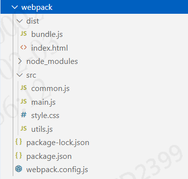

# NodeJs


## 构建 nodejs 项目

> 搭建 nodejs 项目指令

```properties
npm init / npm init -y
# 注：npm init 需要自己手动选择配置，而 npm init -y 直接使用默认配置
```

> 安装第三方依赖模块

```properties
# 安装单个模块
npm install 模块名 / npm i 模块名
# 安装多个模块 模块之间用空格隔开
npm install 模块1 模块2 / npm i 模块1 模块2
# 指定版本号 在模块名后跟 @版本号
npm install 模块@2.x.x / npm i 模块@2.x.x
```

> 模块放置在哪个位置

​	在 项目的 node_modules 文件夹中

> 安装模块后如何使用

​	使用 require 函数

```js
// 导入 http 模块
const http = require('http');
```

> 模块和 package.json 之间的关系

​	package.json 会记录 install 的所有依赖模块

​	通过 npm install 可以直接把 package.json 中的依赖模块自动下载，可以避免重复下载模块

> 如果使用 npm 安装很慢怎么办？

```properties
npm install -g cnpm --registry=https://registry.npm.taobao.org
cnpm install xxx / cnpm i xxx
```

> nodejs如何运行

```properties
node xxx.js
# 注：.js后缀可以省略
```

> 如何卸载模块

```properties
npm uninstall 模块名
```


## Babel

> Babel的安装

```properties
npm install -g babel-cli
```

> 安装解码器

```properties
npm install --save-dev babel-preset-es2015
```

> Babel的使用

- npm init - 创建 nodejs 项目

```properties
npm init
```

- 创建文件 src/xxx.js，并在其中编写 es6 代码
- 配置 .babelrc （babel配置文件），在 presets 字段设置转码规则，将 es2015 规则 加入 .babelrc 配置文件中

```properties
{
  "presets": ["es2015"],
  "plugins": []
}
```

- 使用命令将 src 下的所有文件 进行转码 并放入 dist 文件夹下

```properties
babel src -d dist
```

> 自定义脚本进行转码

- 在 package.json 文件中的 scripts 属性中，添加一个脚本

```properties
"scripts": {
    "test": "echo \"Error: no test specified\" && exit 1",
    "babel": "babel src -d dist"
  }
```

- 通过脚本对代码进行转码

```properties
npm run babel
```


## 模块化规范

### CommonJS规范

- 编写一个工具JS类，并使用 module.exports 将函数导出

```js
// 工具类
const sum = function(a, b){
  return a + b;
}
const sub = function(a, b){
  return a - b;
}
const mul = function(a, b){
  return a * b;
}
const di = function(a, b){
  return a / b;
}

// 使用 module.exports 将函数导出，导出后可以供其他JS使用
module.exports = {
  sum,
  sub,
  mul,
  di
}
```

- 编写一个导入类，并使用 require 函数导入对应工具JS类，并通过 对象. 的方式调用函数

```js
// 使用 require 导入
const utils = require('./utils.js');
// 通过 变量.的方式调用函数
console.log(utils.sum(1, 2));
console.log(utils.sub(1, 2));
console.log(utils.mul(1, 2));
console.log(utils.di(1, 2));
```

### ES6规范

#### 旧版

- 编写工具类，在每个函数上 声明 export

```js
// 工具类
export function getUserList(){
  console.log("获取用户列表中...");
}
export function saveUserInfo(){
  console.log("保存用户信息中...");
}
```

- 编写导入类，使用 import ... from ... 导入对应工具JS类的指定函数，并通过函数名直接调用

```js
// 引入指定文件中的指定函数
import {getUserList, saveUserInfo} from './oldUserApi.js'

getUserList();
saveUserInfo();
```

#### 新版

- 编写工具类，在 export default 中 编写工具函数

```js
// 工具类
export default{
  getUserList(){
    console.log("获取用户列表中...");
  },
  saveUserInfo(){
    console.log("保存用户信息中...");
  }
}
```

- 编写导入类，使用 import ... from ... 导入对应工具JS类的所有函数，并通过 对象. 调用

```js
// 引入指定文件中的指定函数
import user from './newUserApi.js'

user.getUserList();
user.saveUserInfo();
```

#### 新版与旧版的区别

- 旧版导出时 需对每一个函数 单独声明 export，而新版只需在  export default 编写即可

- 旧版导入时 需要指定导入函数，而新版直接导入一个对象


## WebPack

​	作用：合并所有静态资源文件并加密，保护代码私密性。

​	`注意：webpack 默认只支持合并js，合并其他资源时需要下载插件`

### 合并JS

- 创建一个 nodejs 项目
- 创建 src 文件夹，在文件夹下创建两个需要合并的JS文件：utils.js、common.js

**utils.js**

```js
// 输出函数
exports.info = function(str){
  console.log(str);
  document.write(str);
}
```

**common.js**

```js
// 求和函数
exports.add = function(a, b){
  return a + b;
}
```

- 准备一个入口文件 main.js，将模块集中引入 main.js 中

**main.js**

```js
const utils = require("./utils");
const common = require("./common");

require("./style.css");

utils.info("giao," + common.add(10, 20));
```

- 在根目录下创建 webpack.config.js 配置文件，在其中配置打包的规则

**webpack.config.js**

```js
// 导入 path 模块
const path = require("path");

// 定义 JS 打包规则
module.exports = {
  // 入口函数，从哪里开始进行编译打包
  entry: "./src/main.js",
  // 编译成功后把内容输出到哪里
  output: {
    // 定义输出的指定目录，__dirname表示当前项目根目录，产生一个 dist 文件夹
    path: path.resolve(__dirname, "./dist"),
    // 合并的 JS 文件存放在 dist 文件夹下生成 bundle.js 文件
    filename: "bundle.js"
  }
}
```

- 执行 webpack 指令查看结果



### 合并 CSS 

- 创建一个 nodejs 项目
- 安装 style-loader 和 css-loader 插件

```properties
npm install --save-dev style-loader css-loader
```

- 创建 src 文件夹，在文件夹下创建需要合并的 style.css 文件

**style.css**

```css
body {
  background: rebeccapurple;
  font-size: 50px;
  color: brown;
}
```

- 在根目录下 创建 webpack.config.js ，在其中配置打包规则

**webpack.config.js**

```js
// 导入 path 模块
const path = require("path");

// 定义 JS 打包规则
module.exports = {
  // 入口函数，从哪里开始进行编译打包
  entry: "./src/main.js",
  // 编译成功后把内容输出到哪里
  output: {
    // 定义输出的指定目录，__dirname表示当前项目根目录，产生一个 dist 文件夹
    path: path.resolve(__dirname, "./dist"),
    // 合并的 JS 文件存放在 dist 文件夹下生成 bundle.js 文件
    filename: "bundle.js"
  },
  // css部分
  module: {
    rules: [
      {
        test: /\.css$/, // 将项目中所有.css结尾的文件进行打包
        use: ['style-loader', 'css-loader']
      }
    ]
  }
}
```

- 执行 webpack 指令查看结果

### WebPack 常用指令

```
webpack 
  -- 对资源进行打包，其完整命令为 webpack -config webpack.config.js，只要配置文件与默认名相同就不用指定文件
webpack -w
  -- 监听；当静态文件修改时，自动执行 webpack 指令
```

### 总结

- 创建一个 nodejs 项目
- 在根目录下创建 src 文件夹 存放静态资源
- 在根目录下创建 webpack.config.js 文件，在其中编写打包规则
- 执行 webpack 查看结果

  ps：当合并 js 以外的静态资源时，需要下载对应插件