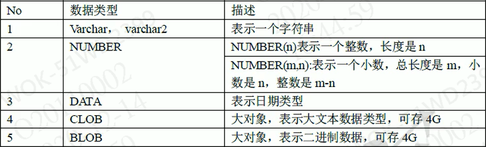

## Oracle数据类型



## dual

> dual：虚标，只是为了补全语法，没有任何意义

## distinct

> distinct：去重

```sql
-- 在字段前使用
select distinct REASON_CODE from SD_HIS_NGMSGPT
```

## 查询昨日八点至今日八点

```sql
SELECT trunc(sysdate)+8/24 FROM DUAL;
SELECT trunc(sysdate-1)+8/24 FROM DUAL;
```

## 单行函数

### 字符函数

#### upper

> upper：将指定数据变成大写

```sql
-- 将字母转换为大写
select upper('lsy') from dual;
```

#### lower

> lower：将指定数据变成小写

```sql
-- 将字母转换为小写
select lower('LSY') from dual;
```

#### substr

> substr：截取字符串
>
> 第一个参数：需要截取的字符串
>
> 第二个参数：截取开始的位置
>
> 第三个参数：截取个数

```sql
SELECT substr(STF.PRODUCT_CODE, 8, 1) FROM DUAL
```

### 数值函数

#### round

> round：四舍五入

```sql
-- 四舍五入
--   不加参数时：直接进行四舍五入
--   参数为正数时，参数为小数点右侧保留位数
--   参数为负数时，参数为小数点左侧保留位数
select round(56.29) from dual;
select round(56.29,1) from dual;
select round(56.29,-1) from dual;
```

#### trunc

> trunc：直接截取直接截取

```sql
-- 直接截取
--   不加参数时，直接截取为整形
--   参数为正数时，截取至小数点右侧的第n个位置
--   参数为负数时，截取至小数点左侧的第n个位置
select trunc(56.29) from dual;
select trunc(56.29,1) from dual;
select trunc(56.29,-1) from dual;
```

#### mod

> mod：求余

```sql
-- 求余
--   求左边数字与右边数字的余数
select mod(11.1,3) from dual;
```

### 日期函数

#### sysdate

> sysdate：当前系统时间

```sql
-- 当前系统时间
select sysdate from dual;
-- 指定日期距离今天的日数
select sysdate - 指定日期 from dual;
-- 明天此刻
select sysdate + 1 from dual;
```

#### months_between

> months_between：指定日期距离今天的月数

```sql
-- 指定日期距离今天的月数
select months_between(sysdate, 指定日期) from dual;
-- 指定日期距离今天的年数
select months_between(sysdate, 指定日期)/12 from dual;
-- 指定日期距离今天的周数
select round((sysdate - 指定日期)/7) from dual;
```

### 转换函数

#### to_char

> to_char：将日期转换为字符串

```sql
-- 将日期转换为字符串
select to_char(sysdate, 'yyyy-mm-dd hh:mi:ss') from dual;
-- 在小时候加上24，会将时间改成24小时制
select to_char(sysdate, 'yyyy-mm-dd hh24:mi:ss') from dual;
```

#### to_date

> to_date：将字符串转换为日期

```sql
-- 将字符串转换为日期
select to_date('2020-12-14 19:13:46', 'yyyy-mm-dd hh24:mi:ss') from dual;
```

### 公共函数

#### nvl

> nvl：如果第一个参数为null，则使用第二个参数

```sql
-- 如果第一个参数为null，则使用第二个参数
select 256 + nvl(null, 1) from dual;
```

### 条件表达式

#### 通用写法

> 条件表达式通用写法-等值判断：
>
> case 字段
>
> ​	when ''值1' then '替换值1'
>
> ​		when '值2' then '替换值2'
>
> ​			when '值3' then '替换值3'
>
> ​				else '替换值4'
>
> ​					end

> 条件表达式通用写法-区值判断：
>
> case
>
> ​	when 表达式1 then '替换值1'
>
> ​		when 表达式2 then '替换值2'
>
> ​			when 表达式3 then '替换值3'
>
> ​				else
>
> ​					end

> 条件表达式oracle专用写法：
>
> decode(字段,
> 	'值1', '替换值1',
> 		'值2', '替换值2',
> 			'替换值3'
> ) 

```sql
-- 条件表达式
-- 通用写法-else可以省略
--  等值判断
select 
   case '张轩'
     when '张轩' then 'sss'
       when '李珏岑' then 'bbb'
         else 'ccc'
           end
from dual;
--  区值判断
select 
   case 
     when 20>60 then 'sss'
       when 20>30 then 'bbb'
         else 'ccc'
           end
from dual;
--  oracle专属写法
select 
   decode(
   '张轩', 'sss',
     '李珏岑', 'bbb',
       'ccc')      
from dual;
```

## 多行函数(聚合函数)

### count

>count：查询该表总记录数

### sum

> sum：查询某字段的和

### max

> max：查询某字段的最大值

### min

> min：查询某字段的最小值

### avg

> avg：查询某字段的平均值

```sql
-- 多行函数：作用于多行，返回一个值
select input from DPM_SEG;
select count(1) from DPM_SEG; -- 总数量
select sum(input) from DPM_SEG; -- 总数量
select max(input) from DPM_SEG; -- 最大数
select min(input) from DPM_SEG; -- 最小数
select avg(input) from DPM_SEG; -- 平均数
```

## 多表查询

### 内连接

```sql
select *
from emp e, dept d
where e.deptno = d.deptno
```

### 外连接

​	Oracle专用写法， (+)写在哪边，则查询所有对面的表的所有信息

​	ps： (+) 在表达式左边，则 右外连接，(+) 在表达式右边，则 左外连接

#### 左外连接

```sql
select *
from emp e, dept d
where e.deptno = d.deptno(+)
```

#### 右外连接

```sql
select *
from emp e, dept d
where e.deptno(+) = d.deptno
```

### 自连接

​	含义：站在不同的角度，将一张表看作多张表，在进行多表联合查询

```sql
-- eg:查询出员工姓名 以及 员工领导姓名
select e1.ename, e2.ename
from emp e1, emp e2
where e1.mgr = e2.empno

-- eg:查询出员工姓名，员工部门名称，员工领导姓名，员工领导所在部门名称

-- 员工和领导在一个部门中
select e1.ename, d.dname, e2.ename, d.dname
from emp e1, emp e2, dept d
where e1.mgr = e2.empno
and e1.deptno = d.deptno
and e2.deptno = d.deptno
-- 员工和领导不需要在一个部门中
select e1.ename, d1.dname, e2.ename, d2.dname
from emp e1, emp e2, dept d1, dept d2
where e1.mgr = e2.empno
and e1.deptno = d1.deptno
and e2.deptno = d2.deptno
```

### 子查询

#### 返回一个值

```sql
select * from emp where sal = 
(select sal from emp where ename = 'SCOTT')
```

#### 返回一个集合

```sql
select * from emp where sal in
(select sal from emp where deptno = 10)
```

#### 返回一个表

```sql
select t.deptno, t.msal, e.ename, d.dname
from (select deptno, min(sal) msal
      from emp
      group by deptno) t, emp e, dept d
where t.deptno = e.depeno
and t.msal = e.sal
and e.deptno = d.deptno
```

## 分页查询

```sql
select * from(
  select rownum rn, DS.* from(
    select * from DPM_SEG order by lv desc
  )DS where rownum < 11
)where rn > 5
```

## 跨库Copy数据

​	将另一个库中表里的数据，全部复制到指定表中，一般用于相同表的数据复制。

```sql
SELECT * FROM SD_OP_CSBODY;
SELECT * FROM SD_OP_CSHEAD;
INSERT INTO SD_OP_CSBODY SELECT * FROM SD_OP_CSBODY@LK_MESDB01;
INSERT INTO SD_OP_CSHEAD SELECT * FROM SD_OP_CSHEAD@LK_MESDB01;
```

## 学习测试sql

```sql
--当前系统时间
select sysdate from dual;
--将字母转换为大写
select upper('lsy') from dual;
--将字母转换为小写
select lower('LSY') from dual;
--四舍五入
--   不加参数时：直接进行四舍五入
--   参数为正数时，参数为小数点右侧保留位数
--   参数为负数时，参数为小数点左侧保留位数
select round(56.29) from dual;
select round(56.29,1) from dual;
select round(56.29,-1) from dual;
--直接截取
--   不加参数时，直接截取为整形 
--   参数为正数时，截取至小数点右侧的第n个位置
--   参数为负数时，截取至小数点左侧的第n个位置
select trunc(56.29) from dual;
select trunc(56.29,1) from dual;
select trunc(56.29,-1) from dual;
--求余
--   求左边数字与右边数字的余数
select mod(11.1,3) from dual;

-- 指定日期距离今天的日数
select sysdate - 指定日期 from dual;
-- 明天此刻
select sysdate + 1 from dual;
-- 指定日期距离今天的月数
select months_between(sysdate, 指定日期) from dual;
-- 指定日期距离今天的年数
select months_between(sysdate, 指定日期)/12 from dual;
-- 指定日期距离今天的周数
select round((sysdate - 指定日期)/7) from dual;

-- 将日期转换为字符串
select to_char(sysdate, 'yyyy-mm-dd hh:mi:ss') from dual;
select to_char(sysdate, 'yyyy-mm-dd hh24:mi:ss') from dual;
-- 将字符串转换为日期
select to_date('2020-12-14 19:13:46', 'yyyy-mm-dd hh24:mi:ss') from dual;

-- 公用函数
--    如果第一个参数为null，则使用第二个参数
select 256 + nvl(null, 1) from dual;

-- 条件表达式
-- 通用写法-else可以省略
--  等值判断
select 
   case '张轩'
     when '张轩' then 'sss'
       when '李珏岑' then 'bbb'
         else 'ccc'
           end
from dual;
--  区值判断
select 
   case 
     when 20>60 then 'sss'
       when 20>30 then 'bbb'
         else 'ccc'
           end
from dual;
-- oracle专属写法
select 
   decode(
   '张轩', 'sss',
     '李珏岑', 'bbb',
       'ccc') 
from dual;

-- 查询今天八点和昨天八点
SELECT trunc(sysdate)+8/24 FROM DUAL;
SELECT trunc(sysdate-1)+8/24 FROM DUAL;

-- 多行函数：作用于多行，返回一个值
select * from DPM_SE                                                           
select count(1) from DPM_SEG; -- 总数量
select sum(input) from DPM_SEG; -- 总数量
select max(input) from DPM_SEG; -- 最大数
select min(input) from DPM_SEG; -- 最小数
select avg(input) from DPM_SEG; -- 平均数

-- 分组查询
--   出现在 group by 后边的原始列，才能出现在 select 后面
--   没有出现在 group bu 后边的原始列，需要使用聚合函数才能使用
select D.SEG_ID, avg(D.Input)
from DPM_SEG D
group by D.SEG_ID
--   where 是过滤分组前的数据，having 是过滤分组后的数据
--   表现形式：where 必须在 group by 前面，having 必须在 group by 后面
select D.SEG_ID, avg(D.Input)
from DPM_SEG D
where D.input > 20000
group by D.SEG_ID
having avg(D.Input)>20000

-- 分页查询
select count(1) from DPM_SEG

select * from(
  select rownum rn, DS.* from(
    select * from DPM_SEG order by lv desc
  )DS where rownum < 11
)where rn > 5

-- 视图
select * from DPM_NGMSG
```

