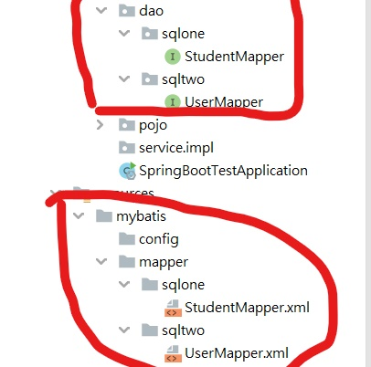
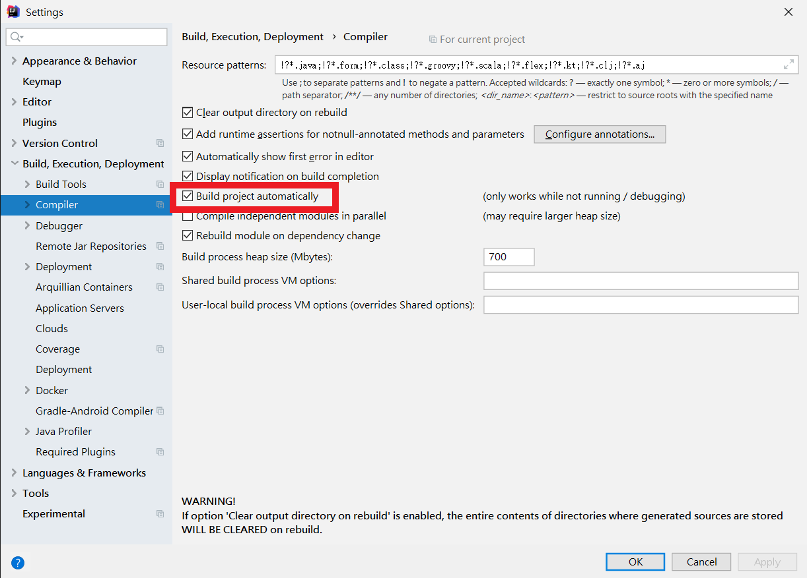
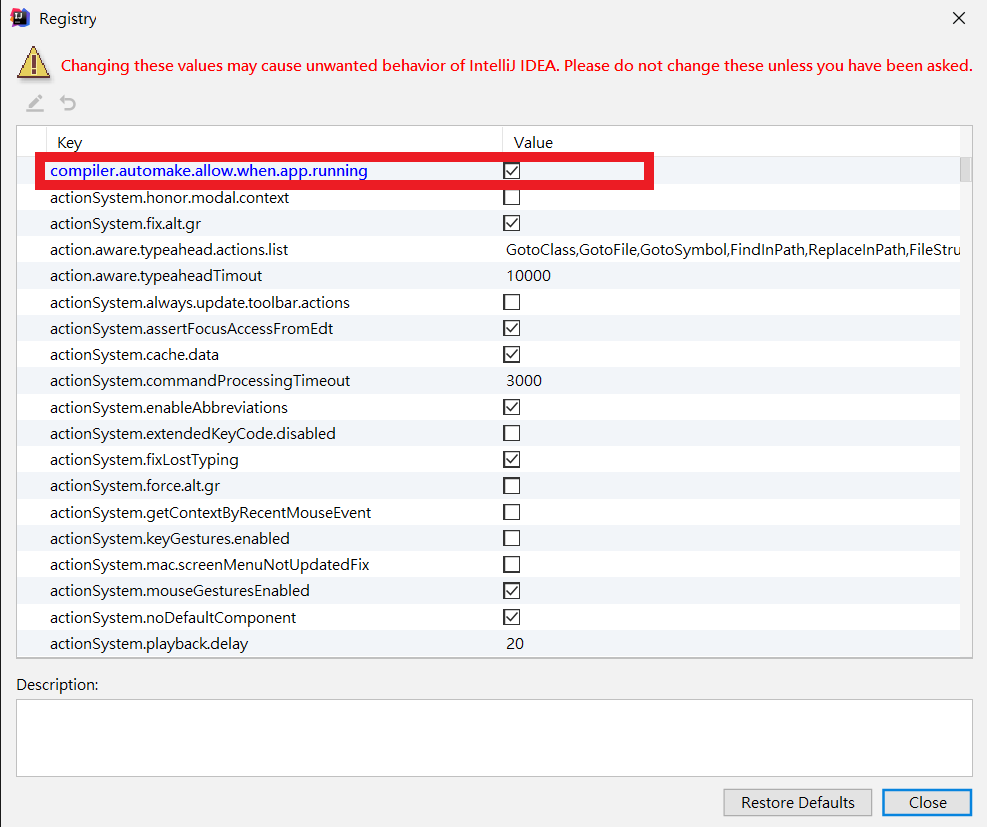

# Spring Boot

## Spring Boot 快速搭建

​	优势：Spring Boot 统一了依赖的版本，解决了版本冲突问题，也简化了繁琐的配置文件。

​	快速搭建Spring Boot 项目步骤：

​		1、在 pom.xml 文件中 引入 Spring Boot 依赖以及对应的版本号；（用于 Spring Boot 包的版本号统一）

​		2、引入 Spring Boot - web 包；（该包中包含了 java web 开发中 常用的jar包）

​		3、简单配置端口号以及项目访问前缀

### pom.xml

```xml
<?xml version="1.0" encoding="UTF-8"?>
<project xmlns="http://maven.apache.org/POM/4.0.0"
         xmlns:xsi="http://www.w3.org/2001/XMLSchema-instance"
         xsi:schemaLocation="http://maven.apache.org/POM/4.0.0 http://maven.apache.org/xsd/maven-4.0.0.xsd">
    <modelVersion>4.0.0</modelVersion>

    <!-- Maven配置 -->
    <groupId>org.example</groupId>
    <artifactId>SpringBootTest</artifactId>
    <version>1.0-SNAPSHOT</version>
    <name>SpringBootTest</name>
    <description>Demo project for Spring Boot</description>

    <!-- 声明JDK版本 -->
    <properties>
        <java.version>1.8</java.version>
    </properties>

    <!-- Spring Boot 依赖 -->
    <parent>
        <groupId>org.springframework.boot</groupId>
        <artifactId>spring-boot-starter-parent</artifactId>
        <version>2.3.1.RELEASE</version>
        <relativePath/> <!-- lookup parent from repository -->
    </parent>

    <!-- 依赖包 -->
    <dependencies>

        <!-- web相关包 -->
        <dependency>
            <groupId>org.springframework.boot</groupId>
            <artifactId>spring-boot-starter-web</artifactId>
        </dependency>

        <!-- 测试包依赖 -->
        <dependency>
        <groupId>org.springframework.boot</groupId>
            <artifactId>spring-boot-starter-test</artifactId>
            <scope>test</scope>
            <exclusions>
                <exclusion>
                    <groupId>org.junit.vintage</groupId>
                    <artifactId>junit-vintage-engine</artifactId>
                </exclusion>
            </exclusions>
        </dependency>

    </dependencies>

    <!-- Spring Boot打包依赖 -->
    <build>
        <plugins>
            <plugin>
                <groupId>org.springframework.boot</groupId>
                <artifactId>spring-boot-maven-plugin</artifactId>
            </plugin>
        </plugins>
    </build>

</project>
```

### application.yml

```yaml
server:
  # 设置端口号
  port: 8081
  servlet:
  # 设置访问前缀
    context-path: /SpringBootTest
```

## Spring Boot 集成Mybatis

​	Mybatis特点：动态SQL、映射结果集

​	集成Mybatis步骤：

​		1、pom.xml 中 引入 Spring Boot 集成 Mybatis 依赖 以及 MySQL驱动依赖。

​		2、在 application.yml 中配置数据源信息 以及 dao 层包扫描路径 和 mapper文件路径

### pom.xml

```xml
<!--Spring Boot 整合 Mybatis -->
<dependency>
    <groupId>org.mybatis.spring.boot</groupId>
    <artifactId>mybatis-spring-boot-starter</artifactId>
    <version>2.0.0</version>
</dependency>

<dependency>
    <groupId>mysql</groupId>
    <artifactId>mysql-connector-java</artifactId>
</dependency>
```

### application.yml

```yaml
spring:
  # 设置数据源
  datasource:
  	# 设置数据源 种类、IP、端口、数据库名称
    url: jdbc:mysql://10.58.241.10:3306/testspringboot?useunicode=true&characterEncoding=utf8
    # 数据源账号
    username: root
    # 数据源密码
    password: Wopt54321
    # 数据源驱动
    driver-class-name: com.mysql.jdbc.Driver
    
mybatis:
  # 全局别名设置
  type-aliases-package: com.liay.pojo
  # mapper文件路径
  mapper-locations: classpath:mybatis/mapper/*.xml
```

## Spring Boot 集成 Druid

​	Druid概念：连接池，sql监控。

​	集成Druid步骤：

​		1、在 pom.xml 中 引入druid 依赖

​		2、在 application.yml 中 替换原有的 Mybatis 数据源配置

### pom.xml

```xml
<!--阿里druid数据库连接池 -->
<dependency>
    <groupId>com.alibaba</groupId>
    <artifactId>druid</artifactId>
    <version>1.1.10</version>
</dependency>
```

### application.yml

```yaml
spring:
  # 数据源
  datasource:
  	  # 数据源类型
      type: com.alibaba.druid.pool.DruidDataSource
      # 驱动类型
      driver-class-name: com.mysql.cj.jdbc.Driver
      # 设置数据源 种类、IP、端口、数据库名称 
      url: jdbc:mysql://10.58.241.10:3306/testspringboot?useUnicode=true&characterEncoding=UTF-8&useJDBCCompliantTimezoneShift=true&useLegacyDatetimeCode=false&serverTimezone=UTC
      # 数据源账号
      username: root
      # 数据源密码
      password: Wopt54321
      druid:
        #初始化连接池的连接数量 大小，最小，最大
        initial-size: 5
        min-idle: 5
        max-active: 20
        #配置获取连接等待超时的时间
        max-wait: 60000
        #配置间隔多久才进行一次检测，检测需要关闭的空闲连接，单位是毫秒
        time-between-eviction-runs-millis: 60000
        # 配置一个连接在池中最小生存的时间，单位是毫秒
        min-evictable-idle-time-millis: 30000
        validation-query: SELECT 1 FROM DUAL
        test-while-idle: true
        test-on-borrow: true
        test-on-return: false
```

## Spring Boot 集成 Mybatis 使用多个数据源

​	优势：可以同时使用多个数据源，可以是相同数据源，也可能是不同数据源。

​	配置多个数据源步骤：

​		1、在 pom.xml 中 引入 Mybatis 依赖 以及 Mysql驱动包

​		2、在 application.yml 中 配置多个数据源信息

​		3、在 config 包下 建立对应的数据源配置信息

​		4、创建对应的 mapper接口 与 mapper文件

### 配置结构



### pom.xml

​	与集成单个数据源使用依赖相同。

```xml
<!--Spring Boot 整合 Mybatis -->
<dependency>
    <groupId>org.mybatis.spring.boot</groupId>
    <artifactId>mybatis-spring-boot-starter</artifactId>
    <version>2.0.0</version>
</dependency>

<dependency>
    <groupId>mysql</groupId>
    <artifactId>mysql-connector-java</artifactId>
</dependency>
```

### application.yml

​	sqlone与sqltwo是用来区分数据源的，无特殊意义。

​	使用的多个数据源 **可以相同**，**也可以不相同**，只需要修改对应的 **driver-class-name** 与 **jdbc-url** 即可。

```yaml
spring:
  datasource:

    sqlone:
      type: com.alibaba.druid.pool.DruidDataSource
      driver-class-name: com.mysql.cj.jdbc.Driver
      jdbc-url: jdbc:mysql://10.58.241.10:3306/testspringboot?useUnicode=true&characterEncoding=UTF-8&useJDBCCompliantTimezoneShift=true&useLegacyDatetimeCode=false&serverTimezone=UTC
      username: root
      password: Wopt54321
      druid:
        #初始化连接池的连接数量 大小，最小，最大
        initial-size: 5
        min-idle: 5
        max-active: 20
        #配置获取连接等待超时的时间
        max-wait: 60000
        #配置间隔多久才进行一次检测，检测需要关闭的空闲连接，单位是毫秒
        time-between-eviction-runs-millis: 60000
        # 配置一个连接在池中最小生存的时间，单位是毫秒
        min-evictable-idle-time-millis: 30000
        validation-query: SELECT 1 FROM DUAL
        test-while-idle: true
        test-on-borrow: true
        test-on-return: false

    sqltwo:
      type: com.alibaba.druid.pool.DruidDataSource
      driver-class-name: com.mysql.cj.jdbc.Driver
      jdbc-url: jdbc:mysql://10.58.241.10:3306/testspringboottwo?useUnicode=true&characterEncoding=UTF-8&useJDBCCompliantTimezoneShift=true&useLegacyDatetimeCode=false&serverTimezone=UTC
      username: root
      password: Wopt54321
      druid:
        #初始化连接池的连接数量 大小，最小，最大
        initial-size: 5
        min-idle: 5
        max-active: 20
        #配置获取连接等待超时的时间
        max-wait: 60000
        #配置间隔多久才进行一次检测，检测需要关闭的空闲连接，单位是毫秒
        time-between-eviction-runs-millis: 60000
        # 配置一个连接在池中最小生存的时间，单位是毫秒
        min-evictable-idle-time-millis: 30000
        validation-query: SELECT 1 FROM DUAL
        test-while-idle: true
        test-on-borrow: true
        test-on-return: false
```

### DataSourceConfig.java

​	配置对应数据源数量的配置文件。

​	以下以两个数据源为例，一个主数据库，一个从数据库；主数据库中使用@Primary注解，从数据库中不需使用。

#### DataSourceOneConfig

```java
package com.liay.common.config;

import org.apache.ibatis.session.SqlSessionFactory;
import org.mybatis.spring.SqlSessionFactoryBean;
import org.mybatis.spring.SqlSessionTemplate;
import org.mybatis.spring.annotation.MapperScan;
import org.springframework.beans.factory.annotation.Qualifier;
import org.springframework.boot.context.properties.ConfigurationProperties;
import org.springframework.boot.jdbc.DataSourceBuilder;
import org.springframework.context.annotation.Bean;
import org.springframework.context.annotation.Configuration;
import org.springframework.context.annotation.Primary;
import org.springframework.core.io.support.PathMatchingResourcePatternResolver;
import org.springframework.jdbc.datasource.DataSourceTransactionManager;

import javax.sql.DataSource;

@Configuration
/**
 * basePackages： 这里的路径与对应的 dao 层路径对应
 */
@MapperScan(basePackages = "com.liay.dao.sqlone", sqlSessionTemplateRef  = "sqloneSqlSessionTemplate")
public class DataSourceOneConfig {

    @Bean(name = "sqloneDataSource")
    /**
     * prefix： 这里的名称需与yml中设置的名称对应
     */
    @ConfigurationProperties(prefix = "spring.datasource.sqlone")
    @Primary
    public DataSource testDataSource() {
        return DataSourceBuilder.create().build();
    }

    @Bean(name = "sqloneSqlSessionFactory")
    @Primary
    public SqlSessionFactory testSqlSessionFactory(@Qualifier("sqloneDataSource") DataSource dataSource) throws Exception {
        SqlSessionFactoryBean bean = new SqlSessionFactoryBean();
        bean.setDataSource(dataSource);
        /**
         * 这里的路径与对应的 mapper.xml 路径对应
         */
        bean.setMapperLocations(new PathMatchingResourcePatternResolver().getResources("classpath:mybatis/mapper/sqlone/*.xml"));
        return bean.getObject();
    }

    @Bean(name = "sqloneTransactionManager")
    @Primary
    public DataSourceTransactionManager testTransactionManager(@Qualifier("sqloneDataSource") DataSource dataSource) {
        return new DataSourceTransactionManager(dataSource);
    }

    @Bean(name = "sqloneSqlSessionTemplate")
    @Primary
    public SqlSessionTemplate testSqlSessionTemplate(@Qualifier("sqloneSqlSessionFactory") SqlSessionFactory sqlSessionFactory) throws Exception {
        return new SqlSessionTemplate(sqlSessionFactory);
    }

}
```

#### DataSourceTwoConfig.java

```java
package com.liay.common.config;

import org.apache.ibatis.session.SqlSessionFactory;
import org.mybatis.spring.SqlSessionFactoryBean;
import org.mybatis.spring.SqlSessionTemplate;
import org.mybatis.spring.annotation.MapperScan;
import org.springframework.beans.factory.annotation.Qualifier;
import org.springframework.boot.context.properties.ConfigurationProperties;
import org.springframework.boot.jdbc.DataSourceBuilder;
import org.springframework.context.annotation.Bean;
import org.springframework.context.annotation.Configuration;
import org.springframework.context.annotation.Primary;
import org.springframework.core.io.support.PathMatchingResourcePatternResolver;
import org.springframework.jdbc.datasource.DataSourceTransactionManager;

import javax.sql.DataSource;

@Configuration
/**
 * basePackages： 这里的路径与对应的 dao 层路径对应
 */
@MapperScan(basePackages = "com.liay.dao.sqltwo", sqlSessionTemplateRef  = "sqltwoSqlSessionTemplate")
public class DataSourceTwoConfig {

    @Bean(name = "sqltwoDataSource")
    /**
     * prefix： 这里的名称需与yml中设置的名称对应
     */
    @ConfigurationProperties(prefix = "spring.datasource.sqltwo")
    public DataSource testDataSource() {
        return DataSourceBuilder.create().build();
    }

    @Bean(name = "sqltwoSqlSessionFactory")
    public SqlSessionFactory testSqlSessionFactory(@Qualifier("sqltwoDataSource") DataSource dataSource) throws Exception {
        SqlSessionFactoryBean bean = new SqlSessionFactoryBean();
        bean.setDataSource(dataSource);
        /**
         * 这里的路径与对应的 mapper.xml 路径对应
         */
        bean.setMapperLocations(new PathMatchingResourcePatternResolver().getResources("classpath:mybatis/mapper/sqltwo/*.xml"));
        return bean.getObject();
    }

    @Bean(name = "sqltwoTransactionManager")
    public DataSourceTransactionManager testTransactionManager(@Qualifier("sqltwoDataSource") DataSource dataSource) {
        return new DataSourceTransactionManager(dataSource);
    }

    @Bean(name = "sqltwoSqlSessionTemplate")
    public SqlSessionTemplate testSqlSessionTemplate(@Qualifier("sqltwoSqlSessionFactory") SqlSessionFactory sqlSessionFactory) throws Exception {
        return new SqlSessionTemplate(sqlSessionFactory);
    }

}
```

### mapper

​	创建对应的 dao 层接口，与对应的 mapper.xml 文件。

​	以下以两个数据源为例。

#### sqlone

##### StudentMapper.java

```java
package com.liay.dao.sqlone;

import com.liay.pojo.Student;
import org.apache.ibatis.annotations.Mapper;
import org.springframework.stereotype.Component;

import java.util.List;

@Component
public interface StudentMapper {

    List<Student> getAllStudent();
}

```

##### StudentMapper.xml

```xml
<?xml version="1.0" encoding="UTF-8"?>
<!DOCTYPE mapper PUBLIC "-//mybatis.org//DTD Mapper 3.0//EN" "http://mybatis.org/dtd/mybatis-3-mapper.dtd">
<mapper namespace="com.liay.dao.sqlone.StudentMapper">

    <select id="getAllStudent" resultType="com.liay.pojo.Student">
        SELECT * FROM student
    </select>

</mapper>
```

#### sqltwo

##### UserMapper.java

```java
package com.liay.dao.sqltwo;

import com.liay.pojo.User;
import org.apache.ibatis.annotations.Mapper;
import org.springframework.stereotype.Component;

import java.util.List;

@Component
public interface UserMapper {

    List<User> getAllUser();
}

```

##### UserMapper.xml

```xml
<?xml version="1.0" encoding="UTF-8"?>
<!DOCTYPE mapper PUBLIC "-//mybatis.org//DTD Mapper 3.0//EN" "http://mybatis.org/dtd/mybatis-3-mapper.dtd">
<mapper namespace="com.liay.dao.sqltwo.UserMapper">

    <select id="getAllUser" resultType="com.liay.pojo.User">
        SELECT * FROM user
    </select>

</mapper>
```

## Spring Boot 集成 Redis

​	Redis概念：非关系型数据库

​	集成Redis步骤：

​		1、在 pom.xml 中 引入Redis依赖	

​		2、在 application.yml 中 设置 IP、端口号、连接超时时间等信息

​		3、在 config 包下 配置 RedisConfig.java 类（重写 RedisTemplate 模板）

​		4、在 utils 包下编写 RedisUtil.java 类（方便后续开发）

### pom.xml

```xml
<!--  redis相关包  -->
<dependency>
<groupId>org.springframework.boot</groupId>
<artifactId>spring-boot-starter-data-redis</artifactId>
</dependency>
```

### application.yml

```yaml
spring:
  redis:
    # Redis服务器地址
    host: 127.0.0.1
    # Redis服务器连接端口
    port: 6379
    # 连接超时时间（毫秒）
    timeout: 1000
```

### RedisConfig.java

```java
package com.liay.common.config;

import org.springframework.context.annotation.Bean;
import org.springframework.context.annotation.Configuration;
import org.springframework.data.redis.connection.RedisConnectionFactory;
import org.springframework.data.redis.core.RedisTemplate;
import org.springframework.data.redis.serializer.Jackson2JsonRedisSerializer;
import org.springframework.data.redis.serializer.StringRedisSerializer;
import com.fasterxml.jackson.annotation.JsonAutoDetect;
import com.fasterxml.jackson.annotation.PropertyAccessor;
import com.fasterxml.jackson.databind.ObjectMapper;

/**
 * redis配置类
 */
@Configuration
public class RedisConfig {

    @Bean
    @SuppressWarnings("all")
    public RedisTemplate<String, Object> redisTemplate(RedisConnectionFactory factory) {

        RedisTemplate<String, Object> template = new RedisTemplate<String, Object>();
        template.setConnectionFactory(factory);
        Jackson2JsonRedisSerializer jackson2JsonRedisSerializer = new Jackson2JsonRedisSerializer(Object.class);
        ObjectMapper om = new ObjectMapper();
        om.setVisibility(PropertyAccessor.ALL, JsonAutoDetect.Visibility.ANY);
        om.enableDefaultTyping(ObjectMapper.DefaultTyping.NON_FINAL);
        jackson2JsonRedisSerializer.setObjectMapper(om);
        StringRedisSerializer stringRedisSerializer = new StringRedisSerializer();
        //key采用String的序列化方式
        template.setKeySerializer(stringRedisSerializer);
        //hash的key也采用String的序列化方式
        template.setHashKeySerializer(stringRedisSerializer);
        //value序列化方式采用jackson
        template.setValueSerializer(jackson2JsonRedisSerializer);
        //hash的value序列化方式采用jackson
        template.setHashValueSerializer(jackson2JsonRedisSerializer);
        template.afterPropertiesSet();
        return template;
    }

}
```

### RedisUtil.java

```java
package com.liay.common.utils;

import java.util.List;
import java.util.Map;
import java.util.Set;
import java.util.concurrent.TimeUnit;
import org.springframework.beans.factory.annotation.Autowired;
import org.springframework.data.redis.core.RedisTemplate;
import org.springframework.stereotype.Component;
import org.springframework.util.CollectionUtils;

import javax.annotation.Resource;

/**
 * Redis工具类
 */
@Component
public class RedisUtil {

    @Autowired
    private RedisTemplate<String, Object> redisTemplate;
        // =============================common============================
        /**
         * 指定缓存失效时间
         * @param key 键
         * @param time 时间(秒)
         * @return
         */
    public boolean expire(String key, long time) {
        try {
            if (time > 0) {
                redisTemplate.expire(key, time, TimeUnit.SECONDS);
            }
            return true;
        } catch (Exception e) {
            e.printStackTrace();
            return false;
        }
    }
        /**
         * 根据key 获取过期时间
         * @param key 键 不能为null
         * @return 时间(秒) 返回0代表为永久有效
         */
    public long getExpire(String key) {
        return redisTemplate.getExpire(key, TimeUnit.SECONDS);
    }
        /**
         * 判断key是否存在
         * @param key 键
         * @return true 存在 false不存在
         */
    public boolean hasKey(String key) {
        try {
            return redisTemplate.hasKey(key);
        } catch (Exception e) {
            e.printStackTrace();
            return false;
        }
    }
        /**
         * 删除缓存
         * @param key 可以传一个值 或多个
         */
    @SuppressWarnings("unchecked")
    public void del(String... key) {
        if (key != null && key.length > 0) {
            if (key.length == 1) {
                redisTemplate.delete(key[0]);
            } else {
                redisTemplate.delete(CollectionUtils.arrayToList(key));
            }
        }
    }
        // ============================String=============================
        /**
         * 普通缓存获取
         * @param key 键
         * @return 值
         */
    public Object get(String key) {
        return key == null ? null : redisTemplate.opsForValue().get(key);
    }
        /**
         * 普通缓存放入
         * @param key 键
         * @param value 值
         * @return true成功 false失败
         */
    public boolean set(String key, Object value) {
        try {
            redisTemplate.opsForValue().set(key, value);
            return true;
        } catch (Exception e) {
            e.printStackTrace();
            return false;
        }
    }
        /**
         * 普通缓存放入并设置时间
         * @param key 键
         * @param value 值
         * @param time 时间(秒) time要大于0 如果time小于等于0 将设置无限期
         * @return true成功 false 失败
         */
    public boolean set(String key, Object value, long time) {
        try {
            if (time > 0) {
                redisTemplate.opsForValue().set(key, value, time, TimeUnit.SECONDS);
            } else {
                set(key, value);
            }
            return true;
        } catch (Exception e) {
            e.printStackTrace();
            return false;
        }
    }
        /**
         * 递增
         * @param key 键
         * @param delta 要增加几(大于0)
         * @return
         */
    public long incr(String key, long delta) {
        if (delta < 0) {
            throw new RuntimeException("递增因子必须大于0");
        }
        return redisTemplate.opsForValue().increment(key, delta);
    }
        /**
         * 递减
         * @param key 键
         * @param delta 要减少几(小于0)
         * @return
         */
    public long decr(String key, long delta) {
        if (delta < 0) {
            throw new RuntimeException("递减因子必须大于0");
        }
        return redisTemplate.opsForValue().increment(key, -delta);
    }
        // ================================Map=================================
        /**
         * HashGet
         * @param key 键 不能为null
         * @param item 项 不能为null
         * @return 值
         */
    public Object hget(String key, String item) {
        return redisTemplate.opsForHash().get(key, item);
    }
        /**
         * 获取hashKey对应的所有键值
         * @param key 键
         * @return 对应的多个键值
         */
    public Map<Object, Object> hmget(String key) {
        return redisTemplate.opsForHash().entries(key);
    }
        /**
         * HashSet
         * @param key 键
         * @param map 对应多个键值
         * @return true 成功 false 失败
         */
    public boolean hmset(String key, Map<String, Object> map) {
        try {
            redisTemplate.opsForHash().putAll(key, map);
            return true;
        } catch (Exception e) {
            e.printStackTrace();
            return false;
        }
    }
        /**
         * HashSet 并设置时间
         * @param key 键
         * @param map 对应多个键值
         * @param time 时间(秒)
         * @return true成功 false失败
         */
    public boolean hmset(String key, Map<String, Object> map, long time) {
        try {
            redisTemplate.opsForHash().putAll(key, map);
            if (time > 0) {
                expire(key, time);
            }
            return true;
        } catch (Exception e) {
            e.printStackTrace();
            return false;
        }
    }
        /**
         * 向一张hash表中放入数据,如果不存在将创建
         * @param key 键
         * @param item 项
         * @param value 值
         * @return true 成功 false失败
         */
    public boolean hset(String key, String item, Object value) {
        try {
            redisTemplate.opsForHash().put(key, item, value);
            return true;
        } catch (Exception e) {
            e.printStackTrace();
            return false;
        }
    }
        /**
         * 向一张hash表中放入数据,如果不存在将创建
         * @param key 键
         * @param item 项
         * @param value 值
         * @param time 时间(秒) 注意:如果已存在的hash表有时间,这里将会替换原有的时间
         * @return true 成功 false失败
         */
    public boolean hset(String key, String item, Object value, long time) {
        try {
            redisTemplate.opsForHash().put(key, item, value);
            if (time > 0) {
                expire(key, time);
            }
            return true;
        } catch (Exception e) {
            e.printStackTrace();
            return false;
        }
    }
        /**
         * 删除hash表中的值
         * @param key 键 不能为null
         * @param item 项 可以使多个 不能为null
         */
    public void hdel(String key, Object... item) {
        redisTemplate.opsForHash().delete(key, item);
    }
        /**
         * 判断hash表中是否有该项的值
         * @param key 键 不能为null
         * @param item 项 不能为null
         * @return true 存在 false不存在
         */
    public boolean hHasKey(String key, String item) {
        return redisTemplate.opsForHash().hasKey(key, item);
    }
        /**
         * hash递增 如果不存在,就会创建一个 并把新增后的值返回
         * @param key 键
         * @param item 项
         * @param by 要增加几(大于0)
         * @return
         */
    public double hincr(String key, String item, double by) {
        return redisTemplate.opsForHash().increment(key, item, by);
    }
        /**
         * hash递减
         * @param key 键
         * @param item 项
         * @param by 要减少记(小于0)
         * @return
         */
    public double hdecr(String key, String item, double by) {
        return redisTemplate.opsForHash().increment(key, item, -by);
    }
        // ============================set=============================
        /**
         * 根据key获取Set中的所有值
         * @param key 键
         * @return
         */
    public Set<Object> sGet(String key) {
        try {
            return redisTemplate.opsForSet().members(key);
        } catch (Exception e) {
            e.printStackTrace();
            return null;
        }
    }
        /**
         * 根据value从一个set中查询,是否存在
         * @param key 键
         * @param value 值
         * @return true 存在 false不存在
         */
    public boolean sHasKey(String key, Object value) {
        try {
            return redisTemplate.opsForSet().isMember(key, value);
        } catch (Exception e) {
            e.printStackTrace();
            return false;
        }
    }
        /**
         * 将数据放入set缓存
         * @param key 键
         * @param values 值 可以是多个
         * @return 成功个数
         */
    public long sSet(String key, Object... values) {
        try {
            return redisTemplate.opsForSet().add(key, values);
        } catch (Exception e) {
            e.printStackTrace();
            return 0;
        }
    }
        /**
         * 将set数据放入缓存
         * @param key 键
         * @param time 时间(秒)
         * @param values 值 可以是多个
         * @return 成功个数
         */
    public long sSetAndTime(String key, long time, Object... values) {
        try {
            Long count = redisTemplate.opsForSet().add(key, values);
            if (time > 0)
            expire(key, time);
            return count;
        } catch (Exception e) {
            e.printStackTrace();
            return 0;
        }
    }
        /**
         * 获取set缓存的长度
         * @param key 键
         * @return
         */
    public long sGetSetSize(String key) {
        try {
            return redisTemplate.opsForSet().size(key);
        } catch (Exception e) {
            e.printStackTrace();
            return 0;
        }
    }
        /**
         * 移除值为value的
         * @param key 键
         * @param values 值 可以是多个
         * @return 移除的个数
         */
    public long setRemove(String key, Object... values) {
        try {
            Long count = redisTemplate.opsForSet().remove(key, values);
            return count;
        } catch (Exception e) {
            e.printStackTrace();
            return 0;
        }
    }
        // ===============================list=================================
        /**
         * 获取list缓存的内容
         * @param key 键
         * @param start 开始
         * @param end 结束 0 到 -1代表所有值
         * @return
         */
    public List<Object> lGet(String key, long start, long end) {
        try {
            return redisTemplate.opsForList().range(key, start, end);
        } catch (Exception e) {
            e.printStackTrace();
            return null;
        }
    }
        /**
         * 获取list缓存的长度
         * @param key 键
         * @return
         */
    public long lGetListSize(String key) {
        try {
            return redisTemplate.opsForList().size(key);
        } catch (Exception e) {
            e.printStackTrace();
            return 0;
        }
    }
        /**
         * 通过索引 获取list中的值
         * @param key 键
         * @param index 索引 index>=0时， 0 表头，1 第二个元素，依次类推；index<0时，-1，表尾，-2倒数第二个元素，依次类推
         * @return
         */
    public Object lGetIndex(String key, long index) {
        try {
            return redisTemplate.opsForList().index(key, index);
        } catch (Exception e) {
            e.printStackTrace();
            return null;
        }
    }
        /**
         * 将list放入缓存
         * @param key 键
         * @param value 值
         * @param time 时间(秒)
         * @return
         */
    public boolean lSet(String key, Object value) {
        try {
            redisTemplate.opsForList().rightPush(key, value);
            return true;
        } catch (Exception e) {
            e.printStackTrace();
            return false;
        }
    }
        /**
         * 将list放入缓存
         * @param key 键
         * @param value 值
         * @param time 时间(秒)
         * @return
         */
    public boolean lSet(String key, Object value, long time) {
        try {
            redisTemplate.opsForList().rightPush(key, value);
            if (time > 0)
            expire(key, time);
            return true;
        } catch (Exception e) {
            e.printStackTrace();
            return false;
        }
    }
        /**
         * 将list放入缓存
         * @param key 键
         * @param value 值
         * @param time 时间(秒)
         * @return
         */
    public boolean lSet(String key, List<Object> value) {
        try {
            redisTemplate.opsForList().rightPushAll(key, value);
            return true;
        } catch (Exception e) {
            e.printStackTrace();
            return false;
        }
    }
        /**
         * 将list放入缓存
         *
         * @param key 键
         * @param value 值
         * @param time 时间(秒)
         * @return
         */
    public boolean lSet(String key, List<Object> value, long time) {
        try {
            redisTemplate.opsForList().rightPushAll(key, value);
            if (time > 0)
            expire(key, time);
            return true;
        } catch (Exception e) {
            e.printStackTrace();
            return false;
        }
    }
        /**
         * 根据索引修改list中的某条数据
         * @param key 键
         * @param index 索引
         * @param value 值
         * @return
         */
    public boolean lUpdateIndex(String key, long index, Object value) {
        try {
            redisTemplate.opsForList().set(key, index, value);
            return true;
        } catch (Exception e) {
            e.printStackTrace();
            return false;
        }
    }
        /**
         * 移除N个值为value
         * @param key 键
         * @param count 移除多少个
         * @param value 值
         * @return 移除的个数
         */
    public long lRemove(String key, long count, Object value) {
        try {
            Long remove = redisTemplate.opsForList().remove(key, count, value);
            return remove;
        } catch (Exception e) {
            e.printStackTrace();
            return 0;
        }
    }
}
```

## Spring Boot 集成 devtools

​	devtools 概述：devtools 即热部署，可以不重启服务器达到刷新服务器的效果。

​	集成 devtools 步骤：

​		1、在 pom.xml 中引入 dependency 依赖 并 开启

​		2、在 application.yml 中配置 后端代码块路径，页面路径信息（可以不配，有默认值）

​		3、开启工程自动编译



​		4、Ctrl + Shift + Alt + / 然后选择Registry，开启运行时允许自动编译



### pom.xml

```xml
<!-- 热部署依赖 -->
<dependency>
    <groupId>org.springframework.boot</groupId>
    <artifactId>spring-boot-devtools</artifactId>
    <!-- 将依赖关系标记为可选<optional>true</optional>，防止使用项目将devtools传递性地应用于其他模块 -->
    <optional>true</optional>
</dependency>

<!-- Spring Boot打包依赖 -->
<build>
    <plugins>

        <!-- 开启热部署 -->
        <plugin>
            <groupId>org.springframework.boot</groupId>
            <artifactId>spring-boot-maven-plugin</artifactId>
            <configuration>
                <fork>true</fork>
            </configuration>
        </plugin>

    </plugins>
</build>
```

### applicatiom.yml

```yaml
spring: 
  devtools:
    restart:
      # 开启热部署
      enabled: true
      # 后端代码块路径
      additional-paths: src\main\java
      # 页面路径
      exclude: template/**
```

## Spring Boot 集成 logging

​	作用：每当执行sql语句时，在控制台打印sql信息

​	集成 logging步骤：

​		1、在 pom.xml 中引入 logging 依赖

​		2、在 applicaiton.yml 中配置 dao 层路径信息

### pom.xml

```xml
<!--sql日志包-->
<dependency>
    <groupId>org.springframework.boot</groupId>
    <artifactId>spring-boot-starter-logging</artifactId>
</dependency>
```

### application.yml

```yaml
logging:
  level:
    com.liay.dao: debug
```

## Spring Boot 集成 screw

​	**screw**作用：一键生成数据库文档，数据库表结构逆向工程

​	特点：

​		1、简洁、轻量

​		2、多数据库支持：MySQL,MariaDB,TIDB,Oracle,SqlServer,PostgreSql,Cache DB

​		3、多种格式文档：html,word,markdwon

​		4、灵活拓展：支持用户自定义模板和展示样式修改（freemarker模板）

​	集成步骤：

​		1、在 pom.xml 中添加screw依赖

​		2、配置生成文档类

### pom.xml

```xml
<!-- screw依赖包 -->
<dependency>
    <groupId>cn.smallbun.screw</groupId>
    <artifactId>screw-core</artifactId>
    <version>1.0.3</version>
</dependency>
```

### ScrewTest.java

```java
package com.liay.common.screw;

import cn.smallbun.screw.core.Configuration;
import cn.smallbun.screw.core.engine.EngineConfig;
import cn.smallbun.screw.core.engine.EngineFileType;
import cn.smallbun.screw.core.engine.EngineTemplateType;
import cn.smallbun.screw.core.execute.DocumentationExecute;
import cn.smallbun.screw.core.process.ProcessConfig;
import com.zaxxer.hikari.HikariConfig;
import com.zaxxer.hikari.HikariDataSource;

import javax.sql.DataSource;
import java.util.ArrayList;

public class ScrewTest {

    public static void main(String[] args) {
        //数据源
        HikariConfig hikariConfig = new HikariConfig();
        hikariConfig.setDriverClassName("com.mysql.cj.jdbc.Driver");
        hikariConfig.setJdbcUrl("jdbc:mysql://10.58.241.10:3306/testspringboottwo");
        hikariConfig.setUsername("root");
        hikariConfig.setPassword("Wopt54321");
        //设置可以获取tables remarks信息
        hikariConfig.addDataSourceProperty("useInformationSchema", "true");
        hikariConfig.setMinimumIdle(2);
        hikariConfig.setMaximumPoolSize(5);
        DataSource dataSource = new HikariDataSource(hikariConfig);

        //生成配置
        EngineConfig engineConfig = EngineConfig.builder()
                //生成文件路径
                .fileOutputDir("D:\\screw")
                //打开目录
                .openOutputDir(true)
                //生成文件类型：HTML
                .fileType(EngineFileType.HTML)
                //生成模板实现
                .produceType(EngineTemplateType.freemarker)
                .build();

        //忽略表
        ArrayList<String> ignoreTableName = new ArrayList<>();
        ignoreTableName.add("test_user");
        ignoreTableName.add("test_group");
        //忽略表前缀
        ArrayList<String> ignorePrefix = new ArrayList<>();
        ignorePrefix.add("test_");
        //忽略表后缀
        ArrayList<String> ignoreSuffix = new ArrayList<>();
        ignoreSuffix.add("_test");
        ProcessConfig processConfig = ProcessConfig.builder()
                //指定生成逻辑、当存在指定表、指定表前缀、指定表后缀时，将生成指定表，其余表不生成、并跳过忽略表配置
                //根据名称指定表生成
                .designatedTableName(new ArrayList<>())
                //根据表前缀生成
                .designatedTablePrefix(new ArrayList<>())
                //根据表后缀生成
                .designatedTableSuffix(new ArrayList<>())
                //忽略表名
                .ignoreTableName(ignoreTableName)
                //忽略表前缀
                .ignoreTablePrefix(ignorePrefix)
                //忽略表后缀
                .ignoreTableSuffix(ignoreSuffix).build();
        //配置
        Configuration config = Configuration.builder()
                //版本
                .version("1.0.0")
                //描述,文档名称
                .description("数据库设计文档生成")
                //数据源
                .dataSource(dataSource)
                //生成配置
                .engineConfig(engineConfig)
                //生成配置
                .produceConfig(processConfig)
                .build();
        //执行生成
        new DocumentationExecute(config).execute();
    }
}
```

## Spring Boot 集成 postgresql

​	集成 postgresql步骤：

​		1、在 pom.xml 中 引入 postgresql 驱动包

​		2、在 application.yml 中设置数据源信息

### pom. xml

```xml
<!--postgresql驱动包-->
<dependency>
    <groupId>org.postgresql</groupId>
    <artifactId>postgresql</artifactId>
    <scope>runtime</scope>
</dependency>
```

### application.yml

```yaml
spring:
  # 设置数据源
  datasource:
    # 设置数据源 种类、IP、端口、数据库名称
    url: jdbc:postgresql://10.57.0.133:5432/board_system
    # 数据源账号
    username: postgres
    # 数据源密码
    password: Wopt54321
    # 数据源驱动
    driver-class-name: org.postgresql.Driver
```

## Spring Boot 集成 Task

​	概念：Spring的一款定时器，可以在项目部署期间，定时执行操作。

​	集成 Task 步骤：

​		1、引入 Spring Boot Web 依赖

​		2、在启动类上加上 @EnableScheduling 注解

​		3、设置定时类

### application.java

```java
package com.wistron;

import org.springframework.boot.SpringApplication;
import org.springframework.boot.autoconfigure.SpringBootApplication;
import org.springframework.scheduling.annotation.EnableScheduling;

/**
 * @EnableScheduling：spring task-定时器
 */
@EnableScheduling
@SpringBootApplication
public class WistronProjectApplication {
    public static void main(String[] args) {
        SpringApplication.run(WistronProjectApplication.class, args);
    }
}

```

### TaskTest.java

```java
package com.wistron.common.task;

import org.springframework.scheduling.annotation.Scheduled;
import org.springframework.stereotype.Component;

import java.util.Date;

@Component
public class TaskTest {
    /**
     * 其中的数据就是每 ? 秒执行一次程序
     */
    @Scheduled(cron = "*/28800 * * * * ?")
    public  void po(){
        // System.out.println(new Date());
    }
}
```

## Spring Boot 集成 PageHelper

​	PageHelper 是一款 分页插件

​	集成步骤：

* 在 pom.xml 文件中导入依赖包
* 在 application.yml 中进行相关设置
* 在 启动类 加入一个设置好的 Bean 对象

### pom.xml

```xml
<!-- 分页插件 -->
<dependency>
    <groupId>com.github.pagehelper</groupId>
    <artifactId>pagehelper-spring-boot-starter</artifactId>
    <version>1.2.5</version>
</dependency>
```

### application.yml

```yaml
#分页插件
pagehelper:
  helperDialect: postgresql
  reasonable: true
  supportMethodsArguments: true
  params: count=countSql
```

### application.java

```java
@Bean
public PageHelper pageHelper(){
    PageHelper pageHelper = new PageHelper();
    Properties properties = new Properties();
    properties.setProperty("offsetAsPageNum","true");
    properties.setProperty("rowBoundsWithCount","true");
    properties.setProperty("reasonable","true");
    properties.setProperty("dialect","postgresql");    //配置postgresql数据库的方言支持Oracle,Mysql,MariaDB,SQLite,Hsqldb,PostgreSQL六种数据库
    pageHelper.setProperties(properties);
    return pageHelper;
}
```

### PageHelper的使用

```java
 @Override
public JsonResult getClickData(String status, String function, int pageNum) {

	// 改行放在sql查询方法的上方
    PageHelper.startPage(当前页, 每页显示数量);
    List<ProjectStatus> projectStatusList = pgpsm.getDataByStatusFunctionAndFunction(status, function, null, null);
    PageInfo<ProjectStatus> pageInfo = new PageInfo<ProjectStatus>(projectStatusList);
    jsonResult.setData(pageInfo);

    return jsonResult;
}
```

## Spring Boot 打 war包

​	配置步骤：

​		1、pom.xml 文件中 将 packaging 标签的值改为 war

​		2、加入 排除内置 tomcat 的依赖

​		3、加入 javax.servlet-api 依赖

​		4、加入打包依赖

​		4、启动类继承 SpringBootServletInitializer 类 并重写 configure 方法

### pom.xml

```xml
<?xml version="1.0" encoding="UTF-8"?>
<project xmlns="http://maven.apache.org/POM/4.0.0"
         xmlns:xsi="http://www.w3.org/2001/XMLSchema-instance"
         xsi:schemaLocation="http://maven.apache.org/POM/4.0.0 http://maven.apache.org/xsd/maven-4.0.0.xsd">
    <modelVersion>4.0.0</modelVersion>

    <groupId>org.example</groupId>
    <artifactId>wistronProject</artifactId>
    <version>1.0-SNAPSHOT</version>
    <name>wistronProject</name>
    <description>Demo project for Spring Boot</description>
    <packaging>war</packaging>

    <!-- 声明JDK版本 -->
    <properties>
        <java.version>1.8</java.version>
    </properties>

    <!-- Spring Boot 依赖 -->
    <parent>
        <groupId>org.springframework.boot</groupId>
        <artifactId>spring-boot-starter-parent</artifactId>
        <version>2.3.1.RELEASE</version>
        <relativePath/> <!-- lookup parent from repository -->
    </parent>

    <!-- 依赖包 -->
    <dependencies>

        <!-- web相关包 -->
        <dependency>
            <groupId>org.springframework.boot</groupId>
            <artifactId>spring-boot-starter-web</artifactId>
        </dependency>

        <!--Spring Boot 整合 Mybatis -->
        <dependency>
            <groupId>org.mybatis.spring.boot</groupId>
            <artifactId>mybatis-spring-boot-starter</artifactId>
            <version>2.1.3</version>
        </dependency>

        <!--在Spring Boot中推荐使用@Transactional注解来申明事务。首先需要导入依赖-->
        <dependency>
            <groupId>org.springframework.boot</groupId>
            <artifactId>spring-boot-starter-jdbc</artifactId>
        </dependency>

        <!-- mysql 配置-->
        <dependency>
            <groupId>mysql</groupId>
            <artifactId>mysql-connector-java</artifactId>
            <scope>runtime</scope>
        </dependency>

        <!--postgresql驱动包-->
        <dependency>
            <groupId>org.postgresql</groupId>
            <artifactId>postgresql</artifactId>
            <scope>runtime</scope>
        </dependency>

        <!--阿里druid数据库连接池 -->
        <dependency>
            <groupId>com.alibaba</groupId>
            <artifactId>druid</artifactId>
            <version>1.1.10</version>
        </dependency>

        <!--sql日志包-->
        <dependency>
            <groupId>org.springframework.boot</groupId>
            <artifactId>spring-boot-starter-logging</artifactId>
        </dependency>

        <!-- 热部署依赖 -->
        <dependency>
            <groupId>org.springframework.boot</groupId>
            <artifactId>spring-boot-devtools</artifactId>
            <!-- 将依赖关系标记为可选<optional>true</optional>，防止使用项目将devtools传递性地应用于其他模块 -->
            <optional>true</optional>
        </dependency>

        <!-- thymeleaf模板依赖 -->
        <dependency>
            <groupId>org.springframework.boot</groupId>
            <artifactId>spring-boot-starter-thymeleaf</artifactId>
        </dependency>

        <!--poi 相关包-->
        <dependency>
            <groupId>org.apache.poi</groupId>
            <artifactId>poi</artifactId>
            <version>3.15</version>
        </dependency>
        <dependency>
            <groupId>org.apache.poi</groupId>
            <artifactId>poi-ooxml</artifactId>
            <version>3.15</version>
        </dependency>
        <!--/poi 相关包-->

        <!--lombok依赖包-->
        <dependency>
            <groupId>org.projectlombok</groupId>
            <artifactId>lombok</artifactId>
            <version>1.16.16</version>
        </dependency>

        <!-- 分页插件 -->
        <dependency>
            <groupId>com.github.pagehelper</groupId>
            <artifactId>pagehelper-spring-boot-starter</artifactId>
            <version>1.2.5</version>
        </dependency>

        <dependency>
            <groupId>commons-codec</groupId>
            <artifactId>commons-codec</artifactId>
        </dependency>

        <!--httpclient依赖包-->
        <dependency>
            <groupId>org.apache.httpcomponents</groupId>
            <artifactId>httpclient</artifactId>
            <version>4.5.2</version>
        </dependency>
        <!--jsoup依赖包-html解析器-->
        <dependency>
            <groupId>org.jsoup</groupId>
            <artifactId>jsoup</artifactId>
            <version>1.10.2</version>
        </dependency>
        <dependency>
            <groupId>commons-io</groupId>
            <artifactId>commons-io</artifactId>
            <version>2.6</version>
        </dependency>
        <dependency>
            <groupId>org.apache.commons</groupId>
            <artifactId>commons-lang3</artifactId>
            <version>3.7</version>
        </dependency>

        <dependency>
            <groupId>org.slf4j</groupId>
            <artifactId>slf4j-log4j12</artifactId>
            <version>1.7.25</version>
        </dependency>

        <!--fastjson依赖包-->
        <dependency>
            <groupId>com.alibaba</groupId>
            <artifactId>fastjson</artifactId>
            <version>1.2.47</version>
        </dependency>

        <dependency>
            <groupId>org.apache.httpcomponents</groupId>
            <artifactId>httpmime</artifactId>
            <version>4.5.5</version>
        </dependency>

        <!-- 测试包依赖 -->
        <dependency>
            <groupId>org.springframework.boot</groupId>
            <artifactId>spring-boot-starter-test</artifactId>
            <scope>test</scope>
            <exclusions>
                <exclusion>
                    <groupId>org.junit.vintage</groupId>
                    <artifactId>junit-vintage-engine</artifactId>
                </exclusion>
            </exclusions>
        </dependency>

        <!--排除内置tomcat-->
        <dependency>
            <groupId>org.springframework.boot</groupId>
            <artifactId>spring-boot-starter-web</artifactId>
            <exclusions>
                <exclusion>
                    <groupId>org.springframework.boot</groupId>
                    <artifactId>spring-boot-starter-tomcat</artifactId>
                </exclusion>
            </exclusions>
        </dependency>

        <dependency>
            <groupId>javax.servlet</groupId>
            <artifactId>javax.servlet-api</artifactId>
            <version>3.1.0</version>
            <scope>provided</scope>
        </dependency>

    </dependencies>

    <build>
        <finalName>wistronProject</finalName>
        <plugins>
            <!-- Spring Boot打包依赖 -->
            <plugin>
                <groupId>org.springframework.boot</groupId>
                <artifactId>spring-boot-maven-plugin</artifactId>
            </plugin>
            <!-- 开启热部署 -->
            <plugin>
                <groupId>org.springframework.boot</groupId>
                <artifactId>spring-boot-maven-plugin</artifactId>
                <configuration>
                    <fork>true</fork>
                </configuration>
            </plugin>
        </plugins>
    </build>

</project>
```

### 启动类

```java
package com.wistron;

import com.github.pagehelper.PageHelper;
import org.springframework.boot.SpringApplication;
import org.springframework.boot.autoconfigure.SpringBootApplication;
import org.springframework.boot.builder.SpringApplicationBuilder;
import org.springframework.boot.web.servlet.support.SpringBootServletInitializer;
import org.springframework.context.annotation.Bean;
import org.springframework.scheduling.annotation.EnableScheduling;

import java.util.Properties;

/**
 * @EnableScheduling：spring task-定时器
 */
//@EnableScheduling
@SpringBootApplication
public class WistronProjectApplication extends SpringBootServletInitializer {
    public static void main(String[] args) {
        SpringApplication.run(WistronProjectApplication.class, args);
    }
    @Bean
    public PageHelper pageHelper(){
        PageHelper pageHelper = new PageHelper();
        Properties properties = new Properties();
        properties.setProperty("offsetAsPageNum","true");
        properties.setProperty("rowBoundsWithCount","true");
        properties.setProperty("reasonable","true");
        properties.setProperty("dialect","postgresql");    //配置postgresql数据库的方言支持Oracle,Mysql,MariaDB,SQLite,Hsqldb,PostgreSQL六种数据库
        pageHelper.setProperties(properties);
        return pageHelper;
    }
    @Override
    protected SpringApplicationBuilder configure(SpringApplicationBuilder application) {
        return application.sources(WistronProjectApplication.class);
    }
}
```

## Spring Boot 集成 Oracle

### pom.xml

```xml
<!--Oracle驱动包-->
<dependency>
    <groupId>com.oracle</groupId>
    <artifactId>ojdbc6</artifactId>
    <version>12.1.0.2.0</version>
</dependency>
```

### application.yml

```yml
driver-class-name: oracle.jdbc.OracleDriver
jdbc-url: jdbc:oracle:thin:@10.57.30.95:1525:WOKDSD
username: WOKDSD
password: WOKDSD
```

## Spring Boot 集成 swagger2

​	swagger2 是一款 自动生成 API接口文档 的框架工具

​	集成步骤：

* 在 pom.xml 中添加依赖
* 创建 swaggerConfig 类，进行相关配置

### pom.xml

```xml
<!--api-->
<dependency>
    <groupId>io.springfox</groupId>
    <artifactId>springfox-swagger2</artifactId>
    <version>2.9.2</version>
</dependency>
<dependency>
    <groupId>io.springfox</groupId>
    <artifactId>springfox-swagger-ui</artifactId>
    <version>2.9.2</version>
</dependency>
```

### swaggerConfig.java

```java
package com.wistron.common.config;


import org.springframework.context.annotation.Bean;
import org.springframework.context.annotation.Configuration;
import springfox.documentation.builders.ApiInfoBuilder;
import springfox.documentation.builders.PathSelectors;
import springfox.documentation.builders.RequestHandlerSelectors;
import springfox.documentation.service.ApiInfo;
import springfox.documentation.spi.DocumentationType;
import springfox.documentation.spring.web.plugins.Docket;
import springfox.documentation.swagger2.annotations.EnableSwagger2;

@Configuration
@EnableSwagger2
public class SwaggerConfig {
    @Bean
    public Docket createRestApi() {
        return new Docket(DocumentationType.SWAGGER_2)
                .apiInfo(apiInfo())
                .select()
                .apis(RequestHandlerSelectors.basePackage("控制层路径"))
                                .paths(PathSelectors.any())
                                .build();
    }
    private ApiInfo apiInfo() {
        return new ApiInfoBuilder()
                .title("标题")
                .description("young as the morning,old ad the sea")
                .termsOfServiceUrl("")
                .contact("创建人")
                .version("版本号")
                .build();
    }
}

```

### Controller

​	在类上 使用 @Api(tags = "") 注解，声明当前类的信息

​	在方法上 使用 @ApiOperation(value = "") 注解，声明接口信息

​	在方法上使用 @ApiImplicitParams({}) 注解，声明接口参数信息

```java
package com.wistron.controller;

@RestController
@Api(tags = "Lst trend chart")
@RequestMapping("/lst")
@CrossOrigin
public class LstController {
    
	@ApiOperation(value = "手动跑某天的数据")
    @ApiImplicitParams({
            @ApiImplicitParam(name = "date",value = "日期",required = true,dataType = "String"),
            @ApiImplicitParam(name = "codemachine",value = "机种",required = true,dataType = "String"),

    })
    @GetMapping("runData")
    @ResponseBody
    public String runData(String date,String codemachine) throws Exception{
        Map temp=new HashMap();
        temp=getChart(codemachine,date);
        String s = JSONUtils.toJSONString(temp);
        return s;
    }

}
```

### 访问路径

```properties
ip+端口/项目名/swagger-ui.html
```

## Spring Boot 设置当前环境

yml配置

```yaml
spring:
  # 设置当前环境
  profiles:
    active: dev
```

​                                                                      