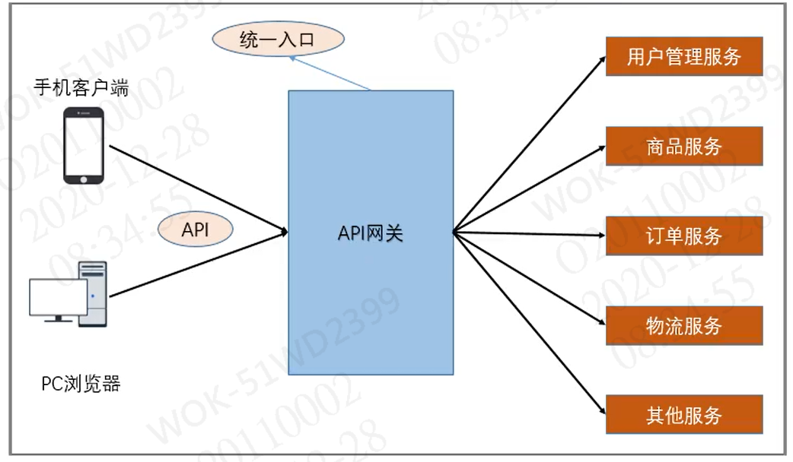
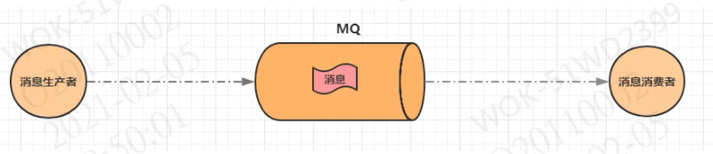

 

# Spring Cloud alibaba


## 系统架构演变

### 1.1 单体应用架构


### 1.2 垂直应用架构


### 1.3 分布式架构


### 1.4 SOA架构


### 1.5 微服务架构 




## Spring  Cloud alibaba项目搭建

### 2.1 父工程创建

​	1、创建**Maven**项目，只保留**pom.xml**文件；

​	2、将父工程的**packaging**设置为**pom**，并添加**dependencyManagement**管控子项目依赖版本；

```xml
<?xml version="1.0" encoding="UTF-8"?>
<project xmlns="http://maven.apache.org/POM/4.0.0"
         xmlns:xsi="http://www.w3.org/2001/XMLSchema-instance"
         xsi:schemaLocation="http://maven.apache.org/POM/4.0.0 http://maven.apache.org/xsd/maven-4.0.0.xsd">
    <modelVersion>4.0.0</modelVersion>

    <groupId>com.liay</groupId>
    <artifactId>springCloudAlibabaStu</artifactId>
    <version>1.0-SNAPSHOT</version>
    <packaging>pom</packaging>

    <!-- 子工程 -->
    <modules>
        <module>common</module>
        <module>user</module>
        <module>product</module>
        <module>order</module>
    </modules>

    <properties>
        <java.version>1.8</java.version>
    </properties>

    <dependencyManagement>
        <dependencies>

            <!-- Spring Boot 依赖 -->
            <dependency>
                <groupId>org.springframework.boot</groupId>
                <artifactId>spring-boot-dependencies</artifactId>
                <version>2.3.5.RELEASE</version>
                <type>pom</type>
                <scope>import</scope>
            </dependency>

            <!-- Spring Cloud 依赖 -->
            <dependency>
                <groupId>org.springframework.cloud</groupId>
                <artifactId>spring-cloud-dependencies</artifactId>
                <version>Hoxton.SR9</version>
                <type>pom</type>
                <scope>import</scope>
            </dependency>

            <!-- Spring Cloud alibaba -->
            <dependency>
                <groupId>com.alibaba.cloud</groupId>
                <artifactId>spring-cloud-alibaba-dependencies</artifactId>
                <version>2.2.1.RELEASE</version>
                <type>pom</type>
                <scope>import</scope>
            </dependency>

        </dependencies>
    </dependencyManagement>


</project>
```

### 2.2 公共资源子工程创建

​	1、在父工程下创建module项目；

​	2、在pom.xml中继承父项目，并将拉取公共依赖；

```xml
<?xml version="1.0" encoding="UTF-8"?>
<project xmlns="http://maven.apache.org/POM/4.0.0"
         xmlns:xsi="http://www.w3.org/2001/XMLSchema-instance"
         xsi:schemaLocation="http://maven.apache.org/POM/4.0.0 http://maven.apache.org/xsd/maven-4.0.0.xsd">
    <parent>
        <artifactId>springCloudAlibabaStu</artifactId>
        <groupId>com.liay</groupId>
        <version>1.0-SNAPSHOT</version>
    </parent>
    <modelVersion>4.0.0</modelVersion>

    <artifactId>common</artifactId>

    <dependencies>

        <!--MybatisPlus驱动包-->
        <dependency>
            <groupId>com.baomidou</groupId>
            <artifactId>mybatis-plus-boot-starter</artifactId>
            <version>3.0.5</version>
        </dependency>

        <!-- Mysql驱动包 -->
        <dependency>
            <groupId>mysql</groupId>
            <artifactId>mysql-connector-java</artifactId>
            <version>5.1.6</version>
        </dependency>

        <!--阿里druid数据库连接池 -->
        <dependency>
            <groupId>com.alibaba</groupId>
            <artifactId>druid</artifactId>
            <version>1.1.10</version>
        </dependency>

        <!--fastjson依赖包-->
        <dependency>
            <groupId>com.alibaba</groupId>
            <artifactId>fastjson</artifactId>
            <version>1.2.75</version>
        </dependency>

        <!--lombok依赖包-->
        <dependency>
            <groupId>org.projectlombok</groupId>
            <artifactId>lombok</artifactId>
            <version>1.18.12</version>
        </dependency>

    </dependencies>


</project>
```

​	3、在项目中编写公共实体类


### 2.3 服务子工程创建

​	1、在父工程下创建module项目；

​	2、在pom.xml中继承父项目，引用公共资源项目依赖；

```xml
<?xml version="1.0" encoding="UTF-8"?>
<project xmlns="http://maven.apache.org/POM/4.0.0"
         xmlns:xsi="http://www.w3.org/2001/XMLSchema-instance"
         xsi:schemaLocation="http://maven.apache.org/POM/4.0.0 http://maven.apache.org/xsd/maven-4.0.0.xsd">
    <parent>
        <artifactId>springCloudAlibabaStu</artifactId>
        <groupId>com.liay</groupId>
        <version>1.0-SNAPSHOT</version>
    </parent>
    <modelVersion>4.0.0</modelVersion>

    <artifactId>product</artifactId>

    <dependencies>

        <!-- Boot web依赖 -->
        <dependency>
            <groupId>org.springframework.boot</groupId>
            <artifactId>spring-boot-starter-web</artifactId>
        </dependency>

        <!-- 公共资源项目依赖 -->
        <dependency>
            <groupId>com.liay</groupId>
            <artifactId>common</artifactId>
            <version>1.0-SNAPSHOT</version>
        </dependency>

        <!-- nacos依赖 -->
        <dependency>
            <groupId>com.alibaba.cloud</groupId>
            <artifactId>spring-cloud-starter-alibaba-nacos-discovery</artifactId>
        </dependency>

    </dependencies>

</project>
```

​	3、编写配置服务环境以及接口


## Spring Cloud alibaba 生态搭建

### 3.1 Nacos Discovery

​	含义：服务注册、发现以及服务配置

#### 3.1.1 搭建Nacos环境

> 下载Nacos

```
下载地址：https://github.com/alibaba/nacos/releases
下载zip格式的压缩包，然后进行解压缩
```

> 启动Nacos 

```sh
# 启动命令
startup.cmd -m standalone
```

> 访问Nacos

```
访问地址：localhost:8848/nacos
PS：默认账号密码都是nacos
```

#### 3.1.2 项目配置Nacos

> 在pom.xml添加Nacos依赖

```xml
<!-- nacos依赖 -->
<dependency>
    <groupId>com.alibaba.cloud</groupId>
    <artifactId>spring-cloud-starter-alibaba-nacos-discovery</artifactId>
</dependency>
```

> 在启动类上添加@EnableDiscoveryClient注解

```java
@SpringBootApplication
// 开启Nacos
@EnableDiscoveryClient
public class ProductApplication {

    public static void main(String[] args) {
        SpringApplication.run(ProductApplication.class, args);
    }
}
```

> 在application.yml中添加Nacos服务的地址

```yaml
spring: 
 cloud:
  nacos:
   discovery:
    server-addr: localhost:8848
```

### 3.2 Ribbon

​	含义：负载均衡

​	作用：在调用相同服务时，实现均衡调用。

​	PS：如有三个服务，A服务1、A服务2、A服务3，在调用A服务时，会按照顺序轮着调用；也可以自定义调用方式。

### 3.3 openFeign

​	含义：服务调用

​	作用：服务之间相互调用

#### 3.3.1 服务项目配置openFeign

> 在pom.xml中拉取依赖

```xml
<!-- openfeign依赖 -->
<dependency>
    <groupId>org.springframework.cloud</groupId>
    <artifactId>spring-cloud-starter-openfeign</artifactId>
</dependency>
```

> 在启动类上添加@EnableFeignClients开启 openfeign 客户端

```java
// 开启 openfeign 客户端
@EnableFeignClients
public class OrderApplication {

    public static void main(String[] args) {
        SpringApplication.run(OrderApplication.class, args);
    }

    @Bean
    public RestTemplate createRestTemplate(){
        return new RestTemplate();
    }
}
```

> 编写服务接口

​	如指定服务设置了访问后缀，调用时必须添加对应的访问后缀

```java
// 指定调用nacos下的哪个微服务
@FeignClient("product")
public interface ProductServiceI {

    // 指定调用服务中的哪个请求
    @GetMapping("/product/getProductById/{pid}")
    public Product getProductById(@PathVariable("pid") Long pid);

}
```

### 3.4 Sentinel

​	含义：一套用于**服务容错**的综合性解决方案。它以流量为切入点，从**流量控制**、**熔断降级**、**系统负载保护**等多个维度来保护服务的稳定性。

#### 3.4.1 搭建Sentinel控制台

> 下载Sentinel

```
下载地址：https://github.com/alibaba/Sentinel/releases
```

> 启动Sentinel

```
启动命令：
	java -Dserver.port=8000 -Dcsp.sentinel.dashboard.server=localhost:8000 -Dproject.name=sentinel-dashboard -jar sentinel-dashboard-1.8.0.jar

PS：
	-Dserver.portj：端口号
	-Dcsp.sentinel.dashboard.server：IP+端口
	-Dproject.name：服务名称
	sentinel-dashboard-1.8.0.jar：启动的jar包
```

> 访问Sentinel

```
访问路径：localhost:8000
PS：默认账号密码都是sentinel
```

#### 3.4.2 项目配置Sentinel

> pom.xml添加依赖

```xml
<!-- sentinel依赖 -->
<dependency>
    <groupId>com.alibaba.cloud</groupId>
    <artifactId>spring-cloud-starter-alibaba-sentinel</artifactId>
</dependency>
```

> application.yml添加配置

```yaml
spring:
  cloud:
    # sentinel配置
    sentinel:
      transport:
        # 跟sentinel控制台交互的端口，随意指定未使用端口即可
        port: 9999
        # sentinel控制台地址
        dashboard: localhost:8000
```

#### 3.4.3 基本概念

- **资源**

  资源是Sentinel的关键概念。他可以是Java程序中的任何东西：服务、方法、代码。

- **规则**

  作用在资源之上，以哪种形式保护资源。

#### 3.4.4 重要功能

​	Sentinel的主要功能为**容错**，主要体现为一下三点

- **流量控制**

  控制访问的流量。

- **熔断降级**

  如下游应用长时间未响应或异常时，对下游应用进行访问限制，如暂停访问，等下游应用恢复正常后继续调用。

- **系统负载保护**

  在集群情况下，当某台服务器的负载过高时，会将这台服务器承载的流量分发到其他服务器上。而如果其他服务器也处于负载过高时，Sentinel会对系统的入口流量进行限制，只处理能力之内的请求。

#### 3.4.5 规则

##### 3.4.5.1 流控规则

​	含义：**流量控制**

​	原理：监控应用流量的**QPS**（每秒查询率）或 **并发线程数**等指标，当达到指定的阈值时对流量进行控制，以避免应用被瞬时的高峰冲垮，从而保证应用的高可用性。

###### 阈值类型/单机阈值

- QPS：每秒钟最多访问次数
- 线程数：同时最多线程访问数量

###### 流控模式

- 直接（默认）：接口达到限流条件时，开启限流
- 关联：当关联的资源达到限流时，开启限流（适合做应用让步）
- 链路：当从某个接口过来的资源达到限流条件时，开启限流

###### 流控效果

- **快速失败（默认）**：直接失败，抛送异常，不做任何额外的处理
- **Warn Up**：从开始阈值到最大QPS阈值会有一个缓冲阶段，一开始的阈值是最大QPS阈值的1/3，然后慢慢增长，直到最大阈值。适用于将突然增大的流量转为缓步增长的场景
- **排队等待**：超出阈值的请求排队等待，如超过请求时间还未处理，则丢弃

##### 3.4.5.2 降级规则

​	含义：对资源进行熔断降级

###### 熔断策略

> 慢调用比例（按平均响应耗时）

- 最大TR：最大响应时长（上限为4900ms，超出此阈值都算作4900ms，若需要变更此上限可以通过过启动设置项 -Dcsp.sentinel.statistic.max.rt=xxx 来设置）
- 比例阈值：超出阈值的请求比例
- 熔断时长：熔断时间
- 最小请求数

​        当资源的响应时间超过最大RT（以ms为单位，最大RT即最大响应时间）之后，资源进入准降级状态。如果接下来1s内持续进入5个请求（最小请求数），如果它们的RT都持续超过这个阈值，那么在接下来的熔断时长之内，就会对这个方法进行服务降级。

> 异常比例（按失败比例）

- 比例阈值：超出阈值的请求比例

- 熔断时长：熔断时间

- 最小请求数

  当资源的每秒请求数大于等于最小请求数，并且异常总数占通过量的比例超过比例阈值时，资源进入降级状态。

> 异常数（按失败数）

- 异常数
- 熔断时长：熔断时间
- 最小请求数

​        当资源1分钟内的异常数目超过阈值（异常数）之后会进行服务降级。注意由于统计时间窗口是分钟级别的，若熔断时长小于60s，则结束熔断状态后仍可能再次进入熔断状态。

##### 3.4.5.3 热点规则

​	含义：热点参数流控，它允许将规则具体到参数上，也可以具体到某个值上。

###### 参数索引

​	参数的下标，从0开始

###### 单机阈值

​	每秒允许访问数量

###### 统计窗口时间

​	熔断时长

###### 参数额外项

​	作用：设置对应参数指定的值的阈值

##### 3.4.5.4 授权规则

​	作用：通过流控应用来设置白名单和和黑名单

​	PS：白名单全部通过，黑名单全部拦截

> 自定义流控应用

```java
package com.liay.config;

import com.alibaba.csp.sentinel.adapter.spring.webmvc.callback.RequestOriginParser;
import org.springframework.stereotype.Component;
import org.springframework.util.StringUtils;

import javax.servlet.http.HttpServletRequest;

@Component
public class RequestOriginParserDefinition implements RequestOriginParser {

    public String parseOrigin(HttpServletRequest request) {
        String serviceName = request.getParameter("serviceName");
        if(StringUtils.isEmpty(serviceName)){
            throw new RuntimeException("serviceName is not empty");
        }
        return serviceName;
    }
}
```

##### 3.4.5.5 自定义异常返回信息


##### 3.4.5.6 @SentinelResource

​	作用：定义一个资源

- value：资源名称
- blockHandlerClass：当资源内部发生了 BlockException 异常时，进入哪个类找方法
- blockHandler：当资源内部发生了 BlockException 异常时，进入的方法
- fallbackClass：当资源内部发生了 Throwable 异常时，进入哪个类找方法
- fallback：当资源内部发生了 Throwable 异常时，进入哪个类找方法

```java
package com.liay.service;

import com.alibaba.csp.sentinel.annotation.SentinelResource;
import com.liay.service.blockHandler.SentinelTestServiceBlockHandle;
import com.liay.service.fallback.SentinelTestServiceFallBack;
import lombok.extern.slf4j.Slf4j;
import org.springframework.stereotype.Service;

@Service
@Slf4j
public class SentinelTestService {

    int i = 0;

    @SentinelResource(
            value = "message",
            blockHandlerClass = SentinelTestServiceBlockHandle.class,
            blockHandler = "blockHandle",
            fallbackClass = SentinelTestServiceFallBack.class,
            fallback = "fallBack"
    )
    public String message(){
        i++;
        if(i % 3 == 0){
            throw new RuntimeException();
        }
        return "message";
    }
    
}
```

#### 3.4.6 OpenFeign 集成 Sentinel

> pom.xml 引入 Sentinel 依赖

```xml
<!-- sentinel依赖 -->
<dependency>
    <groupId>com.alibaba.cloud</groupId>
    <artifactId>spring-cloud-starter-alibaba-sentinel</artifactId>
</dependency>
```

> application.yml 配置开启 OpenFeign 对 Sentinel 的支持

```yaml
# 开启 feign 对 sentinel 的支持
feign:
  sentinel:
    enabled: true
```

> 创建容错类
>
> PS：每个容错类对应一个OpenFeign的接口，容错类会实现接口对应的方法，并进行容错操作

```java
package com.liay.service.openfeign.fallback;

import com.liay.pojo.Product;
import com.liay.service.openfeign.ProductServiceI;
import org.springframework.stereotype.Service;

@Service
public class ProductServiceIFallBack implements ProductServiceI {

    public Product getProductById(Long pid) {

        Product product = new Product();
        product.setPid(-10L);
        product.setPname("进入FallBack方法");
        product.setPprice(10.58);
        return product;

    }

}
```

> 在OpenFeign中声明容错类

​	在@FeignClient注解中添加fallback属性以声明容错类

```java
package com.liay.service.openfeign;

import com.liay.pojo.Product;
import com.liay.service.openfeign.fallback.ProductServiceIFallBack;
import org.springframework.cloud.openfeign.FeignClient;
import org.springframework.web.bind.annotation.GetMapping;
import org.springframework.web.bind.annotation.PathVariable;

// 指定调用nacos下的哪个微服务
@FeignClient(
        value = "product",
        fallback = ProductServiceIFallBack.class
)
public interface ProductServiceI {

    // 指定调用服务中的哪个请求
    @GetMapping("/product/getProductById/{pid}")
    public Product getProductById(@PathVariable("pid") Long pid);

}
```

`但是以上方式没有报错信息，对于后期维护不太友好，所以建议使用以下方式`

> 创建FallBackFactory容错类

​	直接返回一个匿名类，可以在其中输出报错信息以及自定义容错方式。

```java
package com.liay.service.openfeign.fallback;

import com.liay.pojo.Product;
import com.liay.service.openfeign.ProductServiceI;
import feign.hystrix.FallbackFactory;
import lombok.extern.slf4j.Slf4j;
import org.springframework.stereotype.Service;

@Service
@Slf4j
public class ProductServiceIFallBackFactory implements FallbackFactory<ProductServiceI> {

    public ProductServiceI create(final Throwable throwable) {
        
        return new ProductServiceI() {
            
            public Product getProductById(Long pid) {
                log.error("{}", throwable);
                Product product = new Product();
                product.setPid(-10L);
                product.setPname("进入FallBack方法");
                product.setPprice(10.58);
                return product;
            }
            
        };
        
    }

}
```

> 接口声明

​	使用@FeignClient注解中的fallbackFactory声明容错类

```java
package com.liay.service.openfeign;

import com.liay.pojo.Product;
import com.liay.service.openfeign.fallback.ProductServiceIFallBack;
import com.liay.service.openfeign.fallback.ProductServiceIFallBackFactory;
import org.springframework.cloud.openfeign.FeignClient;
import org.springframework.web.bind.annotation.GetMapping;
import org.springframework.web.bind.annotation.PathVariable;

// 指定调用nacos下的哪个微服务
@FeignClient(
        value = "product",
        //fallback = ProductServiceIFallBack.class
        fallbackFactory = ProductServiceIFallBackFactory.class
)
public interface ProductServiceI {

    // 指定调用服务中的哪个请求
    @GetMapping("/product/getProductById/{pid}")
    public Product getProductById(@PathVariable("pid") Long pid);

}
```

### 3.5 Gateway

​	含义：API网关

​	作用：安全、监控、限流

#### 3.5.1 基础版

​	缺点：路由配置中 uri 里的值是死值，当服务器IP和端口发生改变时，需重新配置，十分不便。

> 在父工程下创建 module 项目

> pom.xml文件中加入 gateway 依赖

```xml
<?xml version="1.0" encoding="UTF-8"?>
<project xmlns="http://maven.apache.org/POM/4.0.0"
         xmlns:xsi="http://www.w3.org/2001/XMLSchema-instance"
         xsi:schemaLocation="http://maven.apache.org/POM/4.0.0 http://maven.apache.org/xsd/maven-4.0.0.xsd">
    <parent>
        <artifactId>springCloudAlibabaStu</artifactId>
        <groupId>com.liay</groupId>
        <version>1.0-SNAPSHOT</version>
    </parent>
    <modelVersion>4.0.0</modelVersion>

    <artifactId>gateway</artifactId>

    <dependencies>

        <!-- gateway 注意！：此依赖不能与starter-web同时导入 -->
        <dependency>
            <groupId>org.springframework.cloud</groupId>
            <artifactId>spring-cloud-starter-gateway</artifactId>
        </dependency>

    </dependencies>

</project>
```

> application.yml中配置路由

​	spring.cloud.gateway.routes 为一个数组，可以配置多个路由。

```yaml
server:
  # 路由端口
  port: 7000
spring:
  application:
    # 服务名称
    name: gateway
  cloud:
    gateway:
      # 路由数组[路由指当条件满足什么样的条件时候转发到哪个微服务上]
      routes:
        
        # product 服务路由
          # 当前路由的标识，要求唯一
        - id: product_routes
          # 请求最终要被转发的地址
          uri: http://localhost:8081
          # 路由的优先级，数字越小，代表路由的优先级越高
          order: 1
          # 断言（条件判断，返回值为boolean，转发要满足的条件）
          predicates:
              # 当请求路径满足 Path 指定的规则时，此路由信息才会转发
            - Path=/product-serv/**
          # 过滤器（在请求传递过程中 对请求做处理）
          filters:
              # 在请求转发之前去掉一层路径，后面参数为去掉第几层
            - StripPrefix=1
              # 当前路由的标识，要求唯一
            
        # order 服务路由
        - id: order_routes
          # 请求最终要被转发的地址
          uri: http://localhost:8091
          # 路由的优先级，数字越小，代表路由的优先级越高
          order: 1
          # 断言（条件判断，返回值为boolean，转发要满足的条件）
          predicates:
            # 当请求路径满足 Path 指定的规则时，此路由信息才会转发
            - Path=/order-serv/**
          # 过滤器（在请求传递过程中 对请求做处理）
          filters:
            # 在请求转发之前去掉一层路径，后面参数为去掉第几层
            - StripPrefix=1
```

#### 3.5.2 增强版

​	配置更加灵活

> 在父工程下创建 module 项目

> pom.xml文件中加入 gateway、nacos 依赖

```xml
<?xml version="1.0" encoding="UTF-8"?>
<project xmlns="http://maven.apache.org/POM/4.0.0"
         xmlns:xsi="http://www.w3.org/2001/XMLSchema-instance"
         xsi:schemaLocation="http://maven.apache.org/POM/4.0.0 http://maven.apache.org/xsd/maven-4.0.0.xsd">
    <parent>
        <artifactId>springCloudAlibabaStu</artifactId>
        <groupId>com.liay</groupId>
        <version>1.0-SNAPSHOT</version>
    </parent>
    <modelVersion>4.0.0</modelVersion>

    <artifactId>gateway</artifactId>

    <dependencies>

        <!-- gateway 注意！：此依赖不能与starter-web同时导入 -->
        <dependency>
            <groupId>org.springframework.cloud</groupId>
            <artifactId>spring-cloud-starter-gateway</artifactId>
        </dependency>

        <!-- nacos依赖 -->
        <dependency>
            <groupId>com.alibaba.cloud</groupId>
            <artifactId>spring-cloud-starter-alibaba-nacos-discovery</artifactId>
        </dependency>

    </dependencies>


</project>
```

> application.yml中配置路由

```yaml
server:
  # 路由端口
  port: 7000
spring:

  application:
    # 服务名称
    name: gateway

  cloud:

    nacos:
      discovery:
        # 配置 nacos IP端口号
        server-addr: localhost:8848

    gateway:

      discovery:
        locator:
          # 让 gateway 可以发现 nacos 中的服务
          enabled: true

      # 路由数组[路由指当条件满足什么样的条件时候转发到哪个微服务上]
      routes:

        # product 服务路由
          # 当前路由的标识，要求唯一
        - id: product_routes
          # 请求最终要被转发的地址
          uri: lb://product
          # 路由的优先级，数字越小，代表路由的优先级越高
          order: 1
          # 断言（条件判断，返回值为boolean，转发要满足的条件）
          predicates:
              # 当请求路径满足 Path 指定的规则时，此路由信息才会转发
            - Path=/product-serv/**
          # 过滤器（在请求传递过程中 对请求做处理）
          filters:
              # 在请求转发之前去掉一层路径，后面参数为去掉第几层
            - StripPrefix=1
              # 当前路由的标识，要求唯一

        # order 服务路由
        - id: order_routes
          # 请求最终要被转发的地址
          uri: lb://order
          # 路由的优先级，数字越小，代表路由的优先级越高
          order: 1
          # 断言（条件判断，返回值为boolean，转发要满足的条件）
          predicates:
            # 当请求路径满足 Path 指定的规则时，此路由信息才会转发
            - Path=/order-serv/**
          # 过滤器（在请求传递过程中 对请求做处理）
          filters:
            # 在请求转发之前去掉一层路径，后面参数为去掉第几层
            - StripPrefix=1


```

> 启动类上 + @EnableDiscoveryClient 注解

```java
package com.liay;

import org.springframework.boot.SpringApplication;
import org.springframework.boot.autoconfigure.SpringBootApplication;
import org.springframework.cloud.client.discovery.EnableDiscoveryClient;

@SpringBootApplication
@EnableDiscoveryClient
public class GatewayApplication {

    public static void main(String[] args) {
        SpringApplication.run(GatewayApplication.class, args);
    }
}
```

#### 3.5.3 简写版

​	无需配置路由信息，gateway会默认配置路由

​	断言规则为：Path=/微服务名称/**

> 在父工程下创建 module 项目

> pom.xml文件中加入 gateway、nacos 依赖

```xml
<?xml version="1.0" encoding="UTF-8"?>
<project xmlns="http://maven.apache.org/POM/4.0.0"
         xmlns:xsi="http://www.w3.org/2001/XMLSchema-instance"
         xsi:schemaLocation="http://maven.apache.org/POM/4.0.0 http://maven.apache.org/xsd/maven-4.0.0.xsd">
    <parent>
        <artifactId>springCloudAlibabaStu</artifactId>
        <groupId>com.liay</groupId>
        <version>1.0-SNAPSHOT</version>
    </parent>
    <modelVersion>4.0.0</modelVersion>

    <artifactId>gateway</artifactId>

    <dependencies>

        <!-- gateway 注意！：此依赖不能与starter-web同时导入 -->
        <dependency>
            <groupId>org.springframework.cloud</groupId>
            <artifactId>spring-cloud-starter-gateway</artifactId>
        </dependency>

        <!-- nacos依赖 -->
        <dependency>
            <groupId>com.alibaba.cloud</groupId>
            <artifactId>spring-cloud-starter-alibaba-nacos-discovery</artifactId>
        </dependency>

    </dependencies>

</project>
```

> application.yml中配置路由

```yaml
server:
  # 路由端口
  port: 7000
spring:

  application:
    # 服务名称
    name: gateway

  cloud:

    nacos:
      discovery:
        # 配置 nacos IP端口号
        server-addr: localhost:8848

    gateway:

      discovery:
        locator:
          # 让 gateway 可以发现 nacos 中的服务
          enabled: true
```

> 启动类上 + @EnableDiscoveryClient 注解

```java
package com.liay;

import org.springframework.boot.SpringApplication;
import org.springframework.boot.autoconfigure.SpringBootApplication;
import org.springframework.cloud.client.discovery.EnableDiscoveryClient;

@SpringBootApplication
@EnableDiscoveryClient
public class GatewayApplication {

    public static void main(String[] args) {
        SpringApplication.run(GatewayApplication.class, args);
    }
}
```

#### 3.5.4 路由

​	概念：路由(Route)是 gateway 中最基本的组件之一，表示一个具体的路由信息载体，路由主要定义了下面几个信息

- id：路由标识符，区别于其他 Route
- uri：路由指向的目的地 uri ，即客户端请求最终被转发到的微服务
- order：用于多个 Route 之间的排序，数值越小，匹配优先级越高
- predicate：断言[条件判断，只有断言都返回真，才会执行路由]
- filter：过滤器[用于修改请求和响应信息]

##### 断言

​	Predicate（断言、谓词），只有断言都为真，才会执行路由

​	断言就是说 在什么条件下 才能执行路由

###### 内置路由断言工厂

​	SpringCloud Gateway包括许多内置的断言工厂，所有这些断言都与HTTP请求的不同属性匹配，具体如下：

> 基于 Datetime 类型的断言工厂

- AfterRoutePredicateFactory：接口一个日期参数，判断请求日期是否晚于指定日期

- BeforeRoutePredicateFactory：接收一个日期参数，判断请求日期是否早于指定日期

- BetweenRoutePredicateFactory：接收两个日期参数，判断请求日期是否在指定时间段内

  判断请求的时间 是否早于、晚于或在指定时间段内

```
- After=2020-11-21T00:00:00.000+08:00
```

> 基于远程地址的断言工厂

- RemoteAddrRoutePredicateFactory：接收一个IP地址，判断请求主机地址是否在地址段中

  判断请求的主机地址是否在设置的地址段中

```
-RemoteAddr=192.168.1.1/24
```

> 基于Cookie的断言工厂

- CookieRoutePredicateFactory：接收两个参数，cookie名称和正则表达式，判断请求cookie是否具有给定名称且值与正则表达式匹配

```
-Cookie=chocolate,ch.
```

> 基于Header的断言工厂

- HeaderRoutePredicateFactory：接收两个参数，标题名称和正则表达式。判断请求Header是否具有给定名称且值与正则表达式匹配。

```
-Header:X-Request-ld,\ld+
```

> 基于Host的断言工厂

- HostRoutePredicateFactory：接收一个参数，主机名模式。判断请求的Host是否满足匹配规则。

```
-Host=**.testhost.org
```

> 基于Method请求方法的断言工厂

- MethodRoutePredicateFactory：接收一个参数，判断请求类型是否跟指定的类型匹配

  判断方法请求是否为指定请求方式

```
-Method=GET
```

> 基于Path请求路径的断言工厂

- PathRoutePredicateFactory：接收一个参数，判断请求的URI部分是否满足路径规则

  判断请求路径是否满足设置参数

```
-Path=/product-serv/**
```

> 基于Query请求参数的断言工厂

- QuertRoutePredicateFactory：接收两个参数，请求param和正则表达式，判断请求参数是否具有给定名称且值与正则表达式匹配

```
-Query=baz,ba.
```

> 基于路由权重的断言工厂

- WeightRoutePredicateFactory：接受一个[组名,权重],然后对于同一个组内的路由按照权重转发

  当组名相同时，按照权重比例转发。

  PS：比如下面的就是1:9，就是说有十个请求，会有1个请求进入weight_route1，9个请求进入weight_route2

```yaml
routes: 
 - id: weight_route1
   uri: host1
   predicates: 
     - Path=/product/**
       Weight=group3,1
 - id: weight_route2
   uri: host2
   predicates:
     - Path=/product/**
       Weight=group3,9
```

###### 自定义路由断言

​	自定义路由断言步骤：

- 创建 断言工厂类 并继承 AbstractRoutePredicateFactory<配置类>
- 定义内部配置类
- 创建无参构造函数，并调用父类有参构造，参数为 配置类.class
- 重写 shortcutFieldOrder() 方法，并读取配置文件中的参数后赋值至配置类的属性上
- 重写 apply() 方法，并返回一个 匿名内部 Predicate 类，在其中编写断言逻辑

> 代码实现

```java
package com.liay.routes;

import lombok.Data;
import lombok.NoArgsConstructor;
import org.springframework.cloud.gateway.handler.predicate.AbstractRoutePredicateFactory;
import org.springframework.stereotype.Component;
import org.springframework.util.StringUtils;
import org.springframework.web.server.ServerWebExchange;

import java.util.Arrays;
import java.util.List;
import java.util.function.Predicate;

/**
 * 自定义断言工厂，作用：判断请求年龄是否在18~60之间
 *   自定义断言前提：
 *     1、名字必须是 配置+RoutePredicateFactory
 *     2、必须继承 AbstractRoutePredicateFactory<配置类>
 */
@Component
public class AgeRoutePredicateFactory extends AbstractRoutePredicateFactory<AgeRoutePredicateFactory.Config> {

    // 构造函数
    public AgeRoutePredicateFactory() {
        super(AgeRoutePredicateFactory.Config.class);
    }

    // 读取配置文件中的参数，并赋值至配置类的属性上
    public List<String> shortcutFieldOrder() {
        // 这里的参数顺序要和配置类中一致
        return Arrays.asList("minAge", "maxAge");
    }

    // 断言逻辑
    public Predicate<ServerWebExchange> apply(AgeRoutePredicateFactory.Config config) {
        return new Predicate<ServerWebExchange>() {
            @Override
            public boolean test(ServerWebExchange serverWebExchange) {
                /**
                 * 具体逻辑：
                 *   1、接收前台传入的 age 参数
                 *   2、判断是否为空
                 *   3、进行逻辑判断
                 */
                String ageStr = serverWebExchange.getRequest().getQueryParams().getFirst("age");
                if(!(StringUtils.isEmpty(ageStr))){
                    int age = Integer.parseInt(ageStr);
                    if(age < config.getMaxAge() && age > config.getMinAge()){
                        return true;
                    }
                }
                return false;
            }
        };
    }

    /**
     * 配置类，用于接收配置文件中设置的参数
     */
    @Data
    @NoArgsConstructor
    public static class Config {
        private Integer minAge;
        private Integer maxAge;
    }
}
```

##### 过滤器

​	作用：在请求的传递过程中，对请求和响应进行操作

​	声明周期：

​		Pre：这种过滤器在请求被路由之前调用。可以实现身份验证、在集群中选择请求的微服务、记录调试信息等

​		Post：这种过滤器在路由到微服务以后调用。可用来为响应添加标准的 HTTP Header、收集统计信息和指标、将响应从微服务发送给客户端等

​	分类：

​		局部过滤器（作用在某一条路由上）

​		全局过滤器（作用在全部路由上）

###### 内置局部过滤器

​	在 SpringCloud Gateway中内置了很多不同类型的网关路由过滤器。具体如下 

| 过滤器工厂                  | 作用                                                         | 参数                                                         |
| --------------------------- | ------------------------------------------------------------ | ------------------------------------------------------------ |
| AddRequestHeader            | 为原始请求添加Header                                         | Header的名称及值                                             |
| AddRequestParameter         | 为原始请求添加参数                                           | 参数的名称及值                                               |
| AddResponseHeader           | 为原始响应添加Header                                         | Header的名称及值                                             |
| DedupeResponseHeader        | 剔除响应头中重复的值                                         | 需要去重的Header名称及去重策略                               |
| Hystrix                     | 为路由引入Hystrix的断路器保护                                | `HystrixCommand`的名称                                       |
| FallbackHeaders             | 为fallbackUri的请求头中添加具体的异常信息                    | Header的名称                                                 |
| PrefixPath                  | 为原始请求路径添加前缀                                       | 前缀路径                                                     |
| PreserveHostHeader          | 为请求添加一个 preserveHostHeader=true 的属性，路由过滤器会检查该属性以决定是否要发送原始的Host | 无                                                           |
| RequestRateLimiter          | 用于对请求限流，限流算法为令牌桶                             | KeyResolver、rateLimiter、statusCode、denyEmptyKey、emptyKeyStatus |
| RedirectTo                  | 将原始请求重定向到指定URL                                    | HTTP状态码及重定向的URL                                      |
| RemoveHopByHopHeadersFilter | 为原始请求删除IETF组织规定的一系列Header                     | 默认启用，可以通过配置指定仅删除哪些Header                   |
| RemoveRequestHeader         | 为原始请求删除某个Header                                     | Header名称                                                   |
| RemoveResponseHeader        | 为原始响应删除某个Header                                     | Header名称                                                   |
| RewritePath                 | 重写原始的请求路径                                           | 原始路径正则表达式以及重写后路径的正则表达式                 |
| RewriteResponseHeader       | 重写原始响应中的某个Header                                   | Header名称，值的正则表达式，重写后的值                       |
| SaveSession                 | 在转发请求之前，强制执行`WebSession:save`操作                | 无                                                           |
| secureHeaders               | 为原始响应添加一系列起安全作用的响应头                       | 无支持修改这些安全响应头的值                                 |
| SetPath                     | 修改原始的请求路径                                           | 修改后的路径                                                 |
| SetResponseHeader           | 修改原始响应中某个Header的值                                 | Header名称、修改后的值                                       |
| SetStatus                   | 修改原始响应的状态码                                         | HTTP响应码，可以是数字或字符串                               |
| StripPrefix                 | 用于截断原始请求的路径                                       | 使用数字表示要截断的路径的数量（在请求转发之前去掉一层路径，后面参数为去掉第几层） |
| Retry                       | 针对不同的响应进行重试                                       | retries、statuses、methods、series                           |
| RequestSize                 | 设置允许接收最大请求包的大小。如果请求包大小超过设置的值吗，则返回`413 Payload Too Large` | 请求包大小、单位为字节，默认值为5M                           |
| ModifyRequestBody           | 在转发请求之前修改原始请求体内容                             | 修改后的请求体内容                                           |
| ModifyResponseBody          | 修改原始响应体的内容                                         | 修改后的响应体内容                                           |

###### 自定义内置过滤器

​	自定义内置过滤器步骤：

- 创建自定义过滤器类 并 继承AbstractGatewayFilterFactory<配置类>
- 定义内部配置类
- 创建无参构造函数，并调用父类有参构造，参数为 配置类.class
- 重写 shortcutFieldOrder() 方法，并读取配置文件中的参数后赋值至配置类的属性上
- 重写 apply() 方法，并返回一个 匿名内部 GatewayFilter 类，在其中编写过滤器逻辑

> 代码实现

```java
package com.liay.filters;

import lombok.Data;
import lombok.NoArgsConstructor;
import org.springframework.cloud.gateway.filter.GatewayFilter;
import org.springframework.cloud.gateway.filter.GatewayFilterChain;
import org.springframework.cloud.gateway.filter.factory.AbstractGatewayFilterFactory;
import org.springframework.stereotype.Component;
import org.springframework.web.server.ServerWebExchange;
import reactor.core.publisher.Mono;

import java.util.Arrays;
import java.util.List;

/**
 * 自定义局部过滤器，作用：通过过滤器设置是否开启日志
 *   自定义局部过滤器前提：
 *     1、名称必须是 配置+GatewayFilterFactory
 *     2、必须继承AbstractGatewayFilterFactory<配置类>
 */
@Component
public class LogGatewayFilterFactory extends AbstractGatewayFilterFactory<LogGatewayFilterFactory.config> {

    // 构造函数
    public LogGatewayFilterFactory() {
        super(LogGatewayFilterFactory.config.class);
    }

    // 读取配置文件中的参数，并赋值给配置类
    @Override
    public List<String> shortcutFieldOrder() {
        return Arrays.asList("consoleLog", "cacheLog");
    }

    // 过滤器逻辑
    @Override
    public GatewayFilter apply(LogGatewayFilterFactory.config config) {
        return new GatewayFilter() {
            @Override
            public Mono<Void> filter(ServerWebExchange exchange, GatewayFilterChain chain) {
                if(config.isConsoleLog()){
                    System.out.println("consoleLog已开启...");
                }else if(config.isCacheLog()){
                    System.out.println("cacheLog已开启...");
                }
                return chain.filter(exchange);
            }
        };
    }

    // 配置类
    @Data
    @NoArgsConstructor
    public static class config {
        private boolean consoleLog;
        private boolean cacheLog;
    }
}
```

###### 内置全局过滤器

​	全局过滤器作用于所有路由，无需配置。通过全局过滤器可以实现对权限的统一校验，安全性验证等功能。

###### 自定义全局过滤器

​	自定义全局过滤器步骤：

- 创建自定义全局过滤器类，并实现GlobalFilter、Ordered接口
- 实现 filter() 与 getOrder() 方法
- filter()：逻辑判断
- getOrder()：设置优先级

> 代码实现

```java
package com.liay.filters;

import lombok.extern.slf4j.Slf4j;
import org.springframework.cloud.gateway.filter.GatewayFilterChain;
import org.springframework.cloud.gateway.filter.GlobalFilter;
import org.springframework.core.Ordered;
import org.springframework.http.HttpStatus;
import org.springframework.stereotype.Component;
import org.springframework.web.server.ServerWebExchange;
import reactor.core.publisher.Mono;

@Component
@Slf4j
public class AuthGlobalFilter implements GlobalFilter, Ordered {

    // 完成逻辑判断
    @Override
    public Mono<Void> filter(ServerWebExchange exchange, GatewayFilterChain chain) {
        String token = exchange.getRequest().getQueryParams().getFirst("token");
        if(!("admin".equals(token))){
            log.info("token验证失败...");
            exchange.getResponse().setStatusCode(HttpStatus.UNAUTHORIZED);
            return exchange.getResponse().setComplete();
        }
        // 放行
        return chain.filter(exchange);
    }

    // 优先级，数值越小，优先级越高
    @Override
    public int getOrder() {
        return 0;
    }
}
```

#### 3.5.5 网关限流

​	从1.6.0版本开始，Sentinel提供了SpringCloud Gateway 的适配模块，可以提供两种资源维度的限流

- route 维度：在 Spring 配置文件中配置的路由条目，资源名为对应的routeid
- 自定义API维度：用户可以利用 Sentinel 提供的API来自定义API分组

##### route维度

​	配置步骤：

- pom.xml 导入依赖

```xml
<!-- Gateway 集成 Sentinel -->
<dependency>
    <groupId>com.alibaba.csp</groupId>
    <artifactId>sentinel-spring-cloud-gateway-adapter</artifactId>
</dependency>
```

- 编写配置类

  基于 Sentinel 的 Gateway 限流是通过其提供的 Filter 来完成的，使用时只需要注入对应的 SentinelGatewayFilter实例以及 SentinelGatewayBlockExceptionHandler 实例即可。

> 代码实现

```java
package com.liay.config;

import com.alibaba.csp.sentinel.adapter.gateway.common.rule.GatewayFlowRule;
import com.alibaba.csp.sentinel.adapter.gateway.common.rule.GatewayRuleManager;
import com.alibaba.csp.sentinel.adapter.gateway.sc.SentinelGatewayFilter;
import com.alibaba.csp.sentinel.adapter.gateway.sc.callback.BlockRequestHandler;
import com.alibaba.csp.sentinel.adapter.gateway.sc.callback.GatewayCallbackManager;
import com.alibaba.csp.sentinel.adapter.gateway.sc.exception.SentinelGatewayBlockExceptionHandler;
import org.springframework.beans.factory.ObjectProvider;
import org.springframework.cloud.gateway.filter.GlobalFilter;
import org.springframework.context.annotation.Bean;
import org.springframework.context.annotation.Configuration;
import org.springframework.core.Ordered;
import org.springframework.core.annotation.Order;
import org.springframework.http.HttpStatus;
import org.springframework.http.MediaType;
import org.springframework.http.codec.ServerCodecConfigurer;
import org.springframework.web.reactive.function.BodyInserters;
import org.springframework.web.reactive.function.server.ServerResponse;
import org.springframework.web.reactive.result.view.ViewResolver;
import org.springframework.web.server.ServerWebExchange;
import reactor.core.publisher.Mono;

import javax.annotation.PostConstruct;
import java.util.*;

/**
 * 网关限流-route维度
 */
@Configuration
public class GatewayConfiguration {

    private final List<ViewResolver> viewResolvers;

    private final ServerCodecConfigurer serverCodecConfigurer;

    // 构造器
    public GatewayConfiguration(ObjectProvider<List<ViewResolver>> viewResolversProvider, ServerCodecConfigurer serverCodecConfigurer) {
        this.viewResolvers = viewResolversProvider.getIfAvailable(Collections::emptyList);
        this.serverCodecConfigurer = serverCodecConfigurer;
    }

    // 初始化一个限流的过滤器
    @Bean
    @Order(Ordered.HIGHEST_PRECEDENCE)
    public GlobalFilter sentinelGatewayFilter() {
        return new SentinelGatewayFilter();
    }

    // 配置初始化的限流参数
    @PostConstruct
    public void initGatewayRules() {
        Set<GatewayFlowRule> rules = new HashSet<>();
        rules.add(new GatewayFlowRule("order_route") // 资源名称，对应路由ID
                .setCount(60) // 限流阈值
                .setIntervalSec(60)); // 熔断时长，时间单位：秒，默认：1秒
        rules.add(new GatewayFlowRule("product_route") // 资源名称，对应路由ID
                .setCount(1) // 限流阈值
                .setIntervalSec(60)); // 熔断时长，时间单位：秒，默认：1秒
        GatewayRuleManager.loadRules(rules);
    }

    // 配置限流的异常处理器
    @Bean
    @Order(Ordered.HIGHEST_PRECEDENCE)
    public SentinelGatewayBlockExceptionHandler sentinelGatewayBlockExceptionHandler() {
        return new SentinelGatewayBlockExceptionHandler(viewResolvers, serverCodecConfigurer);
    }

    // 自定义限流页面
    @PostConstruct
    public void initBlockHandlers() {
        BlockRequestHandler blockRequestHandler = new BlockRequestHandler() {
            @Override
            public Mono<ServerResponse> handleRequest(ServerWebExchange serverWebExchange, Throwable throwable) {
                Map<String, Object> dataMap = new HashMap<>();
                dataMap.put("code", 0);
                dataMap.put("message", "接口被限流了");
                return ServerResponse.status(HttpStatus.OK)
                        .contentType(MediaType.APPLICATION_JSON_UTF8)
                        .body(BodyInserters.fromObject(dataMap));
            }
        };
        GatewayCallbackManager.setBlockHandler(blockRequestHandler);
    }
}
```

##### API分组维度

​	作用：API分组可以自定义对接口的前缀匹配或完全匹配限流；相比较于route维度的限流，更趋向于对接口路径进行设置限流

​	配置步骤：

- pom.xml 导入依赖

```xml
<!-- Gateway 集成 Sentinel -->
<dependency>
    <groupId>com.alibaba.csp</groupId>
    <artifactId>sentinel-spring-cloud-gateway-adapter</artifactId>
</dependency>
```

- 自定义API分组

  自定义API分组是一种更细粒度的限流规则定义

> 代码实现

```java
package com.liay.config;

import com.alibaba.csp.sentinel.adapter.gateway.common.SentinelGatewayConstants;
import com.alibaba.csp.sentinel.adapter.gateway.common.api.ApiDefinition;
import com.alibaba.csp.sentinel.adapter.gateway.common.api.ApiPathPredicateItem;
import com.alibaba.csp.sentinel.adapter.gateway.common.api.ApiPredicateItem;
import com.alibaba.csp.sentinel.adapter.gateway.common.api.GatewayApiDefinitionManager;
import com.alibaba.csp.sentinel.adapter.gateway.common.rule.GatewayFlowRule;
import com.alibaba.csp.sentinel.adapter.gateway.common.rule.GatewayRuleManager;
import com.alibaba.csp.sentinel.adapter.gateway.sc.SentinelGatewayFilter;
import com.alibaba.csp.sentinel.adapter.gateway.sc.callback.BlockRequestHandler;
import com.alibaba.csp.sentinel.adapter.gateway.sc.callback.GatewayCallbackManager;
import com.alibaba.csp.sentinel.adapter.gateway.sc.exception.SentinelGatewayBlockExceptionHandler;
import org.springframework.beans.factory.ObjectProvider;
import org.springframework.cloud.gateway.filter.GlobalFilter;
import org.springframework.context.annotation.Bean;
import org.springframework.context.annotation.Configuration;
import org.springframework.core.Ordered;
import org.springframework.core.annotation.Order;
import org.springframework.http.HttpStatus;
import org.springframework.http.MediaType;
import org.springframework.http.codec.ServerCodecConfigurer;
import org.springframework.web.reactive.function.BodyInserters;
import org.springframework.web.reactive.function.server.ServerResponse;
import org.springframework.web.reactive.result.view.ViewResolver;
import org.springframework.web.server.ServerWebExchange;
import reactor.core.publisher.Mono;

import javax.annotation.PostConstruct;
import java.util.*;

/**
 * 网关限流-API分组维度
 */
@Configuration
public class GatewayConfiguration {

    private final List<ViewResolver> viewResolvers;

    private final ServerCodecConfigurer serverCodecConfigurer;

    // 构造器
    public GatewayConfiguration(ObjectProvider<List<ViewResolver>> viewResolversProvider, ServerCodecConfigurer serverCodecConfigurer) {
        this.viewResolvers = viewResolversProvider.getIfAvailable(Collections::emptyList);
        this.serverCodecConfigurer = serverCodecConfigurer;
    }

    // 初始化一个限流的过滤器
    @Bean
    @Order(Ordered.HIGHEST_PRECEDENCE)
    public GlobalFilter sentinelGatewayFilter() {
        return new SentinelGatewayFilter();
    }

    // 配置初始化的限流参数
    @PostConstruct
    public void initGatewayRules() {
        /*Set<GatewayFlowRule> rules = new HashSet<>();
        rules.add(new GatewayFlowRule("order_route") // 资源名称，对应路由ID
                .setCount(60) // 限流阈值
                .setIntervalSec(10)); // 熔断时长，时间单位：秒，默认：1秒
        rules.add(new GatewayFlowRule("product_route") // 资源名称，对应路由ID
                .setCount(60) // 限流阈值
                .setIntervalSec(10)); // 熔断时长，时间单位：秒，默认：1秒
        GatewayRuleManager.loadRules(rules);*/
        Set<GatewayFlowRule> rules = new HashSet<>();
        rules.add(new GatewayFlowRule("api1") // 资源名称，对应路由ID
                .setCount(1) // 限流阈值
                .setIntervalSec(10)); // 熔断时长，时间单位：秒，默认：1秒
        rules.add(new GatewayFlowRule("api2") // 资源名称，对应路由ID
                .setCount(1) // 限流阈值
                .setIntervalSec(10)); // 熔断时长，时间单位：秒，默认：1秒
        GatewayRuleManager.loadRules(rules);
    }

    // 配置限流的异常处理器
    @Bean
    @Order(Ordered.HIGHEST_PRECEDENCE)
    public SentinelGatewayBlockExceptionHandler sentinelGatewayBlockExceptionHandler() {
        return new SentinelGatewayBlockExceptionHandler(viewResolvers, serverCodecConfigurer);
    }

    // 自定义限流页面
    @PostConstruct
    public void initBlockHandlers() {
        BlockRequestHandler blockRequestHandler = new BlockRequestHandler() {
            @Override
            public Mono<ServerResponse> handleRequest(ServerWebExchange serverWebExchange, Throwable throwable) {
                Map<String, Object> dataMap = new HashMap<>();
                dataMap.put("code", 0);
                dataMap.put("message", "接口被限流了");
                return ServerResponse.status(HttpStatus.OK)
                        .contentType(MediaType.APPLICATION_JSON_UTF8)
                        .body(BodyInserters.fromObject(dataMap));
            }
        };
        GatewayCallbackManager.setBlockHandler(blockRequestHandler);
    }

    // 自定义API分组
    @PostConstruct
    public void initCustomizedApis() {
        Set<ApiDefinition> definitions = new HashSet<>();
        ApiDefinition api1 = new ApiDefinition("api1").setPredicateItems(new HashSet<ApiPredicateItem>(){{
            add(new ApiPathPredicateItem()
                    .setPattern("/product-serv/product/api1/**") // 部分匹配
                    .setMatchStrategy(SentinelGatewayConstants.URL_MATCH_STRATEGY_PREFIX)); // 设置为前缀匹配
        }});
        ApiDefinition api2 = new ApiDefinition("api2").setPredicateItems(new HashSet<ApiPredicateItem>(){{
            add(new ApiPathPredicateItem()
                    .setPattern("/product-serv/product/api2/demo2")); // 完整匹配
        }});
        // 将自定义分组放入Set集合中
        definitions.add(api1);
        definitions.add(api2);
        GatewayApiDefinitionManager.loadApiDefinitions(definitions);
    }
}
```

### 3.6 Sleuth

​	概念：链路追踪；Spring Cloud 主要功能就是在分布式系统中提供追踪解决方案。

- Trace

  ​		由一组 Trace Id 相同的 Span 串联形成一个树状结构。为了实现请求追踪，当请求到达分布式系统的入口端口时，只需要服务跟踪架构为该请求创建唯一标识（Trace Id），通过在分布式系统内部流转的时候，框架始终保持传递该 唯一值，直到整个请求的返回。我们可以通过使用该唯一值将所有的请求串联起来，形成一条完美的请求链路。

- Span

  ​		 代表了一组基本的工作单元。为了统计各处理单元的延迟，当请求达到各个服务组件的时候，也通过一个唯一标识（SpanId）来标记他的开始、具体过程和结束。通过 SpanId 的开始和结束时间戳，就能统计该 Span 的调用时间，除此之外。还可以获取如 事件的名称、请求信息等元数据。

- Annotation

  ​		用他记录一段时间内的事件，内部使用的重要注释：

  - cs（Client Send）：客户端发送请求，开始一个请求的生命

  - sr（Server Received）：服务端接收到请求 并 开始进行处理，sr - cs = 网络延迟（服务调用的时间）

  - ss（Server Send）：服务端处理请求完毕 准备发送到客户端，ss - sr = 服务器请求处理时间

  - cr（Client Reveived）：客户端接收到服务端的响应，请求结束，cr - sr = 请求的总时间

#### 3.6.1 项目配置 Sleuth

​	在每个微服务上 添加 Sleuth 依赖

```xml
<!-- sleuth-链路追踪 依赖包 -->
<dependency>
    <groupId>org.springframework.cloud</groupId>
    <artifactId>spring-cloud-starter-sleuth</artifactId>
</dependency>
```

​	启动微服务后，可以在控制台查看到 Sleuth 的日志输出

​		追踪链路结果：[product,fa7e0f164b60e422,0a7c2b48ef30a94d,true]

​		参数分析：

​			第一个参数：调用微服务名称

​			第二个参数：TraceId

​			第三个参数：SpanId

​			第四个参数：是否将链路的追踪结果输出到第三方平台

### 3.7 ZipKin

​		ZipKin 可以用来收集各个服务器上请求链路的跟踪结果，并通过他提供的 REST API 接口来辅助我们查询跟踪数据 以实现对分布式系统的监控，从而及时的发现系统中出现的延迟升高问题并找出系统性能瓶颈的根源。

​		除了面向开发的 API 接口外，他也提供了 UI 组件来帮助我们直观的搜索跟踪信息和分析请求链路明细；如查询某个时间段内各用户请求的处理时间 等。

​		ZipKin 提供了可插拔数据存储方式：In-Memory、MySql、Cassandra 以及 Elasticsearch。


​	ZipKin 分为两端，一个是服务端，一个是客户端；

​	服务端是一个 Spring Boot 项目，需要独立运行。客户端就是微服务项目。

​	客户端会配置服务端的 URL 地址，一旦发生服务间的相互调用，就会被配置在微服务里的 Sleuth 的监听器监听，并生成响应的 Trace 和 Span 信息发送给服务端。

#### 3.7.1 服务端搭建

- 在官网下载 ZipKin 的jar包

```
https://search.maven.org/remote_content?g=io.zipkin.java&a=zipkin-server&v=LATEST&c=exec
```

- 通过命令行启动 ZipKin Server

```
java -jar zipkin-server-2.12.9-exec.jar
```

- 通过浏览器访问 http://localhost:9411访问，默认端口：9411


#### 3.7.2 客户端配置

- 在 pom.xml 中添加依赖

```xml
<!-- zipkin 依赖包 -->
<dependency>
    <groupId>org.springframework.cloud</groupId>
    <artifactId>spring-cloud-starter-zipkin</artifactId>
</dependency>
```

- 在 application.yml 配置文件中添加 sleuth和zipkin的配置信息

```yaml
spring:
  zipkin:
  # zipkin server 地址
    base-url: http://127.0.0.1:9411/
    # 开启则 让 nacos 把他当成一个 URL，而不要当做服务名
    discovery-client-enabled: false
  sleuth:
    sampler:
      # 采样百分比
      probability: 1.0
```

#### 3.7.3 数据持久化

##### 3.7.3.1 Mysql

- 在 Mysql 数据库中 创建对应存储表

  ​	以下为官方提供SQL

```sql
CREATE TABLE IF NOT EXISTS zipkin_spans (
  `trace_id_high` BIGINT NOT NULL DEFAULT 0 COMMENT 'If non zero, this means the trace uses 128 bit traceIds instead of 64 bit',
  `trace_id` BIGINT NOT NULL,
  `id` BIGINT NOT NULL,
  `name` VARCHAR(255) NOT NULL,
  `remote_service_name` VARCHAR(255),
  `parent_id` BIGINT,
  `debug` BIT(1),
  `start_ts` BIGINT COMMENT 'Span.timestamp(): epoch micros used for endTs query and to implement TTL',
  `duration` BIGINT COMMENT 'Span.duration(): micros used for minDuration and maxDuration query',
  PRIMARY KEY (`trace_id_high`, `trace_id`, `id`)
) ENGINE=InnoDB ROW_FORMAT=COMPRESSED CHARACTER SET=utf8 COLLATE utf8_general_ci;
 
ALTER TABLE zipkin_spans ADD INDEX(`trace_id_high`, `trace_id`) COMMENT 'for getTracesByIds';
ALTER TABLE zipkin_spans ADD INDEX(`name`) COMMENT 'for getTraces and getSpanNames';
ALTER TABLE zipkin_spans ADD INDEX(`remote_service_name`) COMMENT 'for getTraces and getRemoteServiceNames';
ALTER TABLE zipkin_spans ADD INDEX(`start_ts`) COMMENT 'for getTraces ordering and range';
 
CREATE TABLE IF NOT EXISTS zipkin_annotations (
  `trace_id_high` BIGINT NOT NULL DEFAULT 0 COMMENT 'If non zero, this means the trace uses 128 bit traceIds instead of 64 bit',
  `trace_id` BIGINT NOT NULL COMMENT 'coincides with zipkin_spans.trace_id',
  `span_id` BIGINT NOT NULL COMMENT 'coincides with zipkin_spans.id',
  `a_key` VARCHAR(255) NOT NULL COMMENT 'BinaryAnnotation.key or Annotation.value if type == -1',
  `a_value` BLOB COMMENT 'BinaryAnnotation.value(), which must be smaller than 64KB',
  `a_type` INT NOT NULL COMMENT 'BinaryAnnotation.type() or -1 if Annotation',
  `a_timestamp` BIGINT COMMENT 'Used to implement TTL; Annotation.timestamp or zipkin_spans.timestamp',
  `endpoint_ipv4` INT COMMENT 'Null when Binary/Annotation.endpoint is null',
  `endpoint_ipv6` BINARY(16) COMMENT 'Null when Binary/Annotation.endpoint is null, or no IPv6 address',
  `endpoint_port` SMALLINT COMMENT 'Null when Binary/Annotation.endpoint is null',
  `endpoint_service_name` VARCHAR(255) COMMENT 'Null when Binary/Annotation.endpoint is null'
) ENGINE=InnoDB ROW_FORMAT=COMPRESSED CHARACTER SET=utf8 COLLATE utf8_general_ci;
 
ALTER TABLE zipkin_annotations ADD UNIQUE KEY(`trace_id_high`, `trace_id`, `span_id`, `a_key`, `a_timestamp`) COMMENT 'Ignore insert on duplicate';
ALTER TABLE zipkin_annotations ADD INDEX(`trace_id_high`, `trace_id`, `span_id`) COMMENT 'for joining with zipkin_spans';
ALTER TABLE zipkin_annotations ADD INDEX(`trace_id_high`, `trace_id`) COMMENT 'for getTraces/ByIds';
ALTER TABLE zipkin_annotations ADD INDEX(`endpoint_service_name`) COMMENT 'for getTraces and getServiceNames';
ALTER TABLE zipkin_annotations ADD INDEX(`a_type`) COMMENT 'for getTraces and autocomplete values';
ALTER TABLE zipkin_annotations ADD INDEX(`a_key`) COMMENT 'for getTraces and autocomplete values';
ALTER TABLE zipkin_annotations ADD INDEX(`trace_id`, `span_id`, `a_key`) COMMENT 'for dependencies job';
 
CREATE TABLE IF NOT EXISTS zipkin_dependencies (
  `day` DATE NOT NULL,
  `parent` VARCHAR(255) NOT NULL,
  `child` VARCHAR(255) NOT NULL,
  `call_count` BIGINT,
  `error_count` BIGINT,
  PRIMARY KEY (`day`, `parent`, `child`)
) ENGINE=InnoDB ROW_FORMAT=COMPRESSED CHARACTER SET=utf8 COLLATE utf8_general_ci;
```

- 启动 zipkin 时配置 Mysql 数据库信息
  - java -jar zipkin-server-2.12.9-exec.jar：启动 zipkin server
  - STORAGE_TYPE：存储类型
  - MYSQL_HOST：Mysql数据库 IP 地址
  - MYSQL_TCP_PORT：Mysql数据库 端口号
  - MYSQL_DB：数据库名称
  - MYSQL_USER：数据库用户名
  - MYSQL_PASS：数据库密码

```
java -jar zipkin-server-2.12.9-exec.jar --STORAGE_TYPE=mysql --MYSQL_HOST=10.58.241.10 --MYSQL_TCP_PORT=3306 --MYSQL_DB=testspringboottwo --MYSQL_USER=root --MYSQL_PASS=Wopt54321
```

##### 3.73.3.2 elasticsearch

- 下载 elasticsearch 

```
https://www.elastic.co/cn/downloads/elasticsearch
```

- 启动 elasticsearch
  - STORAGE_TYPE：存储类型
  - ES-HOST：elasticsearch 地址

```
java -jar zipkin-server-2.12.9-exec.jar --STORAGE_TYPE=elasticsearch --ES-HOST=localhost:9200
```

### 3.8 RocketMQ

#### 3.8.1 MQ

​	MQ（Message Queue）是一种跨进程的通信机制，用于传递消息。是一种先进先出的结构。



##### 3.8.1.1 MQ的应用场景	

###### 3.8.1.1.1异步解耦

​	最常见的一个场景就是用户注册后，需要发送注册邮件和短信通知，以告知用户注册成功。传统的做法如下


​		传统架构需要 注册、邮件通知、短信通知三个任务全部完成后，才会返回结果到客户端，然后用户才可以使用账号登录。但是对于用户来说，注册功能实际上只需要注册系统储存用户信息后，用户即可登录。而邮件通知和短信通知不是用户登录需要关心的步骤。

​		所以在实际开发中，当数据写入数据库中后，注册系统就可以把其他操作放入对应的消息队列MQ中，然后马上返回用户注册结果，由消息队列MQ异步的进行这些操作。架构图如下


​		异步解耦是消息队列MQ的主要特点，主要的目的是减少请求时间和解耦。主要的**应用场景**为将**比较耗时**而且**不需要即时（同步）返回结果**的操作放入消息队列。同时，由于使用了消息队列MQ，只要保证消息格式不变，消息的发送方和接收方不需要彼此联系，也不需要受对方的影响，即解耦。 

###### 3.8.1.1.2 流量削峰

​		流量削峰一般用秒杀或团队抢购等并发量大的情况下。

​		在秒杀或团队抢购活动中，由于用户请求量较大，导致流量暴增，秒杀的应用在处理如此大量的访问流量后，下游的通知系统无法承载海量的调用量，严重会导致系统崩溃等问题。为解决这些问题，可在应用和下游通知系统之间加入消息队列MQ。


​		秒杀处理流程如下所述：

​			1、用户 发起 海量秒杀请求 到 秒杀业务处理系统。

​			2、秒杀处理系统 按照 秒杀处理逻辑 将 满足秒杀条件的请求 发送至 消息队列MQ。

​			3、下游的通知系统订阅消息队列MQ的秒杀相关消息，再讲秒杀成功的消息发送至响应用户

​			4、用户成功收到秒杀成功消息。

#### 3.8.2 RocketMQ-Linux的安装

- 下载地址：http://rocketmq.apache.org/release_notes/release-notes-4.4.0/
- 将 压缩包 解压缩

```
unzip 压缩包名称
```

- 修改 runserver.sh 和 runbroker.sh 文件，将占用内存修改为 256m 和 128m

```
vim runserver.sh
vim runbroker.sh
```

#### 3.8.3 RocketMQ-Linux的启动

- 启动 nameServer 和 broker

```
启动nameServer：nohup ./mqnamesrv 10.57.94.100:9876 &
监听日志文件：tail -f /home/wok_www/logs/rocketmqlogs/namesrv.log

启动broker：nohup ./mqbroker -n 10.57.94.100:9876 -c ../conf/broker.conf autoCreateTopicEnable=true &
监听日志文件：tail -f /home/wok_www/logs/rocketmqlogs/broker.log

注意：& 代表后台运行
```

- 测试RocketMQ

```
测试消息发送：
	export NAMESRV_ADDR=localhost:9876
	./tools.sh org.apache.rocketmq.example.quickstart.Producer
测试消息接收
	export NAMESRV_ADDR=localhost:9876
	./tools.sh org.apache.rocketmq.example.quickstart.Consumer
```

- 关闭 nameServer 和 broker

```
关闭broker：./mqshutdown broker
关闭nameServer：./mqshutdown namesrv
```

#### 3.8.4 RocketMQ控制台的安装

- 下载地址：https://github.com/apache/rocketmq-externals/releases

- 下载后修改 application.properties 配置文件

  ​	修改端口：

  ​		server.port=7777

  ​	修改 rocketmq 地址：

  ​		rocketmq.config.namesrvAddr=127.0.0.1:9876

- 进入项目目录下将项目打成 jar 包

```
mvn clean package -Dmaven.test.skip=true
```

#### 3.8.5 微服务中使用 RocketMQ

​	操作步骤：

​		1、在 pom.xml 中添加 RocketMQ 依赖

```xml
<!-- rocketmq 依赖 -->
<dependency>
    <groupId>org.apache.rocketmq</groupId>
    <artifactId>rocketmq-spring-boot-starter</artifactId>
    <version>2.0.2</version>
</dependency>
```

​		2、在 yml 配置文件中添加配置

```yaml
rocketmq: 
  # RocketMQ服务端地址
  name-server: 10.57.0.181:9876
  producer: 
    # 生产者组
    group: shop-order
```

​		3、发出消息

```java
@Autowired
private RocketMQTemplate rocketMQTemplate;

/**
 * 向RocketMQ中发送消息
 *  参数信息：
 *      第一个：主题
 *      第二个：参数
 */
rocketMQTemplate.convertAndSend("order-topic", order);
```

​		4、接收消息

```java
package com.liay.service.rocketmq;

import com.liay.pojo.Orders;
import lombok.extern.slf4j.Slf4j;
import org.apache.rocketmq.spring.annotation.RocketMQMessageListener;
import org.apache.rocketmq.spring.core.RocketMQListener;
import org.springframework.stereotype.Service;

@Slf4j
@Service
/**
 * consumerGroup：组名
 * topic：要消费的主题
 */
@RocketMQMessageListener(consumerGroup = "shop-user", topic = "order-topic")
public class SmsService implements RocketMQListener<Orders> {

    public void onMessage(Orders orders) {
        log.info("接收消息：{}", orders);
    }

}

```

### 3.9 Nacos Config

#### 3.9.1 服务配置中心介绍

​	微服务架构关于配置文件存在一些问题：

​		1、配置文件相对松散。在一个微服务架构下，配置文件会随着微服务的增多而增多，而且分散在各个微服务配置中，不便统一配置和管理。

​		2、配置文件无法区分环境。微服务项目可能会有多个环境。例如：测试环境、预发布环境、生产环境。每一个环境所使用的配置理论上都是不同的，一旦需要修改，就需要我们去各个微服务下手动维护，相对费劲。

​		3、配置文件无法实时更新，我们修改了配置文件之后，必须重启微服务才能使配置生效，这对一个正在运行的项目来说是非常不友好的。

​	基于上面这些问题，我们就需要**配置中心**的加入来解决这些问题。

​	配置中心的思路是：

​		1、首先把项目中的各种配置全部放到一个集中的地方进行统一管理，并提供一套标准的接口。

​		2、当各个服务需要获取配置的时候，就来配置中心的接口拉取自己的配置。

​		3、当配置中心中的各种参数有更新的时候，也能通知到各个服务实时的过来通过最新的信息，达到动态更新的效			  果。

 	加入了服务配置中心后，系统架构图会变成下图所示


#### 3.9.2 服务配置中心配置

##### 3.9.2.1 入门配置

​		使用 nacos 作为配置中心，其实就是将 nacos 当做一个服务端，将各个微服务当做客户端，然后将各个微服务的配置文件统一存放在 nacos 上，然后将各个微服务从 nacos 上拉取配置即可。

​		配置步骤：

​			1、搭建 nacos 环境，详细信息参考 3.1

​			2、在微服务 pom.xml 中引入 nacos config 依赖

```xml
<!-- Nacos Config 依赖包 -->
<dependency>
    <groupId>com.alibaba.cloud</groupId>
    <artifactId>spring-cloud-starter-alibaba-nacos-config</artifactId>
</dependency>
```

​			3、在微服务中创建配置文件并添加 nacos config 的配置

​				**注意**：不能使用原来的 application.yml 作为配置文件，而是新建一个 bootstrap.yml 作为配置文件

​				**配置文件优先级**:bootstrap.properties > bootstrap.yml > application.properties > application.yml

```yaml
spring:
  application:
  	# 服务名称-自定义
    name: product
  cloud:
    nacos:
      config:
        # nacos 服务端地址
        server-addr: 127.0.0.1:8848
        # 配置格式
        file-extension: yaml
  profiles:
    # 开发环境
    active: dev
```

​			4、nacos 中添加配置文件

​				Data ID：配置ID，命名规则：微服务配置文件中spring.application.name-spring.active.配置格式

​				Group：组名，用来区分项目


##### 3.9.2.2 共享配置

###### 3.9.2.2.1 同一微服务的不同环境之间配置共享

​		配置步骤：

​			1、创建一个以 spring.application.name.yaml 命名的配置文件，然后将所有环境的公共配置放在里面即可。

​			2、配置某环境下的配置则在 spring.application.name 后加上环境标识。

###### 3.9.2.2.2 不同微服务共享配置

​		配置步骤：

​			1、在 nacos 中定义一个 DataID为 all-server.yaml 的配置文件，用于存放所有微服务共享配置

​			2、修改微服务中 bootstrap.yml 配置文件，添加 shared-dataids 和 refreshable-dataids 属性，并导入公共配置

```yaML
spring:
  application:
    name: product
  cloud:
    nacos:
      config:
        # nacos 服务端地址
        server-addr: 127.0.0.1:8848
        # 配置格式
        file-extension: yaml
        # 配置要引入的公共配置
        shared-dataids: all-server.yaml
        # 配置要动态刷新的配置
        refreshable-dataids: all-server.yaml
  profiles:
    # 开发环境
    active: dev
```

### 3.10 Seata

#### 3.10.1 分布式事务基础

##### 3.10.1.1 事务

​		事务指的是一个操作单元，在这个操作单元中所有的操作最终要保持一致的行为，要么所有操作都成功，要么所有操作都被撤销。简单的说，事务提供一种“要么都做，要么都不做”的机制。

##### 3.10.1.2 本地事务

​		本地事务是数据库提供的事务机制。

​		数据库事务的四大特性：

​			A：原子性（Atomicity），一个事务中的所有操作，要么全部完成，要么全部撤销。

​			C：一致性（Consistency），在一个事务执行之前和执行之后，数据库必须处于一个一致性状态。

​			I ：隔离性（Isolation），在并发环境中，当不同的事务同时操作相同的数据时，事务之间互不影响。

​			D：持久性（Durability），指的是只要事务成功结束，他对数据库所做的操作就必须永久保存下来。

​		数据库事务在实现时会将一次事务涉及的所有操作全部纳入到一个不可分割的执行单元，该执行单元中的所有操作要么都成功，要么都失败，只要其中任一操作执行失败，都将导致整个事务回滚。

##### 3.10.1.3 分布式事务

​		分布式事务指事务的参与者、支持事务的服务器、资源服务器以及事务管理器分别位于不同的分布式系统的不同节点上。

​		就是说，一次大的操作由不同的小操作组成，这些小的操作分布在不同的服务器上，且属于不同的应用，分布式事务需保证这些小操作要么都成功，要么全部失败。

​		本质上来说，分布式事务就是为了保证不同数据库的数据一致性。

##### 3.10.1.4 分布式事务的使用场景

> 单体系统访问多个数据库

​		一个服务需要调用多个数据库实例完成数据库的增删改查操作


> 多个微服务访问同一个数据库

​		多个服务需要调用同一个数据库实例完成数据的增删改查操作


> 多个微服务访问多个数据库

​		多个服务需要调用多个数据库实例完成数据的增删改查操作


#### 3.10.2 分布式事务解决方案

##### 3.10.2.1 全局事务

​		全局事务基于DTP模型实现。DTP是由X/Open组织提出的一种分布式事务模型——X/Open Distributed Transaction Processing Reference Model。他规定了要实现分布式事务，需要三种角色：

- AP： Application 应用系统
- TM：Transaction Manager 事务管理器
- RM：Resource Manager 资源管理器


整个事务分成**两个阶段**：

-  阶段一：表决阶段，所有参与者都将本事务执行预提交，并将能否成功的消息反馈给协调者
- 阶段二：执行阶段，协调者根据所有参与者的反馈，通知所有参与者，步调一致的执行提交或者回滚


**优点**：

- 提高了数据一致性的概率，实现成本较低

**缺点**：

- 单点问题：如果事务协调者宕机就全部崩盘
- 同步阻塞：延迟了提交事件，加长了资源阻塞问题
- 数据不一致：提交第二阶段，依然存在commit结果未知的情况，有可能导致数据不一致

##### 3.10.2.2 可靠消息服务

​		基于可靠消息服务的方案是通过消息中间件保证上、下游应用数据操作的一致性。

​		假设有A和B两个系统，分别可以处理任务A和任务B。此时存在一个业务流程，需要将任务A和任务B在同一个事务中处理。就可以使用消息中间件来实现这种分布式事务。


处理过程：

​	第一步：消息由系统A投递到中间件

​		1、在系统A处理任务A前，首先向消息中间件发送一条消息

​		2、消息中间件收到后将该条消息持久化，但并不投递。持久化成功后，向A回复一个确认应答

​		3、系统A收到确认应答后，则可以开始处理任务A

​		4、任务A处理完成后，向消息中间件发送Commit或者Rollback请求。该请求发送完成后，对系统A而言，该事务的处理过程就结束了

​		5、如果消息中间件收到Commit，则向B系统投递消息；如果收到Rollback，则直接丢弃消息。但是如果消息中间件收不到Commit和Rollback指令，那么就要依靠“超时询问机制”

> 超时询问机制
>
> ​		系统A除了实现正常的业务流程外，还需提供一个事务询问的接口，供消息中间件调用。当消息中间件收到发布消息便开始计时，如果到时后没有收到确认指令，就会主动调用系统A提供的事务询问接口询问该系统目前的状态。该接口会返回三种结果，中间件根据三种结果做出不同反应：
>
> - 提交：将该消息传递给系统B
> - 回滚：直接将该条消息丢弃
> - 处理中：继续等待

​	第二步：

​		消息中间件向下游系统后投递完消息后便进入阻塞等待状态，下游系统便立即进行任务的处理，任务处理完成后便向消息中间件返回应答。

- 如果消息中间件收到确认应答后便认为该事务处理完毕
- 如果消息中间件在等待确认应答超时之后就会重新投递，直到下游消费者返回消费成功响应为止。一般消息中间件可以设置消息重试的次数和时间间隔，如最终还是不能投递成功，则需要人工干预。（这里之所以使用人工干预，而不是让系统A系统回滚，主要是考虑到整个系统设计的复杂度问题）

> 基于可靠消息服务的分布式事务，前半部分使用异步，注重性能；后半部分使用同步，注重开发成本。

##### 3.10.2.3 最大努力通知

​		最大努力通知也称为定期校对，其实是对第二种解决方案的进一步优化。它引入的本地消息表来记录错误消息，然后加入失败消息的定期校对功能，来进一步保证消息会被下游系统消费。


操作步骤：

​	第一步：消息由系统A投递到中间件

​		1、处理业务的同一事务中，向本地消息表中写入一条记录

​		2、准备专门的消息发送者不断的发送本地消息表中的消息到消息中间件，如果发送失败则重试

​	第二步：消息由中间件投递到系统B

​		1、消息中间件收到消息后负责将该消息同步投递给对应的下游系统，并触发下游系统的任务执行

​		2、当下游系统处理成功后，向消息中间件反馈确认应答，消息中间件便可以将该条消息删除，从而该事务完成

​		3、对于投递失败的消息，利用重试机制进行重试，对于重试失败的，写入错误消息表

​		4、消息中间件需要提供失败消息的查询接口，下游系统会定期查询失败消息，并将其消费

**优点**：一种非常经典的实现，实现了最终一致性

**缺点**：消息表会耦合到业务系统中，如果没有封装好的解决方案，会有很多杂活需要处理

##### 3.10.2.4 TCC事务

​	TCC，即 Try Confirm Cancel，他属于补偿型分布式事务。TCC 实现分布式事务一共有三个步骤：

- Try：尝试待执行的业务

  ​		这个过程并未执行业务，只是完成所有业务的一致性检查，并预留好执行所需的全部资源

- Confirm：确认执行的业务

  ​		确认执行业务操作，不做任何业务检查，只使用 Try 阶段预留的业务资源。通常情况下，采用 TCC 则认为 Confirm 阶段是不会出错的。即只要 Try 成功，Confirm 一定成功。若 Confirm 阶段真的出错了，需引入重试机制或人工处理。

- Cancel：取消待执行的业务

  ​		取消 Try 阶段预留的业务资源。通常情况下，采用 TCC 则认为 Cancel 阶段也一定是成功的。若 Cancel 阶段真的出错了，需引入重试机制或人工处理。


TCC 两阶段比较与 XA（全局事务）两阶段提交的区别是：

- XA是资源层面的分布式事务，强一致性，在两阶段提交的整个过程中，一直会持有资源的锁

- TCC 是业务层面的分布式事务，最终一致性，不会一直持有资源的锁

**优点**：把数据库层的二阶段提交上提到了应用层来实现，规避了数据库层的两阶段提交的性能低下问题

**缺点**：TCC 的 Try、Confirm 和 Cancel 操作功能需求业务提供，开发成本高。

#### 3.10.3 Seata 介绍

​		Seata 的设计目标是对业务无侵入，因此从业务无侵入的 2PC 方案着手，在传统 2PC 的基础上演进。他把一个分布式事务理解成了一个包含了若干分支事务的全局事务。全局事务的职责是协调其下管辖的分支事务达成一致，要么一起成功提交，要么一起失败回滚。此外，通常分支事务本身就是一个关系型数据库的本地事务。


**Seata主要由三个重要的组件组成：**

- TC：Transaction Coordinator 事务协调器，管理全局的分支事务的状态，用于全局性事务的提交和回滚。
- TM：Transaction Manager 事务管理器，用于开启、提交或回滚全局事务
- RM：Resource Manager 资源管理器，用于分支事务上的资源管理，向 TC 注册分支事务，上报分支事务的状态，接收 TC 的命令来提交或者回滚分支事务


**Seata 执行流程如下**：

​	1、A服务的 TM 向 TC 申请开启一个全局事务，TC 就会创建一个全局事务并返回一个唯一的 XID

​	2、A服务的 RM 向 TC 注册分支事务，并将其纳入 XID 对应全局事务的管辖

​	3、A服务执行分支事务，执行数据库操作

​	4、A服务开始远程调用B服务，此时 XID 会在微服务的调用链上传播

​	5、B服务的 RM 开始向 TC 注册分支事务，并将其纳入 XID 对应的全局事务的管辖

​	6、B服务执行分支事务，执行数据库操作

​	7、全局事务调用链处理完毕，TM 根据有无异常 向 TC 发起全局事务的提交或者回滚

​	8、TC 协调其管辖下的所有分支事务，决定是否回滚

**Seata 实现 2PC 和 传统 2PC 的差别：**

​	1、架构层次方面，传统 2PC 方案的 RM 其实是在数据库层，RM 本质上就是数据库本身，通过 XA 协议实现，而 Seata 的 RM 是以 jar 包的形式作为中间件层部署在应用程序这一侧。

​	2、两阶段提交方面，传统 2PC 无论第二阶段的决议是 Commit 还是 Rollback，事务性资源的锁都要保持到 Phase2 完成才释放。而 Seata 的做法是在 Phase1 就将本地事务提交，这样就省去 Phase2 持锁的时间，整体提高效率。

#### 3.10.4 Seata 启动

> 下载 Seata

​	seata下载地址：https://github.com/seata/seata/releases

> 修改配置文件

​	将下载的到的压缩包进行解压，进入 conf 目录，调整下面的配置文件

​	**registry.conf**

```
registry {
	type = "nacos"
	nacos {
		serverAddr = "localhost"
		namespace = "public"
		cluster = "default"
	}
}

config {
	type = "nacos"
	nacos {
		serverAddr = "localhost"
		namespace = "public"
		cluster = "default"
	}
}
```

​	**nacos-config.txt**

​		修改 service.vgroup_mapping.**=default 

​		**位置为服务名称，有几个服务配几条。

```properties
service.vgroup_mapping.product=default
service.vgroup_mapping.order=default
```

> 初始化 Seata 在 NacosConfig 中的配置

```
# 初始化 Seata 在 NacosConfig 中的配置
# 注意！！！：这里要保证 Nacos 是已经正常运行的
cd conf
nacos-config.sh 127.0.0.1
```

执行成功后可以在 Nacos 的配置列表中看到初始化了很多 Group 为 SEATA_GROUP 的配置

> 启动 Seata 服务

```
cd bin
seata-server.bat -p 9000 -m file
```

启动后可以在 Nacos 的服务列表中看到一个名为 serverAddr 的服务

> 初始化数据表

​	在我们的数据库中需加入一张 undo_log 表，这是 Seata 记录事务日志要用到的表

```
CREATE TABLE `undo_log`
(
  `id` 		   BIGINT(20) 	  NOT NULL AUTO_INCREMENT,
  `branch_id`      BIGINT(20)	  NOT NULL,
  `xid` 	   VARCHAR(100)   NOT NULL,
  `context` 	   VARCHAR(128)   NOT NULL,
  `rollback_info`  LONGBLOB	  NOT NULL,
  `log_status`	   INT(11)	  NOT NULL,
  `log_created`    DATETIME	  NOT NULL,
  `log_modified`   DATETIME       NOT NULL,
  `ext` 	   VARCHAR(100)   DEFAULT NULL,
  PRIMARY KEY (`id`),
  UNIQUE KEY `ux_undo_log` (`xid`, `branch_id`)
) ENGINE = INNODB
  AUTO_INCREMENT = 1
  DEFAULT CHARSET = utf8;
```

#### 3.10.5 微服务配置 Seata

> 在 pom.xml 中加入 Seata 依赖

```xml
<!-- Seata 依赖 -->
<dependency>
    <groupId>com.alibaba.cloud</groupId>
    <artifactId>spring-cloud-starter-alibaba-seata</artifactId>
</dependency>
```

> 创建 DataSourceProxyConfig.java 配置类

​	Seata 是通过代理数据源实现事务分支的，所以需要配置 io.seata.rm.datasource.DataSourceProxy 的 Bean，且是 @Primary 默认的数据源，否则事务不会回滚，无法实现分布式事务。

```java
package com.liay.config;

import com.alibaba.druid.pool.DruidDataSource;
import io.seata.rm.datasource.DataSourceProxy;
import org.springframework.boot.context.properties.ConfigurationProperties;
import org.springframework.context.annotation.Bean;
import org.springframework.context.annotation.Configuration;
import org.springframework.context.annotation.Primary;

/**
 * Seata 配置类
 */
@Configuration
public class DataSourceProxyConfig {

    @Bean
    @ConfigurationProperties(prefix = "spring.datasource")
    public DruidDataSource druidDataSource() {
        return new DruidDataSource();
    }

    @Bean
    @Primary
    public DataSourceProxy dataSourceProxy(DruidDataSource druidDataSource) {
        return new DataSourceProxy(druidDataSource);
    }
}
```

> 在 resources 文件夹下创建 Seata 的 registry.conf 配置文件

```
registry {
	type = "nacos"
	nacos {
		serverAddr = "localhost"
		namespace = "public"
		cluster = "default"
	}
}

config {
	type = "nacos"
	nacos {
		serverAddr = "localhost"
		namespace = "public"
		cluster = "default"
	}
}
```

> 修改 bootstrap.yml

​	添加 **命名空间** 和 **组 **以及 seata的配置

```yaml
spring:
  application:
    name: order
  cloud:
    nacos:
      config:
        # nacos 服务端地址
        server-addr: 127.0.0.1:8848
        # 配置格式
        file-extension: yaml
        # 配置要引入的公共配置
        shared-dataids: all-server.yaml
        # 配置要动态刷新的配置
        refreshable-dataids: all-server.yaml

        # 命名空间
        namespace: public
        # 组
        group: SEATA_GROUP

    alibaba:
      seata:
        tx-service-group: ${spring.application.name}

  profiles:
    # 开发环境
    active: dev
```

> 微服务开启全局事务

​	在 Service 方法的上边 + @GlobalTransactional 注解