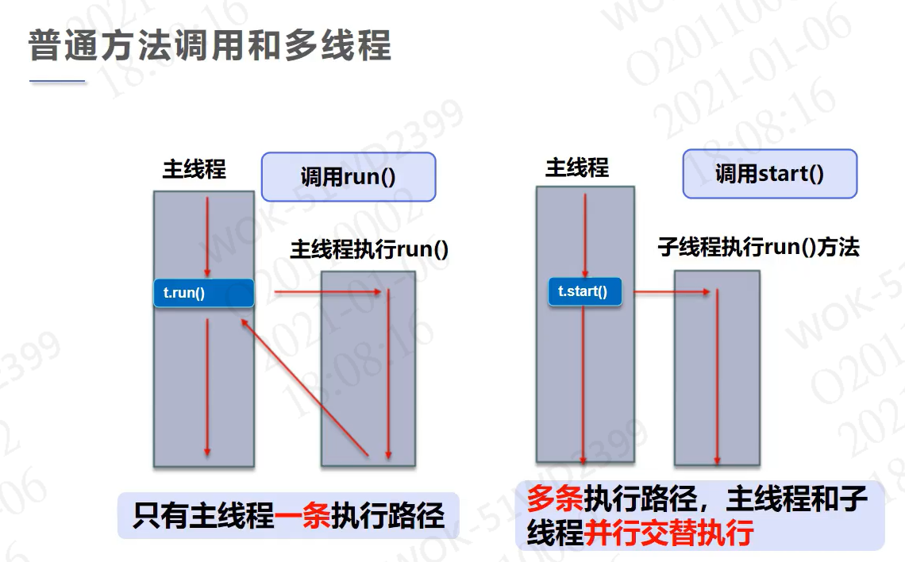
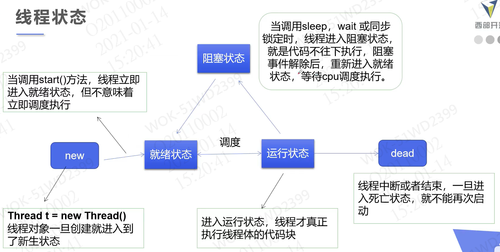
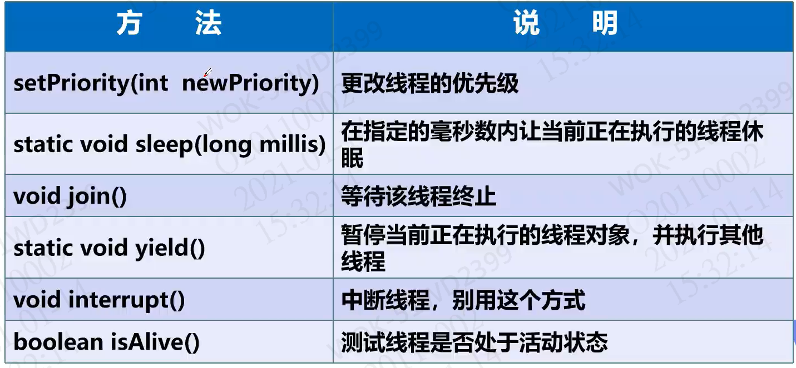

## 程序、进程、线程

> 程序：程序员编写的代码，是静态的
>
> 进程：程序执行起来就是进程，是动态的
>
> 线程：一个进程包括一个或多个线程

## 实现多线程

实现多线程有三种方式：

- 集成Thread类
- 实现Runnable接口
- 实现Callable接口

### Thread

实现方式：

- 自定义线程类，集成**Thread类**
- 重写**run()**方法，编写线程执行体
- 创建线程对象，调用**start()**方法启动线程

PS：线程开启后不一定会立即执行，根据CPU调度执行。

> start() 和 run() 的区别：start() 是同时执行，而run() 会先执行该线程，执行完毕后再回归主线程



> 实现代码

```java
package com.liay.thread;

// 继承 Thread 线程类
public class testThread extends Thread {

    // 重写run方法
    @Override
    public void run() {
        for (int i = 0; i < 20; i++) {
            System.out.println("学习java-"+i);
        }
    }

    public static void main(String[] args) {
        // 创建线程对象，并开启线程
        //new testThread().start();
        new testThread().run();
        for (int i = 0; i < 20; i++) {
            System.out.println("学习多线程-"+i);
        }
    }
}
```

### Runnable

实现方式：

- 自定义线程类，实现**Runnable**接口
- 实现**run()**方法，编程线程执行体
- 创建线程方法，调用**start()**方法启动线程

PS：Runnable 在启动时，也是创建Thread对象，然后将实现了Runnable接口的自定义线程类传入进去，然后调用 Thread.start()

> 实现代码

```java
package com.liay.runnable;

import com.liay.thread.testThread;

// 实现 Runnable 接口
public class testRunnable implements Runnable {

    // 重写run方法
    public void run() {
        for (int i = 0; i < 20; i++) {
            System.out.println("学习java-"+i);
        }
    }

    public static void main(String[] args) {
        // 创建线程对象，并通过线程对象进行代理，以开启线程
        new Thread(new testRunnable()).start();
        for (int i = 0; i < 20; i++) {
            System.out.println("学习多线程-"+i);
        }
    }
}
```

### Thread与Runnable

​	为避免OOP单继承局限性，**不建议使用 Thread**

​	**推荐使用 Runnable**，因为Runnable 可避免单继承局限性，灵活方便，方便同一对象被多个线程使用

### Callable

实现方式：

- 集成 Callable 接口
- 实现 call() 方法
- 使用 Executors.newFixedThreadPool() 创建服务
- 使用 ExecutorService.submit(自定义线程对象) 执行提交
- 使用 Future.get() 获取结果
- 使用 ExecutorService.shutdownNow() 关闭服务

> 代码实现

```java
package com.liay.callable;

import java.util.concurrent.*;

public class TestCallable implements Callable<String> {

    public String call() throws Exception {
        return Thread.currentThread().getName() + "线程正在执行！";
    }

    public static void main(String[] args) throws ExecutionException, InterruptedException {

        TestCallable t1 = new TestCallable();
        TestCallable t2 = new TestCallable();
        TestCallable t3 = new TestCallable();

        // 创建执行服务
        ExecutorService service = Executors.newFixedThreadPool(3);

        // 执行提交
        Future<String> st1 = service.submit(t1);
        Future<String> st2 = service.submit(t2);
        Future<String> st3 = service.submit(t3);

        // 获取结果
        String s1 = st1.get();
        String s2 = st2.get();
        String s3 = st3.get();

        // 打印结果
        System.out.println(s1);
        System.out.println(s2);
        System.out.println(s3);

        // 关闭服务
        service.shutdownNow();

    }
}
```

## 静态代理模式

​	含义：通过其他类帮助你实现某些功能，静态代理中你并没有调用任何方法或接口。

 	好处：代理对象可以做到很多真实对象做不了的事情，真实对象可以专注于做自己的事情。

> 代码实现

```java
package com.liay;

/**
 * 静态代理模式-婚庆公司帮助你结婚
 */
public class StaticProxy {

    public static void main(String[] args) {
        Marry marry = new MarryCompany(new You());
        marry.HappyMarry();
    }
}

/**
 * 结婚接口
 */
interface Marry{
    void HappyMarry();
}

/**
 * 你-真实对象
 */
class You implements Marry{

    public void HappyMarry() {
        System.out.println("开开心心结大婚");
    }
}

/**
 * 婚庆公司-代理对象
 */
class MarryCompany implements Marry{

    // 代理谁=》真实目标角色
    private Marry marry;

    public MarryCompany(Marry marry) {
        this.marry = marry;
    }

    public void HappyMarry() {
        System.out.println("布置现场");
        marry.HappyMarry();
        System.out.println("下班回家");
    }
}
```

## λ(lamda)表达式

​	lambda表达式属于函数式编程，其作用为避免匿名内部类定义过多。

> 函数式接口

​	定义：

- 任何借口，如果只包含唯一一个抽象方法，那么这个接口就是函数式接口
- 对于函数式接口，我们可以使用lambda表达式来创建该接口的对象

> 代码实现

```java
package com.liay.lambda;

public class lambda {

    /**
     * 3、静态内部类
     */
    static class ErTwo implements Die{
        public void lambda() {
            System.out.println("labmda2");
        }
    }

    public static void main(String[] args) {

        /**
         * 4、局部内部类
         */
        class ErThree implements Die{
            public void lambda() {
                System.out.println("labmda3");
            }
        }

        Die die = null;
        // 1、实现类实现接口
        die = new ErOne();
        die.lambda();
        // 2、静态内部类
        die = new ErTwo();
        die.lambda();
        // 3、局部内部类
        die = new ErThree();
        die.lambda();
        // 4、匿名内部类
        die = new Die() {
            public void lambda() {
                System.out.println("labmda4");
            }
        };
        die.lambda();
        //5、labmda表达式
        /**
         * ErOne er = ()->{
         *   System.out.println("labmda5");
         * };
         */
    }
}

/**
 * 1、定义一个函数式接口
 */
interface Die{
    void lambda();
}

interface Die2{
    int chazhi(int a, int b);
}

/**
 * 2、实现类
 */
class ErOne implements Die{
    public void lambda() {
        System.out.println("labmda1");
    }
}
```

## 线程状态



## 线程方法



### 线程停止

- 不推荐使用JDK提供的stop()与的destory()方法（已废弃）

- 推荐让线程自己停下来

- 建议使用一个标志位来终止变量，当flag为false则停止线程

> 代码实现

```java
package com.liay.state;

/**
 * 自定义线程停止方法
 */
public class Stop implements Runnable {

    // 设置标识
    private boolean flag = true;

    public void run() {
        int i = 0;
        while (flag){
            System.out.println("线程执行中："+i++);
        }
    }

    public void stop(){
        flag = false;
    }

    public static void main(String[] args) {

        Stop stop = new Stop();

        new Thread(stop).start();

        for (int i = 0; i < 1000; i++){
            if(i == 900){
                System.out.println("调用stop方法停止线程");
                // 调用自定义停止方法
                stop.stop();
            }
            System.out.println("main线程："+i);
        }

    }
}
```

### 线程休眠

- sleep(millis)中参数指定当前线程阻塞的毫秒数
- sleep存在异常InterruptedException
- sleep时间达到后进入就绪状态
- sleep可以模拟网络延迟，倒计时等
- 每一个对象都有一个锁，sleep不会释放锁

> 代码实现

```java
package com.liay.state;

import java.text.SimpleDateFormat;
import java.util.Date;

/**
 * 线程休眠-另当前线程休眠
 */
public class Sleep {

    public static void main(String[] args) {
        Date date = null;
        while (true){
            try {
                Thread.sleep(1000);
                // 获取当前时间
                date = new Date(System.currentTimeMillis());
                System.out.println(new SimpleDateFormat("HH:mm:ss").format(date));
            } catch (InterruptedException e) {
                e.printStackTrace();
            }
        }
    }
}
```

### 线程礼让

- 让当前正在执行的线程暂停，但不阻塞
- 将线程从运行状态转为就绪状态
- 礼让不一定成功，看CPU的调度

> 代码实现

```java
package com.liay.state;

public class Yield {

    public static void main(String[] args) {
        MyYield myYield = new MyYield();
        new Thread(myYield, "A").start();
        new Thread(myYield, "B").start();
    }
}

class MyYield implements Runnable{

    public void run() {
        System.out.println(Thread.currentThread().getName() + "线程开始执行");
        // 线程礼让
        Thread.yield();
        System.out.println(Thread.currentThread().getName() + "线程停止执行");
    }
}
```

### 线程合并

- join合并线程，待此线程执行完毕后，在执行其他线程，执行时其他线程阻塞
- 可以想象为强行插队

> 代码实现

```java
package com.liay.state;

/**
 * 线程插队
 */
public class Join implements Runnable {

    public void run() {
        for (int i = 0; i < 100; i++) {
            System.out.println("wo nb " + i);
        }
    }

    public static void main(String[] args) {

        Thread thread = new Thread(new Join());
        thread.start();

        for (int i = 0; i < 500; i++) {
            if(i == 200){
                try {
                    // 线程插队-待thread线程执行完毕后再执行其他线程
                    thread.join();
                } catch (InterruptedException e) {
                    e.printStackTrace();
                }
            }
            System.out.println("main " + i);
        }

    }
}
```

