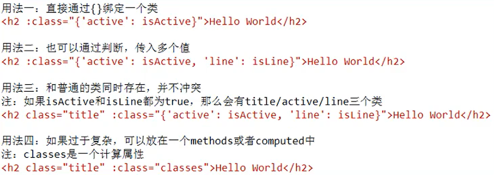

#  Vue

## 概念

​	Vue的 编程范式 为 声明式编程

​	ps：jQuery的 编程范式 为 命令式编程，命令式编程相当于 面向过程，而声明式编程相当于 面向对象

## Vue的安装

* CND引入-通过 script 标签直接通过外网引入
* 下载引入-下载后通过 script 标签引入
* npm安装-脚手架

## Vue的MVVM


​	含义：MVVM = Model + View + ViewModel

### View层

​	含义：

​		视图层

​		页面中的DOM元素

​		用于展示各种信息

### Model层

​	含义：

​		数据层

​		相当于 Vue 实例中 data 里绑定的数据

### ViewModel层

​	含义：

​		视图模型层

​	作用：

​		ViewModel层 是 View层 和 Model层 沟通的桥梁

​		一方面它实现了 Data Binding，也就是数据绑定，将 Model 的改变实时反映到 View层  中

​		另一方面它实现了 Data Listeners，也就是 DOM 监听，当 DOM 发生一些事件（点击、滚动、touch）时，可以监听并做出相应的操作

## 生命周期

​	Vue 实例在不同的时期，会执行不同的函数，比如beforeCreate、created函数。

```js
new Vue({
  data: {
    a: 1
  },
  created: function () {
    // `this` 指向 vm 实例
    console.log('a is: ' + this.a)
  }
})
```


## ES5和ES6的区别

* ES5 中的 var 是没有作用域的（if/for）
* ES6 中的 let 是有作用域的（if/for）
* ES5 和之前中的 if 和 for 是没有作用域的，但是 function 有，所以很多时候必须借助 function 的作用域来解决应用变量是全局的问题
* ES6 中加入了 let，let 是有 if 和 for 的作用域的

```html
<!DOCTYPE html>
<html lang="en">
<head>
    <meta charset="UTF-8">
    <title>Title</title>
</head>
<body>

    <div>
        <button>1</button>
        <button>2</button>
        <button>3</button>
        <button>4</button>
        <button>5</button>
    </div>

    <script>

        // ES5 不适用闭包
        var btns = document.getElementsByTagName('button');
        for(var i = 0; i < btns.length; i++) {
            btns[i].addEventListener('click', function () {
                console.log('当前按钮为第' + i + '个按钮');
            })
        }

        // ES5 使用闭包
        var btns = document.getElementsByTagName('button');
        for(var i = 0; i < btns.length; i++) {
            (function (i) {
                btns[i].addEventListener('click', function () {
                    console.log('当前按钮为第' + i + '个按钮');
                })
            })(i)
        }

        // ES6 使用 let
        var btns = document.getElementsByTagName('button');
        for(let i = 0; i < btns.length; i++) {
            btns[i].addEventListener('click', function () {
                console.log('当前按钮为第' + i + '个按钮');
            })
        }

    </script>

</body>
</html>
```


## 元素

### el

​	含义：挂载点、元素、节点

​	作用：Vue会管理 el 选项指定的元素及其内部的后代元素

​	ps：

​		推荐使用ID选择器

​		不能编写HTML和BODY标签

### data

​	含义：数据对象

​	ps：

​		Vue 中用到的数据定义在data中

​		data 中 可以写复杂类型的数据

​		渲染复杂数据类型时，遵守 js 即可

### computed

​	含义：Vue 计算属性

​	作用：用于编写需要计算后在进行展示的数据，编写时以函数形式编写，使用时当做变量使用。

​	computed 相对于 methods 的好处：methods 每次都会重新计算，而 computed 会将结果储存在缓存中，所以computed 比methods 更高效一些.

​	简写与完整写法：一般情况下我们只需要 getter 方法，所以可以省略 setter 方法，使用简写写法；但在某些情况下我们需要为 计算属性 提供一个 setter 方法。

```html
<!DOCTYPE html>
<html lang="en" xmlns:th="http://www.thymeleaf.org">
<head>
    <meta charset="UTF-8">
    <title>Liay | computed-计算属性</title>
    <!-- 开发环境版本，包含了有帮助的命令行警告 -->
    <script src="js/vue.js"></script>
</head>
<body>

    <div id="app">

        <h2>{{ firstName + ' ' +lastName }}</h2>
        <h2>{{ firstName }} {{ lastName }}</h2>

        <h2>{{ getFullName() }}</h2>
        <h2 v-text="getFullName()"></h2>

        <h2>{{ fullName }}</h2>

        <h2>总价格：{{ totalPrice }}</h2>

        <h2>{{ allFullName }}</h2>
    </div>

    <script type="text/javascript">

        var app = new Vue({
            el: "#app",
            data: {
                firstName: 'Liay',
                lastName: 'Li',
                books: [
                    {id:110, name: '龙族1', price: 25},
                    {id:111, name: '龙族2', price: 27},
                    {id:112, name: '龙族3', price: 26},
                    {id:113, name: '龙族4', price: 24}
                ]
            },
            methods: {
                getFullName() {
                    return this.firstName + ' ' + this.lastName
                }
            },
            // 计算属性
            computed: {
                // 简写写法
                fullName: function () {
                    return this.firstName + ' ' + this.lastName
                },
                // 完整写法
                allFullName: {
                    set: function(newName) {
                        const nameArr = newName.split(' ');
                        this.firstName = nameArr[0];
                        this.lastName = nameArr[1];
                    },
                    get: function() {
                        return this.firstName + ' ' + this.lastName
                    }
                },
                totalPrice: function () {
                   /* let result = 0;
                    for (let i = 0; i < this.books.length; i++) {
                        result += this.books[i].price;
                    }
                    return result;*/

                    /*let result = 0;
                    for (let i in this.books) {
                        result += this.books[i].price;
                    }
                    return result;*/

                    let result = 0;
                    for(let book of this.books) {
                        result += book.price;
                    }
                    return result;
                }
            },

        })

    </script>

</body>
</html>
```

### filters 

​	过滤器的声明：filters 属性

​	过滤器的使用：{{  元素 | 过滤器名称 }}

​	详解：在调用过滤器时，会默认将 | 左边的元素当做参数 传入过滤器中

```html
<!DOCTYPE html>
<html lang="en" xmlns:th="http://www.thymeleaf.org">
<head>
    <meta charset="UTF-8">
    <title>Liay | arrayMethods</title>
    <!-- 开发环境版本，包含了有帮助的命令行警告 -->
    <script src="https://cdn.jsdelivr.net/npm/vue/dist/vue.js"></script>
    <style>
        table {
            border: 1px solid #e9e9e9;
            border-collapse: collapse;
            border-spacing: 0;
        }
        th, td {
            padding: 8px 16px;
            border: 1px solid #e9e9e9;
            text-align: left;
        }
        th {
            background-color: #f7f7f7;
            color: #5c6b77;
            font-weight: 600;
        }
    </style>
</head>
<body>

    <div id="app">

        <table>
            <thead>
                <tr>
                    <th></th>
                    <th>书籍名称</th>
                    <th>出版日期</th>
                    <th>价格</th>
                    <th>购买数量</th>
                    <th>操作</th>
                </tr>
            </thead>
            <tbody>
                <tr v-for="(item, index) in books">
                    <td>{{ item.id }}</td>
                    <td>{{ item.name }}</td>
                    <td>{{ item.date }}</td>
                    <!-- 过滤器的使用 -->
                    <td>{{ item.price |  showPrice}}</td>
                    <!-- 过滤器的使用 -->
                    <td>
                        <button>-</button>
                        {{ item.count }}
                        <button>+</button>
                    </td>
                    <td><button>移除</button></td>
                </tr>
            </tbody>
        </table>
    </div>

    <script type="text/javascript">

        const app = new Vue({
            el: "#app",
            data: {
                books: [
                    {
                        id: 1,
                        name: ' 《算法概论》 ',
                        date: '2006-9',
                        price: 85.00,
                        count: 1
                    },
                    {
                        id: 2,
                        name: ' 《UNIX编程艺术》 ',
                        date: '2006-2',
                        price: 59.00,
                        count: 1
                    },
                    {
                        id: 3,
                        name: ' 《编程珠玑》 ',
                        date: '2008-10',
                        price: 39.00,
                        count: 1
                    },
                    {
                        id: 4,
                        name: ' 《代码大全》 ',
                        date: '2006-3',
                        price: 128.00,
                        count: 1
                    }
                ]
            },
            methods: {

            },
            // 过滤器的声明
            filters: {
                showPrice(price) {
                    return '￥' + price.toFixed(2)
                }
            }
        })

    </script>

</body>
</html>
```

## vue指令

### 内容/事件绑定

#### v-text

​	作用：设置标签的内容

​	ps：

​		默认写法会替换全部内容，使用**差值表达式{{}}**可以替换指定内容

​		内部支持表达式

​		差值表达式{{}}的专业叫法为：Mustache 语法-意为 胡子/胡须

```html
<!DOCTYPE html>
<html lang="en" xmlns:th="http://www.thymeleaf.org">
<head>
    <meta charset="UTF-8">
    <title>Liay | v-text</title>
    <!-- 开发环境版本，包含了有帮助的命令行警告 -->
    <script src="https://cdn.jsdelivr.net/npm/vue/dist/vue.js"></script>
</head>
<body>

    <div id="app">
        <!--两种方式的数据拼接-->
        <h2 v-text="message+'!'">暂无数据</h2>
        <h2>我{{ message + "!" }}</h2>
        <p>--------------------------------------------</p>
    </div>

    <div id="app2">
        <p v-text="userList"></p>
        <p v-text="intArr"></p>
        <p v-text="intArr[0]"></p>
    </div>

    <script th:inline="javascript">

        var app = new Vue({
            el:"#app",
            data:{
                message:"giao"
            }
        })

        var app2 = new Vue({
            el:"#app2",
            data:{
                userList:[[ ${userList} ]],
                intArr:[[ ${intArr} ]]
            }
        })
    </script>

</body>
</html>
```

#### v-html

​	作用：内容中有 html 结构的地方会被解析为 **标签**

```html
<!DOCTYPE html>
<html lang="en" xmlns:th="http://www.thymeleaf.org">
<head>
    <meta charset="UTF-8">
    <title>Liay | v-html</title>
    <!-- 开发环境版本，包含了有帮助的命令行警告 -->
    <script src="https://cdn.jsdelivr.net/npm/vue/dist/vue.js"></script>
</head>
<body>

    <div id="app">

        <p v-html="connect"></p>
        <p v-text="connect"></p>
    </div>

    <script th:inline="javascript">

        var app = new Vue({
            el:"#app",
            data:{
                connect:"<a href='http://www.baidu.com'>百度</a>"
            }
        })
    </script>

</body>
</html>
```

#### v-text 和 v-html的区别

​	v-text 无论其中内容是什么，都会解析为文本；而 v-html 会解析其中 html 部分。

#### v-on

​	作用：为元素**绑定事件**

​	ps：

​		事件名称不需要写 on

​		v-on 指令可以简写为@

​		 绑定的方法定义在 methods 中

```html
<!DOCTYPE html>
<html lang="en" xmlns:th="http://www.thymeleaf.org">
<head>
    <meta charset="UTF-8">
    <title>Liay | v-on</title>
    <!-- 开发环境版本，包含了有帮助的命令行警告 -->
    <script src="https://cdn.jsdelivr.net/npm/vue/dist/vue.js"></script>
</head>
<body>

    <div id="app">
        <input type="button" value="v-on指令" v-on:click="doit">
        <input type="button" value="v-on简写" @click="doit">
        <input type="button" value="v-on简写双击事件" @dblclick="doit">
        <input type="button" value="v-on鼠标移入事件" @monseenter="doit">
        <h2 @click="changeFood">{{ food }}</h2>
    </div>

    <script th:inline="javascript">

        var app = new Vue({
            el:"#app",
            data:{
                food:"青椒肉丝"
            },
            methods:{
                doit:function () {
                    alert("触发点击事件！")
                },
                changeFood:function () {
                    this.food += "is very good "
                }
            }
        })

    </script>


</body>
</html>
```

#### v-once

​	作用：使用该属性声明的元素，只会在初始化的时候渲染数据，当对应的数据改变时，不会进行二次渲染

```html
<!DOCTYPE html>
<html lang="en" xmlns:th="http://www.thymeleaf.org">
<head>
    <meta charset="UTF-8">
    <title>Liay | v-once</title>
    <!-- 开发环境版本，包含了有帮助的命令行警告 -->
    <script src="js/vue.js"></script>
    <script src="js/jquery-2.1.1.min.js"></script>
    <script src="js/axios.js"></script>
</head>
<body>

    <div id="app">
        <h2>{{ message }}</h2>
        <h2 v-once>{{ message }}</h2>
    </div>

    <script type="text/javascript">

        const app = new Vue({
            el:"#app",
            data:{
                message: 'giao'
            }
        })

    </script>

</body>
</html>
```

#### v-pre

​	作用：使用该属性的标签中的值，不会被 Vue 解析，会显示其中原本的内容

```html
<!DOCTYPE html>
<html lang="en" xmlns:th="http://www.thymeleaf.org">
<head>
    <meta charset="UTF-8">
    <title>Liay | v-pre</title>
    <!-- 开发环境版本，包含了有帮助的命令行警告 -->
    <script src="js/vue.js"></script>
    <script src="js/jquery-2.1.1.min.js"></script>
    <script src="js/axios.js"></script>
</head>
<body>

    <div id="app">
        <h2>{{ message }}</h2>
        <h2 v-pre>{{ message }}</h2>
    </div>

    <script type="text/javascript">

        const app = new Vue({
            el: "#app",
            data: {
                message: 'giao'
            }
        })

    </script>

</body>
</html>
```

#### v-cloak

​	作用：在 Vue 渲染数据前，v-cloak 属性 会存在；在 Vue 渲染数据时，v-cloak 属性 会被删除

​	eg：给 v-cloak 属性加上 display: none; 的属性，在 Vue 没有渲染之前 他都不会被显示，当 Vue 渲染数据时，会将 v-cloak 属性剔除，被修饰的元素也会显示出来。

```html
<!DOCTYPE html>
<html lang="en" xmlns:th="http://www.thymeleaf.org">
<head>
    <meta charset="UTF-8">
    <title>Liay | v-pre</title>
    <!-- 开发环境版本，包含了有帮助的命令行警告 -->
    <script src="js/vue.js"></script>
    <script src="js/jquery-2.1.1.min.js"></script>
    <script src="js/axios.js"></script>
    <style>
        [v-cloak]{
            display: none;
        }
    </style>
</head>
<body>

<div id="app" v-cloak>
    <h2>{{ message }}</h2>
</div>

    <script type="text/javascript">

        setTimeout(function () {
            const app = new Vue({
                el: "#app",
                data: {
                    message: 'giao'
                }
            })
        }, 1000)

    </script>

</body>
</html>
```


#### 小节

​	创建 Vue 实例时，**el**（元素节点），**data**（数据），**methods**（方法）

​	**v-on** 的作用为**绑定事件**，简写为**@**

​	方法中通过 **this** 关键字获取 **data** 中的数据

​	**v-text** 的作用为**设置元素的文本值**，简写为**{{}}**

#### 计数器

```html
<!DOCTYPE html>
<html lang="en" xmlns:th="http://www.thymeleaf.org">
<head>
    <meta charset="UTF-8">
    <title>Liay | 计数器</title>
    <!-- 开发环境版本，包含了有帮助的命令行警告 -->
    <script src="https://cdn.jsdelivr.net/npm/vue/dist/vue.js"></script>
</head>

    <div id="app">
        <div class="input-num">
            <button @click="sub">
                -
            </button>
            <span>{{ num }}</span>
            <button @click="add">
                +
            </button>
        </div>
    </div>

    <script>

        var app = new Vue({
            el:"#app",
            data:{
                num:1
            },
            methods: {
                add:function () {
                    if(this.num < 10){
                        this.num++;
                    }else{
                        alert("已经最大了")
                    }
                },
                sub:function () {
                    if(this.num > 0){
                        this.num--;
                    }else{
                        alert("已经最小了")
                    }
                }
            }
        })

    </script>

</body>
</html>
```

### 显示切换，属性绑定

#### v-show

​	作用： 根据真假切换元素的显示状态

​	ps：

​		v-show的原理是修改元素的 display 属性

​		指令后面的内容最终都会解析为 boolean 值

​		值为 true 元素显示，值为 false 元素隐藏

```html
<!DOCTYPE html>
<html lang="en" xmlns:th="http://www.thymeleaf.org">
<head>
    <meta charset="UTF-8">
    <title>Liay | v-show</title>
    <!-- 开发环境版本，包含了有帮助的命令行警告 -->
    <script src="https://cdn.jsdelivr.net/npm/vue/dist/vue.js"></script>
</head>
<body>

    <div id="app">
        <input type="button" value="开关" @click="flag">
        <br>
        
        = 18">
    </div>

    <script>

        var app = new Vue({
            el:"#app",
            data:{
                isShow:false,
                age:17
            },
            methods:{
                flag:function () {
                    this.isShow = !this.isShow;
                }
            }
        })

    </script>

</body>
</html>
```

#### v-if

​	作用：根据表达式的真假切换元素的显示状态

​	ps：

​		本质是通过操纵 DOM 元素来切换显示状态

​		表达式的值为 true，元素存在于 DOM 树中，为 false，从 DOM 树中移除。

​		v-if如果为 false 的话，网页中就不会再有该标签了，更安全，不会被人为修改。

​		v-else 与 v-else-if 同java一样

```html
<!DOCTYPE html>
<html lang="en" xmlns:th="http://www.thymeleaf.org">
<head>
    <meta charset="UTF-8">
    <title>Liay | v-if</title>
    <!-- 开发环境版本，包含了有帮助的命令行警告 -->
    <script src="https://cdn.jsdelivr.net/npm/vue/dist/vue.js"></script>
</head>
<body>

    <div id="app">
        
        
        
    </div>

    <script type="text/javascript">

        var app = new Vue({
            el:"#app",
            data:{
                isShow:false
            }
        })

    </script>

</body>
</html>
```

#### v-bind

​	作用：为元素绑定属性

​	ps：

​		完整写法是：v-bind:属性名

​		简写写法时：:属性名（直接省略v-bind）

​		需要动态的增删 class 建议使用对象的方式，eg：:class="{active: isActive, color: isActive}"



```html
<!DOCTYPE html>
<html lang="en" xmlns:th="http://www.thymeleaf.org">
<head>
    <meta charset="UTF-8">
    <title>Liay | v-bind</title>
    <!-- 开发环境版本，包含了有帮助的命令行警告 -->
    <script src="https://cdn.jsdelivr.net/npm/vue/dist/vue.js"></script>
    <style>
        .active{
            border: 1px solid red;
        }
        .red{
            color: red;
        }
    </style>
</head>
<body>

    <div id="app">
        <!--标准语法-->
        <!--写法一-->
        
        <br>
        <!--语法糖语法-->
        
        <br>
        

        <h2 :class="{'red': isActive}">111</h2>
        <h2 class="yellow" :class="{'red': isActive}">111</h2>
        <h2 :class="{'red': isActive, 'line': isActive}">111</h2>
        <h2 class="yellow" :class="{'red': isActive, 'line': isActive}">111</h2>
        <h2 class="yellow" :class="['red', 'line']">111</h2>
        <h2 :class="getClasses()">111</h2>
        <h2 :class="getClassesTwo()">111</h2>

        <h2 :style="{color: 'red'}">hello</h2>
        <h2 :style="{color: color}">hello</h2>
        <h2 :style="[baseStyle, nbStyle]">hello</h2>

        <ul>
            <li v-for="(item, index) in movies">
                <h2 :class="{red: index == activeIndex}" @click="changeRed(index)">{{ item }}</h2>
            </li>
        </ul>

    </div>

    <script type="text/javascript">

        var app = new Vue({
            el:"#app",
            data:{
                imgSrc:"images/cxk.jpg",
                imgTitle:"giao",
                isActive:true,
                red: 'red',
                line: 'line',
                movies: ['海王', '复仇者联盟', '加勒比海盗', '唐人街探案'],
                activeIndex: 0,
                color: 'yellow',
                baseStyle: {background: 'red'},
                nbStyle: {fontSize: '100px'}
            },
            methods:{
                toggleActive:function () {
                    this.isActive = !this.isActive
                },
                getClasses: function () {
                    return {'red': this.isActive, 'line': this.isActive}
                },
                getClassesTwo: function () {
                    return [this.red, this.line]
                },
                changeRed: function (index) {
                    this.activeIndex = index
                }
            }
        })
    </script>

</body>
</html>
```

#### 图片切换

​	列表数据使用 数组 保存

​	v-bind 指令可以设置元素属性，比如 src

​	v-show 和 v-if 都可以切换元素的显示状态，频繁切换用 v-show

```html
<!DOCTYPE html>
<html lang="en" xmlns:th="http://www.thymeleaf.org">
<head>
    <meta charset="UTF-8">
    <title>Liay | 轮播图</title>
    <!-- 开发环境版本，包含了有帮助的命令行警告 -->
    <script src="https://cdn.jsdelivr.net/npm/vue/dist/vue.js"></script>
</head>
<body>

    <div id="mask">
        <a href="javascript:void(0)" @click="perv" class="left" v-show="index != 0"> < </a>
        
        <a href="javascript:void(0)" @click="next" class="right" v-show="index < imgArr.length - 1"> > </a>
        <script type="text/javascript">

           var app = new Vue({
               el:"#mask",
               data:{
                   imgArr:[
                       "images/cxk.jpg",
                       "images/cxk2.jpg",
                       "images/cxk3.jpg"
                   ],
                   index:0
               },
               methods:{
                   perv:function () {
                       this.index--;
                   },
                   next:function () {
                       this.index++;
                   }
               }
           })

        </script>
    </div>


</body>
</html>
```

### 列表循环，表单元素绑定

#### v-for

​	作用：根据数据生成列表结构（循环遍历）

​	语法：(item,index) in 数据

​	ps：数组长度的更新会同步到页面上，是响应式的。

```html
<!DOCTYPE html>
<html lang="en" xmlns:th="http://www.thymeleaf.org">
<head>
    <meta charset="UTF-8">
    <title>Liay | v-for</title>
    <!-- 开发环境版本，包含了有帮助的命令行警告 -->
    <script src="https://cdn.jsdelivr.net/npm/vue/dist/vue.js"></script>
</head>
<body>

    <div id="app">

        <ul>
            <li v-for="(item,index) in arr">
                便利数据：{{ item }}，便利次数：{{ index }}
            </li>
        </ul>
        <input type="button" value="add" @click="add">
        <input type="button" value="remove" @click="remove">
        <h2 v-for="(item,index) in objArr" v-bind:title="item.name">
            {{ item.name }}
        </h2>
    </div>

    <script type="text/javascript">

        var app = new Vue({
            el:"#app",
            data:{
                arr:[1,2,3,4,5],
                objArr:[{name:"张三"},{name:"李四"}]
            },
            methods:{
                add:function () {
                    this.objArr.push({name:"王五"})
                },
                remove:function () {
                    this.objArr.shift();
                }
            }
        })

    </script>

</body>
</html>
```

#### v-on 补充

​	事件绑定的方法写成函数调用形式，可以传入自定义参数

​	定义方法时，需要定义形参来接受传入的实参

​	事件的后面跟上 **.修饰符** 可以对事件进行限制

​	**.enter** 可以限制触发的按键为 **回车**

```html
<!DOCTYPE html>
<html lang="en" xmlns:th="http://www.thymeleaf.org">
<head>
    <meta charset="UTF-8">
    <title>Liay | v-on-buchong</title>
    <!-- 开发环境版本，包含了有帮助的命令行警告 -->
    <script src="https://cdn.jsdelivr.net/npm/vue/dist/vue.js"></script>
</head>
<body>

    <div id="app">
        <input type="button" value="点击" @click="doIt(12,'giao')">
        <!--    @keyup：输入框改变事件
                @keyup.enter：输入框回车事件-->
        <input type="text" value="" @keyup.enter="sayHi">
    </div>

    <script type="text/javascript">

        var app = new Vue({
            el:"#app",
            methods:{
                doIt:function (id,str) {
                    console.log(id+str);
                },
                sayHi:function () {
                    alert("giao");
                }
            }
        })
    </script>

</body>
</html>
```

#### v-on 带参补充

```html
<!DOCTYPE html>
<html lang="en" xmlns:th="http://www.thymeleaf.org">
<head>
    <meta charset="UTF-8">
    <title>Liay | computed-计算属性</title>
    <!-- 开发环境版本，包含了有帮助的命令行警告 -->
    <script src="https://cdn.jsdelivr.net/npm/vue/dist/vue.js"></script>
</head>
<body>

    <div id="app">

        <!--1、调用方法时，没有参数-->
        <button @click="btn1click">btn1</button>
        <button @click="btn1click()">btn1</button>

        <!--2、调用方式时，有参数，
            当不写括号时，Vue会默认将浏览器产生的event事件对象作为参数传入方法中
            当写上括号，不传参数时，函数中的形参为 未定义变量-->
        <button @click="btn2click">btn2</button>
        <button @click="btn2click()">btn2</button>

        <!--3、调用方法时，如果想主动的将浏览器生成的 event 事件对象作为参数传入方法，格式为：$event-->
        <button @click="btn3click(123, $event)">btn3</button>

    </div>

    <script>

        var app = new Vue({
            el: "#app",
            data: {

            },
            methods:{
                btn1click() {
                    console.log('btn1');
                },
                btn2click(data) {
                    console.log(data);
                },
                btn3click(data, event) {
                    console.log(data, event);
                }
            \}
        })

    </script>

</body>
</html>
```

#### v-on 修饰符

* **.stop**：**阻止冒泡事件**----比如 父级元素DIV 上有一个点击事件A，而 子级元素Button 上也有一个 点击事件B，点击 子级元素Button触发B事件的同时，也会触发A事件；而使用 .stop 修饰符 后将不会触发父级事件。

* **.prevent**：**阻止默认事件**----比如 form 标签中 有一个 type 为 submit 的 input 框，点击这个 input 框 默认会触发 form 标签的 action 事件；而使用 .prevent 修饰符后将不再触发。

* **.{KeyCode | KeyAlias}**：**限制事件**----比如 @keyup 为键盘按键抬起事件，而 @keyup.enter 则限制为 只有回车案件抬起时才会触发

* **.once**：**表示该事件只有第一次触发时生效**

  ```html
  <!DOCTYPE html>
  <html lang="en" xmlns:th="http://www.thymeleaf.org">
  <head>
      <meta charset="UTF-8">
      <title>Liay | computed-计算属性</title>
      <!-- 开发环境版本，包含了有帮助的命令行警告 -->
      <script src="https://cdn.jsdelivr.net/npm/vue/dist/vue.js"></script>
  </head>
  <body>
  
      <div id="app">
  
          <!-- 1、阻止冒泡行为 -->
          <!--默认点击button点击事件也会触发父级div的点击事件-->
          <div @click="divClick">
              <button @click="btnClick">1</button>
          </div>
          <!--使用 .stop 修饰符后 将不会再执行父级元素的点击事件-->
          <div @click="divClick">
              <button @click.stop="btnClick">1</button>
          </div>
  
          <!-- 2、阻止默认事件 -->
          <!--input框 默认触发 form 的 action 提交事件-->
          <form action="baidu">
              <input type="submit">
          </form>
          <!--在 input框 上添加 点击事件时，添加 prevent修饰符，会取消 form 的默认提交事件-->
          <form action="baidu">
              <input type="submit" @click.prevent="inputClick">
          </form>
          <!--在 form 标签上直接添加 @submit.prevent 会取消 form 的默认提交事件-->
          <form action="baidu" @submit.prevent>
              <input type="submit">
          </form>
  
          <!-- 3、限制事件 -->
          <!--keyup 事件为 键盘按键抬起事件，所有按键抬起时 都会触发-->
          <input type="text" @keyup="keyupClick">
          <!--添加 .enter 后，将事件限制为只有回车按键抬起时才会触发-->
          <input type="text" @keyup.enter="keyupClick">
  
          <!-- 4、一次性事件 -->
          <button @click="btnClick">2</button>
          <!--在添加 .once 修饰符后，该事件只会在第一次触发时生效-->
          <button @click.once="btnClick">2</button>
  
      </div>
  
      <script type="text/javascript">
  
          const app = new Vue({
              el: "#app",
              data: {
  
              },
              methods: {
                  divClick() {
                      console.log('divClick');
                  },
                  btnClick() {
                      console.log('btnClick');
                  },
                  inputClick() {
                      console.log('inputClick');
                  },
                  keyupClick() {
                      console.log('keyupClick');
                  }
              }
          })
  
      </script>
  
  </body>
  </html>
  ```

#### v-model

​	作用：便捷的设置和获取表单元素的值（双向数据绑定）

​	ps：

​		绑定的数据会和表单元素值相关联

​		绑定的数据<----->表单元素的值							

```html
<!DOCTYPE html>
<html lang="en" xmlns:th="http://www.thymeleaf.org">
<head>
    <meta charset="UTF-8">
    <title>Liay | v-model</title>
    <!-- 开发环境版本，包含了有帮助的命令行警告 -->
    <script src="https://cdn.jsdelivr.net/npm/vue/dist/vue.js"></script>
</head>
<body>

    <div id="app">

        <input type="button" value="修改message" @click="setM">
        <input type="text" v-model="message" @keyup.enter="getM">
        <h2>{{ message }}</h2>

    </div>

    <script type="text/javascript">

        var app = new Vue({
            el:"#app",
            data:{
                message:"李珏岑"
            },
            methods:{
                getM:function () {
                    alert(this.message);
                },
                setM:function () {
                    this.message = "张轩";
                }
            }
        })
    </script>

</body>
</html>
```

#### v-model-原理

​	v-model 实际上是一个语法糖写法，他本质上其实是两个操作：

* v-bind 绑定一个 value 元素

* v-on 给当前元素绑定input事件

  ```html
  <!DOCTYPE html>
  <html lang="en" xmlns:th="http://www.thymeleaf.org">
  <head>
      <meta charset="UTF-8">
      <title>Liay | v-model-yuanli</title>
      <!-- 开发环境版本，包含了有帮助的命令行警告 -->
      <script src="https://cdn.jsdelivr.net/npm/vue/dist/vue.js"></script>
  </head>
  <body>
  
      <div id="app">
          <!--通过 v-bind 动态绑定 input 框的 value 属性，通过 input 框的 input 事件，触发 valueChange 函数-->
          <input type="text" :value="message" @input="valueChange">
          <input type="text" :value="message" @input="message = $event.target.value">
          <h2>{{ message }}</h2>
      </div>
  
      <script type="text/javascript">
  
          const app = new Vue({
              el: "#app",
              data: {
                  message: 'init'
              },
              methods: {
                  // 通过 event 事件对象 获取最新 input 框中的 value
                  valueChange(event) {
                      this.message = event.target.value
                  }
              }
          })
  
      </script>
  
  </body>
  </html>
  
  
  <!-- ----------------------------------------------------- -->
  <input type="text" v-model="message">
  <!-- 等同于 -->
  <input type="text" v-bind:value="message" v-on:input="message = $event.target.value">
  ```

#### v-model-radio

​	v-model 绑定 单选框

```html
<!DOCTYPE html>
<html lang="en" xmlns:th="http://www.thymeleaf.org">
<head>
    <meta charset="UTF-8">
    <title>Liay | v-model-yuanli</title>
    <!-- 开发环境版本，包含了有帮助的命令行警告 -->
    <script src="https://cdn.jsdelivr.net/npm/vue/dist/vue.js"></script>
</head>
<body>

    <div id="app">
        <label for="male">
            <input type="radio" id="male" value="男" v-model="sex">
        </label>
        <label for="female">
            <input type="radio" id="female" value="女" v-model="sex">
        </label>
        <h3>性别：{{ sex }}</h3>
    </div>

    <script type="text/javascript">

        const app = new Vue({
            el: "#app",
            data: {
                sex: '男'
            },
            methods: {

            }
        })

    </script>

</body>
</html>
```

#### v-model-checkbox

​	v-model 绑定 checkbox

```html
<!DOCTYPE html>
<html lang="en" xmlns:th="http://www.thymeleaf.org">
<head>
    <meta charset="UTF-8">
    <title>Liay | v-model-checkbox</title>
    <!-- 开发环境版本，包含了有帮助的命令行警告 -->
    <script src="https://cdn.jsdelivr.net/npm/vue/dist/vue.js"></script>
</head>
<body>

    <div id="app">

        <!--1、checkbox 作为单选框时-->
        <label for="agree">
            <input type="checkbox" id="agree" v-model="isAgree">同意协议
        </label>
        <h3>您的选择是：{{ isAgree }}</h3>
        <button :disabled="!isAgree">下一步</button>
        <br>

        <!--2、checkbox 作为多选框时-->
        <input type="checkbox" value="篮球" v-model="hobbies">篮球
        <input type="checkbox" value="足球" v-model="hobbies">足球
        <input type="checkbox" value="乒乓球" v-model="hobbies">乒乓球
        <input type="checkbox" value="羽毛球" v-model="hobbies">羽毛球
        <h3>您选择的爱好有：{{ hobbies }}</h3>
        
    </div>

    <script type="text/javascript">

        const app = new Vue({
            el: "#app",
            data: {
                isAgree: false, // 单选框
                hobbies: []     // 多选框
            },
            methods: {

            }
        })

    </script>

</body>
</html>
```

#### v-model-select

​	v-model 绑定 下拉框

```html
<!DOCTYPE html>
<html lang="en" xmlns:th="http://www.thymeleaf.org">
<head>
    <meta charset="UTF-8">
    <title>Liay | v-model-checkbox</title>
    <!-- 开发环境版本，包含了有帮助的命令行警告 -->
    <script src="https://cdn.jsdelivr.net/npm/vue/dist/vue.js"></script>
</head>
<body>

    <div id="app">

        <!--1、单选下拉框-->
        <select name="xxx" id="" v-model="fruit">
            <option value="苹果">苹果</option>
            <option value="香蕉">香蕉</option>
            <option value="提子">提子</option>
            <option value="葡萄">葡萄</option>
        </select>
        <h3>你选择的水果为：{{ fruit }}</h3>

        <!--2、多选下拉框-->
        <select name="ccc" id="" v-model="fruits" multiple>
            <option value="苹果">苹果</option>
            <option value="香蕉">香蕉</option>
            <option value="提子">提子</option>
            <option value="葡萄">葡萄</option>
        </select>
        <h3>你选择的水果为：{{ fruits }}</h3>
    </div>

    <script type="text/javascript">

        const app = new Vue({
            el: "#app",
            data: {
                fruit: '香蕉',
                fruits: []
            },
            methods: {

            }
        })

    </script>

</body>
</html>
```

#### v-model-修饰符


```html
<!DOCTYPE html>
<html lang="en" xmlns:th="http://www.thymeleaf.org">
<head>
    <meta charset="UTF-8">
    <title>Liay | v-model-checkbox</title>
    <!-- 开发环境版本，包含了有帮助的命令行警告 -->
    <script src="https://cdn.jsdelivr.net/npm/vue/dist/vue.js"></script>
</head>
<body>

    <div id="app">

        <!--1、lazy 修饰符-->
        <div>
            <!--普通双向绑定，只要发生改变立马同步数据-->
            <input type="text" v-model="message">
            <h2>{{ message }}</h2>
            <br>
            <!--在上 lazy 修饰符后，只有在聚焦 或是 回车的时候，才会同步数据-->
            <input type="text" v-model.lazy="message">
            <h2>{{ message }}</h2>
        </div>

        <!--2、number 修饰符-->
        <div>
            <!--v-model 默认会将数据转换成 String 形式-->
            <input type="number" v-model="age">
            <h2>{{ typeof age }}</h2>
            <br>
            <!--加上 number 修饰符后，会将数据转换成 数字类型-->
            <input type="number" v-model.number="age">
            <h2>{{ typeof age }}</h2>
        </div>

        <!--3、trim 修饰符-->
        <div>
            <input type="text" v-model="stringData">
            <h2>数据：{{ stringData }}</h2>
            <br>
            <!--加上 trim 修饰符后，会将数据左右两边的空格去除-->
            <input type="text" v-model.trim="stringData">
            <h2>数据：{{ stringData }}</h2>
        </div>
    </div>

    <script type="text/javascript">

        const app = new Vue({
            el: "#app",
            data: {
                message: '你好啊',
                age: 0,
                stringData: ''
            },
            methods: {

            }
        })

    </script>

</body>
</html>
```

#### 记事本

​	列表结构可以通过 v-for 指令结合数据生成

​	v-on 结合事件修饰符可以对事件进行限制，比如 **.enter**

​	v-on 在绑定事件时，可以传递自定义参数

​	通过 v-model 可以快速的设置和获取表单元素的值

​	基于数据的开发方式

###  key

​	Vue 在替换元素时，会默认复用可复用的元素，而属性 key 是主动设置是否复用的元素

```html
<!DOCTYPE html>
<html lang="en" xmlns:th="http://www.thymeleaf.org">
<head>
    <meta charset="UTF-8">
    <title>Liay | computed-计算属性</title>
    <!-- 开发环境版本，包含了有帮助的命令行警告 -->
    <script src="https://cdn.jsdelivr.net/npm/vue/dist/vue.js"></script>
</head>
<body>

    <div id="app">
        <!--Vue 在替换元素时，会将可以复用的元素进行复用，比如input框中的内容-->
        <span v-if="isShow">
            <label for="account">用户账号</label>
            <input type="text" id="account" placeholder="用户账号">
        </span>
        <span v-else>
            <label for="email">用户邮箱</label>
            <input type="text" id="email" placeholder="用户邮箱">
        </span>
        <button @click="isShow = !isShow">切换方式</button>

        <!--这时可以在元素上添加 key 属性，在替换时判断 key 是否相同，如果相同，则复用，如果不同，则不复用-->
        <span v-if="isShow">
            <label for="account">用户账号</label>
            <input type="text" id="account" placeholder="用户账号" key="account">
        </span>
        <span v-else>
            <label for="email">用户邮箱</label>
            <input type="text" id="email" placeholder="用户邮箱" key="email">
        </span>
        <button @click="isShow = !isShow">切换方式</button>

    </div>

    <script type="text/javascript">

        const app = new Vue({
            el: "#app",
            data: {
                isShow: true
            },
            methods: {

            }
        })

    </script>

</body>
</html>
```

## Vue 监听的数组函数

* push方法：在数组末尾追加元素

* pop方法：删除数组末尾的元素

* shift：删除数组的第一个元素

* unshift方法：在数组的最前方添加元素

* splice方法：删除/插入/替换元素

* sort方法：排序

* reverse方法：内容反转

* Vue.set方法：在指定下标添加元素

  ```html
  <!DOCTYPE html>
  <html lang="en" xmlns:th="http://www.thymeleaf.org">
  <head>
      <meta charset="UTF-8">
      <title>Liay | arrayMethods</title>
      <!-- 开发环境版本，包含了有帮助的命令行警告 -->
      <script src="https://cdn.jsdelivr.net/npm/vue/dist/vue.js"></script>
  </head>
  <body>
  
      <div id="app">
          <ul>
              <li v-for="item in letters">
                  {{ item }}
              </li>
          </ul>
          <button @click="btnMethod">□</button>
      </div>
  
      <script type="text/javascript">
  
          const app = new Vue({
              el: "#app",
              data: {
                  letters: ['b' ,'a', 'd', 'c']
              },
              methods: {
                  btnMethod() {
                      // 1、push 方法：在数组末尾追加元素
                      // 一次添加单个
                      //this.letters.push('e')
                      // 一次添加多个
                      //this.letters.push('e' ,'f', 'g')
                      // 2、pop 方法：删除数组末尾元素
                      //this.letters.pop()
                      // 3、shift 方法：删除数组的第一个元素
                      //this.letters.shift()
                      // 4、unshift 方法：在数组的最前方添加元素
                      //this.letters.unshift('aa')
                      // 5、splice 方法作用：删除元素/插入元素/替换元素
                      // 删除元素：第一个参数：起始下标，第二个参数，要删除的元素个数
                      // 如果只传入一个参数，将会删除指定下标和该元素后边的所有元素
                      //this.letters.splice(2)
                      //this.letters.splice(2,1)
                      // 替换元素：第一个参数：起始下标，第二个参数：要替换几个元素，后续元素为替换的元素的值
                      //this.letters.splice(1, 3, 'm', 'n', 'l')
                      // 插入元素：第一个元素：起始下标，第二个参数 0，后续元素为需要添加的元素的值
                      //this.letters.splice(1, 0, 'm', 'n')
                      // 5、sort 方法：排序
                      //this.letters.sort();
                      // 6、reverse 方法：内容反转
                      //this.letters.reverse()
                      // 7、Vue.set 方法：第一个参数：要修改的对象，第二个参数：目标索引，第三个参数：修改后的值
                      Vue.set(this.letters, 0, 'bbbb')
                  }
   
              }
          })
  
      </script>
  
  </body>
  </html>                                    
  ```

## javasrcipt高阶函数

### filter

使用场景：当需要对一个数组进行过滤时调用

参数：回调函数中的元素为 当前便利元素

返回值：当返回 true 时，将当前便利元素返回出去

```js
const nums = [10,20,30,402, 250, 340,15]
console.log("原数组", nums);
// 1、filter 函数的使用
// 使用场景：当需要对一个数组进行过滤时调用，
// 函数的使用：回调函数中的元素为 当前便利元素，
//            当返回 true 时，将便利元素返回出去
const filterNums = nums.filter(function (n) {
    return n > 100;
})
console.log("filter", filterNums);
```

### **map**

使用场景：需要对数组中的元素进行操作时调用

参数：回调函数中的元素为 当前便利元素

返回值：对元素操作后的数据

```js
const nums = [10,20,30,402, 250, 340,15]
console.log("原数组", nums);
// 2、map 函数的使用
// 使用场景：需要对数组中的元素进行操作时调用
// 函数的使用：回调函数中的元素为 当前便利元素
//            返回值为 对元素操作后的数据
const mapNums = filterNums.map(function (n) {
    return n * 2
})
console.log("map", mapNums);
```

### **reduce**

使用场景：需要对数组中的元素进行汇总

参数：回调中的元素为 上一次便利的元素 和 本次便利元素，第二个参数为 preValue 的初始值

返回值：整个数组的总和

```js
const nums = [10,20,30,402, 250, 340,15]
console.log("原数组", nums);
 // 3、reduce 函数的使用
// 使用场景：需要对数组中的元素进行汇总
// 函数的使用：回调中的元素为 上一次便利的元素 和 本次便利元素，第二个参数为 preValue 的初始值
//            返回值为 整个数组的总和
const reduceNums = mapNums.reduce(function (preValue, n) {
    return preValue + n
}, 0)
console.log("reduce", reduceNums);
```

### 函数式编程方式

```js
// 函数式编程调用方式
const finalTotal = nums.filter(function (n) {
    return n > 100
}).map(function (n) {
    return n * 2
}).reduce(function (preValue, n) {
    return preValue + n
})

console.log("函数式编程", finalTotal);
```

### 函数式编程+箭头函数

```js
// 函数式编程箭头函数方式
const jianxie = nums.filter(n => n > 100).map(n => n*2).reduce((preValue, n) => preValue + n)
console.log("简写模式", jianxie);
```

## 组件化

### 组件化概念


### 组件化的基本使用

​	组件的定义及使用步骤：

* 创建组件构造器对象

* 注册 全局/局部 组件

* 使用组件

  ps：声明的全局组件可以在多个Vue实例中使用，但局部组件只能在声明的Vue实例中使用

```html
<!DOCTYPE html>
<html lang="en" xmlns:th="http://www.thymeleaf.org">
<head>
    <meta charset="UTF-8">
    <title>Liay | 组件化的基本使用</title>
    <!-- 开发环境版本，包含了有帮助的命令行警告 -->
    <script src="https://cdn.jsdelivr.net/npm/vue/dist/vue.js"></script>
</head>
<body>

    <div id="app">
        <!--3、使用组件-->
        <my-cpn></my-cpn>
        <cpn></cpn>
    </div>

    <div id="app2">
        <!--3、使用组件-->
        <my-cpn></my-cpn>
        <cpn></cpn>
    </div>

    <script type="text/javascript">

        /*1、创建组件构造器对象*/
        const cpn = Vue.extend({
            template: `
                <div>
                    <h2>标题</h2>
                    <h2>文本区域</h2>
                </div>
            `
        })

        /*2、注册 全局 组件，全局组件可以在多个 Vue 实例中使用*/
        Vue.component('my-cpn', cpn)

        const app = new Vue({
            el: "#app",
            // 2、注册 局部组件，局部组件只能在当前 Vue 实例中使用
            components: {
                cpn: cpn
            }
        })

        const app2 = new Vue({
            el: "#app2"
        })

    </script>

</body>
</html>
```

### 父子组件得定义和使用

​	步骤：

* 创建 父子组件构造器

* 在 父级组件 中定义并使用 子级组件

* 在Vue实例中注册 父级组件

* 使用父级组件

  ps：在父级组件中使用子级组件时，不可以在父级DIV外使用，没否则无效

```html
<!DOCTYPE html>
<html lang="en" xmlns:th="http://www.thymeleaf.org">
<head>
    <meta charset="UTF-8">
    <title>Liay | 组件化的基本使用</title>
    <!-- 开发环境版本，包含了有帮助的命令行警告 -->
    <script src="https://cdn.jsdelivr.net/npm/vue/dist/vue.js"></script>
</head>
<body>

    <div id="app">
        <die></die>
    </div>

    <script type="text/javascript">

        /*创建 子级 组件构造器*/
        const erzi = Vue.extend({
            template: `
                <div>
                    <h2>儿子</h2>
                    <h2>文本区域</h2>
                </div>
            `
        })
        /*创建 父级 组件构造器*/
        const die = Vue.extend({
            template: `
                <div>
                    <h2>爸爸</h2>
                    <h2>文本区域</h2>
                    <erzi></erzi>
                </div>
            `,
            // 声明子级构造器
            components: {
                erzi: erzi
            }
        })

        const app = new Vue({
            el: "#app",
            // 声明局部组件
            components: {
                die: die
            }
        })

    </script>

</body>
</html>
```

### 组件的语法糖注册方式

​	传统方式要先创建 组件构造器对象，而语法糖形式直接剔除了这一步骤，直接在注册时 构建。

```html
<!DOCTYPE html>
<html lang="en" xmlns:th="http://www.thymeleaf.org">
<head>
    <meta charset="UTF-8">
    <title>Liay | 组件化的基本使用</title>
    <!-- 开发环境版本，包含了有帮助的命令行警告 -->
    <script src="https://cdn.jsdelivr.net/npm/vue/dist/vue.js"></script>
</head>
<body>

    <div id="app">
        <cpn1></cpn1>
        <cpn2></cpn2>
        <cpn3></cpn3>
        <cpn4></cpn4>
    </div>

    <script type="text/javascript">

        /*传统方式*/
        const cpn1 = Vue.extend({
            template: `
                <div>
                    <h2>giao</h2>
                    <h2>文本区域</h2>
                </div>
            `
        })
        Vue.component('cpn1', cpn1)
        /*传统方式*/
        /*语法糖方式*/
        Vue.component('cpn2', {
            template: `
                <div>
                    <h2>标题</h2>
                    <h2>文本区域</h2>
                </div>
            `
        })
        /*语法糖方式*/

        const app = new Vue({
            el: "#app",
            components: {
                /*传统方式*/
                cpn3: cpn1,
                /*语法糖形式*/
                cpn4: {
                    template: `
                        <div>
                            <h2>标题</h2>
                            <h2>文本区域</h2>
                        </div>
                    `
                }
            }
        })

    </script>

</body>
</html>
```

### 组件模板的抽离写法

​	通过标签的形式，在标签中编写模板。

​	标签 1：script 标签，必须是 **text/x-template** 类型

​	标签 2：template 标签

​	ps：都是通过 **ID** 获取标签中数据

```html
<!DOCTYPE html>
<html lang="en" xmlns:th="http://www.thymeleaf.org">
<head>
    <meta charset="UTF-8">
    <title>Liay | 组件模板的抽离写法</title>
    <!-- 开发环境版本，包含了有帮助的命令行警告 -->
    <script src="https://cdn.jsdelivr.net/npm/vue/dist/vue.js"></script>
</head>
<body>

    <div id="app">
        <cpn></cpn>
        <cpn2></cpn2>
    </div>

    <!--1、方式1-->
    <script type="text/x-template" id="cpnScr">
        <div>giao</div>
    </script>

    <!--2、方式2-->
    <template id="cpnTem">
        <div>wo giao</div>
    </template>

    <script type="text/javascript">

        const app = new Vue({
            el: "#app",
            components: {
                // 直接通过 ID 拉取数据
                cpn: {
                    template: '#cpnScr'
                },
                cpn2: {
                    template: '#cpnTem'
                }
            }
        })

    </script>

</body>
</html>
```

### 组件中数据的存放

​	每一个组件 起始本质上 就是一个 Vue 实例，所以每个组件都有它所对应的 data、methods等属性

​	ps：组件的data属性是一个函数，而不是一个对象

```html
<!DOCTYPE html>
<html lang="en" xmlns:th="http://www.thymeleaf.org">
<head>
    <meta charset="UTF-8">
    <title>Liay | 组件中数据的存放</title>
    <!-- 开发环境版本，包含了有帮助的命令行警告 -->
    <script src="https://cdn.jsdelivr.net/npm/vue/dist/vue.js"></script>
</head>
<body>

    <div id="app">
        <cpn></cpn>
        <cpn></cpn>
        <cpn></cpn>
    </div>

    <template id="cpn">
        <div>
            <h2>{{ message }}</h2>
        </div>
    </template>

    <script type="text/javascript">

        const app = new Vue({
            el: "#app",
            components: {
                cpn: {
                    template: '#cpn',
                    data() {
                        return {
                            message: 'wo giao'
                        }
                    }
                }
            }
        })

    </script>

</body>
</html>
```

### 组件的 data 属性为什么是一个函数

​	原因：

* 组件 是可复用的
* 如果 data 属性是一个对象的话，在多次创建和使用组件实例时，他们使用的 data 是共用的
* 而如果是函数的话，每次创建的组件实例，他们的 data 是独立的

### **组件通信**

#### 父组件向子组件传递数据

​	父组件向子组件传递数据步骤：

* 在组件中定义 props 属性，在其中定义元素

* 在使用组件时，通过 v-bind 绑定 props 中定义的属性，将 root组件中的数据 传入子组件中

* 子组件模板可以直接使用 props 中定义的数据

  ```html
  <!DOCTYPE html>
  <html lang="en" xmlns:th="http://www.thymeleaf.org">
  <head>
      <meta charset="UTF-8">
      <title>Liay | 父组件向子组件传递数据</title>
      <!-- 开发环境版本，包含了有帮助的命令行警告 -->
      <script src="https://cdn.jsdelivr.net/npm/vue/dist/vue.js"></script>
  </head>
  <body>
  
      <div id="app">
          <!--通过 v-bind 绑定属性，向子组件中传递 root组件中的数据-->
          <cpn :cmessage="message" :cmovies="movies"></cpn>
      </div>
  
      <template id="cpn">
          <div>
              <p>{{ cmessage }}</p>
              <ul>
                  <li v-for="item in cmovies">{{ item }}</li>
              </ul>
          </div>
      </template>
  
      <script type="text/javascript">
  
          // 全局注册
          const cpn = {
              template: '#cpn',
              // 1、props 数组形式，通过数组形式声明变量
              // props: ['cmessage', 'cmovies']
              // 2、props 对象形式 1，通过对象方式声明变量对应类型
              // props: {
              //     cmessage: String,
              //     cmovies: Array
              // }
              // 3、props 对象形式 2
              props: {
                  // 通过对象形式可以设置多个属性，如 类型、默认值、是否必须传递该参数（开启后如果没有传递，则会报错）
                  cmessage: {
                      type: String,
                      default: 'giao giao giao',
                      required: true
                  },
                  cmovies: {
                      type: Array,
                      // 当 类型为 对象或者数组时，默认值为函数形式，数组返回 []，对象返回 {}
                      default() {
                          return ['水王', '天天历险记', '超狗武装']
                      },
                      required: false
                  }
              }
          }
  
          const app = new Vue({
              el: "#app",
              data: {
                  message: 'Liay Li',
                  movies: ['海王', '洛洛历险记', '超兽武装']
              },
              components: {
                  cpn
              }
          })
  
      </script>
  
  </body>
  </html>
  ```


#### 父传子（props的驼峰标识）

​	当子组件声明 props 属性时，使用驼峰命名法；在使用 v-bind 向组件传值时，需将大写改成小写，然后用 - 连接

​	eg：myMessage => my-message

```html
<!DOCTYPE html>
<html lang="en" xmlns:th="http://www.thymeleaf.org">
<head>
    <meta charset="UTF-8">
    <title>Liay | 父传子（props中的驼峰标识）</title>
    <!-- 开发环境版本，包含了有帮助的命令行警告 -->
    <script src="https://cdn.jsdelivr.net/npm/vue/dist/vue.js"></script>
</head>
<body>

    <div id="app">
        <!--当子组件中生命的变量使用驼峰命名法时，在标签上用 v-bind 传值时，需要将大写字母改成小写，并在前面加上 - -->
        <cpn :my-message="message"></cpn>
    </div>

    <template id="cpn">
        <div>
            <p>{{ myMessage }}</p>
        </div>
    </template>

    <script type="text/javascript">

        const cpn = {
            template: '#cpn',
            props: {
                myMessage: {
                    type: String,
                    default: ''
                }
            }
        }

        const app = new Vue({
            el: "#app",
            data: {
                message: 'wo giao'
            },
            methods: {

            },
            components: {
                cpn
            }
        })

    </script>

</body>
</html>
```

#### 子传父（自定义事件）

​	子传父分为两步骤：

* 子组件在 方法中 发送自定义事件
* 父组件在 子组件标签上 使用 v-on 监听自定义事件，并作出相应操作

```html
<!DOCTYPE html>
<html lang="en" xmlns:th="http://www.thymeleaf.org">
<head>
    <meta charset="UTF-8">
    <title>Liay | 子传父</title>
    <!-- 开发环境版本，包含了有帮助的命令行警告 -->
    <script src="https://cdn.jsdelivr.net/npm/vue/dist/vue.js"></script>
</head>
<body>

     <div id="app">

         <!--在子组件标签 使用 v-on 监听子组件自定义事件-->
         <cpn :my-movies="movies" @item-click="itemClick"></cpn>

     </div>

     <template id="cpn">
         <div>
             <ul>
                 <li v-for="item in myMovies">
                     <button @click="myMoviesClick(item)">{{ item }}</button>
                 </li>
             </ul>
         </div>
     </template>

     <script type="text/javascript">

         const cpn = {
             template: '#cpn',
             props: {
                 myMovies: {
                     type: Array,
                     default: ['河王']
                 }
             },
             methods: {
                 myMoviesClick(item) {
                     /**
                      * $emit 发送一个自定义请求
                      * 第一个参数：自定义事件名称
                      * 第二个参数：传递数据
                      */
                     this.$emit('item-click', item)
                 }
             }
         }

         const app = new Vue({
             el: "#app",
             data: {
                movies: ['海王', '大海王', 'big 海王']
             },
             methods: {
                 itemClick(item) {
                     console.log(item);
                 }
             },
             components: {
                 cpn
             }
         })

     </script>

</body>
</html>
```

