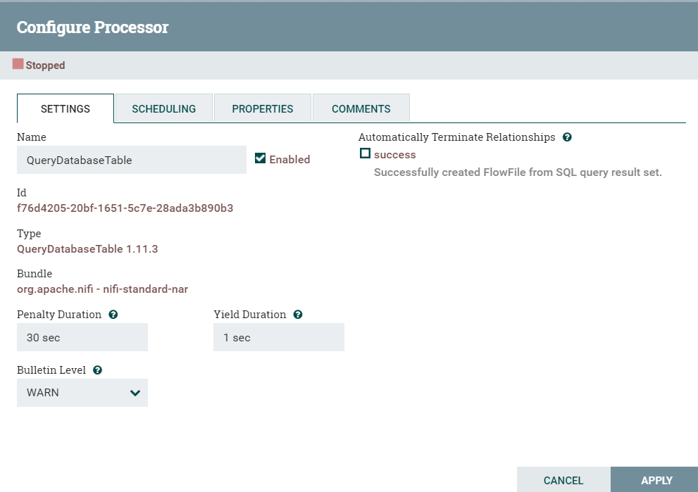

# nifi的使用

##                                              nifi的配置

### QueryDataBaseTable

​	作用：设置要拉取的数据源

### ConvertAvroToJson

​	作用：将拉取的数据转化为 Json 格式

### SplitJson

​	作用：将获取到的 Json 数据拆分成一个个数据

### EvaluateJsonPath

​	作用：将拆分的 数据 设置成 一个个变量

### ExecuteSQL

​	作用：将获取的数据 通过 SQL 写入指定数据库当中

